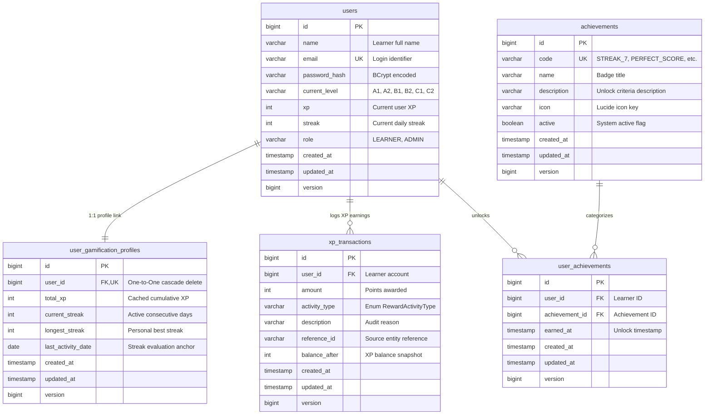
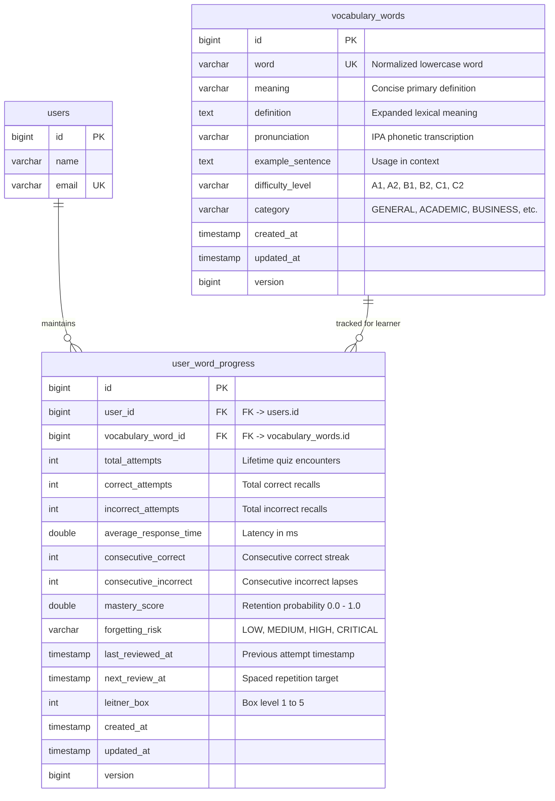
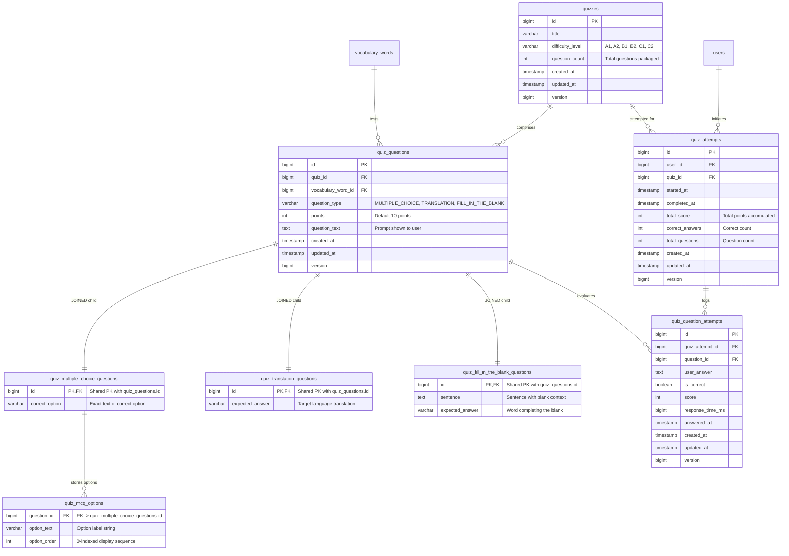
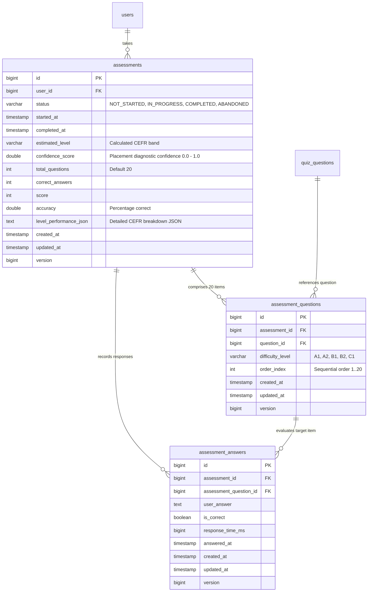
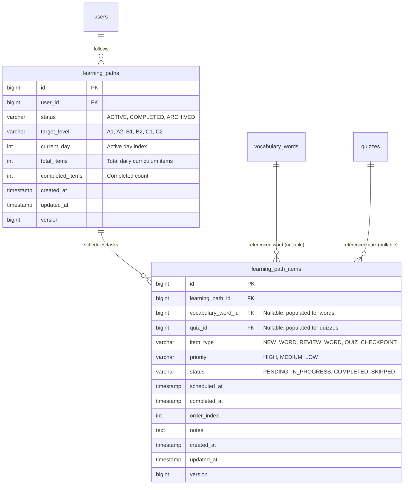
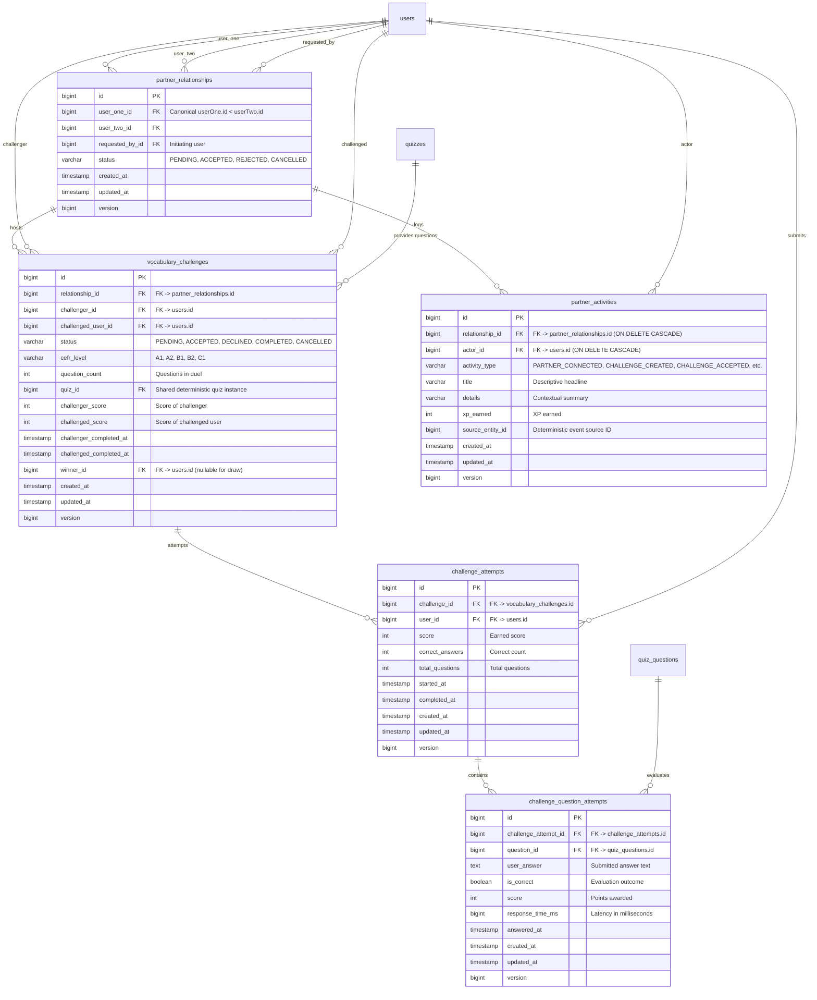

# 🏛️ Memora — Database Architecture & Entity-Relationship Diagram (ERD)

This document provides a comprehensive Entity-Relationship Diagram (ERD) and relational database schema specification for the **Memora** adaptive personalized vocabulary learning platform.

---

## 📑 Table of Contents

1. [Architectural Overview](#-architectural-overview)
2. [Global Entity-Relationship Diagram (Full System)](#-global-entity-relationship-diagram-full-system)
3. [Subsystem ER Diagrams](#-subsystem-er-diagrams)
   - [1. User Management & Gamification](#1-user-management--gamification-subsystem)
   - [2. Vocabulary & Spaced Repetition Retention](#2-vocabulary--spaced-repetition-retention-subsystem)
   - [3. Polymorphic Quiz Engine & Attempt Tracking](#3-polymorphic-quiz-engine--attempt-tracking-subsystem)
   - [4. Diagnostic Placement Assessment](#4-diagnostic-placement-assessment-subsystem)
   - [5. Adaptive Learning Path Curriculum](#5-adaptive-learning-path-curriculum-subsystem)
   - [6. Learning Partner, Challenge & Social Activity](#6-learning-partner-vocabulary-challenge--social-activity-subsystem)
4. [Relational Integrity & Foreign Key Mapping Matrix](#-relational-integrity--foreign-key-mapping-matrix)
5. [Data Dictionary & Table Specifications](#-data-dictionary--table-specifications)
6. [JPA Inheritance & OOP Database Patterns](#-jpa-inheritance--oop-database-patterns)
7. [Domain Enums & Lookup Values](#-domain-enums--lookup-values)

---

## 🧭 Architectural Overview

The Memora persistence tier is built on **PostgreSQL** with **Hibernate / JPA 3.x**. The schema comprises **25 database tables** organized across six bounded domains:

- **Audit & Concurrency Foundation**: Every core entity inherits from `BaseEntity` (`@MappedSuperclass`), providing auto-incrementing ID (`IDENTITY`), UTC timestamping (`created_at`, `updated_at`), and optimistic locking via `@Version` (`version`).
- **Polymorphic Question Hierarchy**: Question types implement JPA `InheritanceType.JOINED`, cleanly separating the polymorphic base table `quiz_questions` from concrete subtypes (`quiz_multiple_choice_questions`, `quiz_translation_questions`, `quiz_fill_in_the_blank_questions`).
- **Granular Progress & Retention**: Spaced repetition tracking (`user_word_progress`) implements the Leitner box model (1–5) and dynamic forgetting risk metrics (`LOW`, `MEDIUM`, `HIGH`, `CRITICAL`).
- **Auditable Gamification**: User profiles, cumulative XP transaction ledgers, daily streak maintenance, and idempotent achievement unlocking.
- **Learning Partner, Challenge & Social Subsystem**: Canonical paired learner relationships (`partner_relationships`), synchronous competitive duels (`vocabulary_challenges`, `challenge_attempts`, `challenge_question_attempts`), and deterministic privacy-safe activity feeds (`partner_activities`).

---

## 🌐 Global Entity-Relationship Diagram (Full System)

Below is the complete database schema with all 25 tables, primary keys, foreign keys, unique constraints, and cardinalities:

```mermaid
erDiagram
    users ||--|| user_gamification_profiles : "maintains (1:1)"
    users ||--o{ xp_transactions : "audits (1:N)"
    users ||--o{ user_achievements : "earns (1:N)"
    achievements ||--o{ user_achievements : "awarded_in (1:N)"

    users ||--o{ user_word_progress : "tracks (1:N)"
    vocabulary_words ||--o{ user_word_progress : "tracked_for (1:N)"

    quizzes ||--o{ quiz_questions : "comprises (1:N)"
    vocabulary_words ||--o{ quiz_questions : "evaluates (1:N)"

    quiz_questions ||--|| quiz_multiple_choice_questions : "specializes (JOINED)"
    quiz_questions ||--|| quiz_translation_questions : "specializes (JOINED)"
    quiz_questions ||--|| quiz_fill_in_the_blank_questions : "specializes (JOINED)"
    quiz_multiple_choice_questions ||--o{ quiz_mcq_options : "has (1:N)"

    users ||--o{ quiz_attempts : "attempts (1:N)"
    quizzes ||--o{ quiz_attempts : "attempted_in (1:N)"
    quiz_attempts ||--o{ quiz_question_attempts : "contains (1:N)"
    quiz_questions ||--o{ quiz_question_attempts : "answered_in (1:N)"

    users ||--o{ assessments : "takes (1:N)"
    assessments ||--o{ assessment_questions : "contains (1:N)"
    quiz_questions ||--o{ assessment_questions : "references (1:N)"
    assessments ||--o{ assessment_answers : "records (1:N)"
    assessment_questions ||--o{ assessment_answers : "evaluates (1:N)"

    users ||--o{ learning_paths : "follows (1:N)"
    learning_paths ||--o{ learning_path_items : "schedules (1:N)"
    vocabulary_words ||--o{ learning_path_items : "introduces (1:N)"
    quizzes ||--o{ learning_path_items : "consolidates (1:N)"

    users ||--o{ partner_relationships : "user_one (1:N)"
    users ||--o{ partner_relationships : "user_two (1:N)"
    users ||--o{ partner_relationships : "requested_by (1:N)"
    partner_relationships ||--o{ vocabulary_challenges : "hosts (1:N)"
    users ||--o{ vocabulary_challenges : "challenger (1:N)"
    users ||--o{ vocabulary_challenges : "challenged (1:N)"
    quizzes ||--o{ vocabulary_challenges : "provides_questions (1:N)"
    vocabulary_challenges ||--o{ challenge_attempts : "records_attempts (1:N)"
    users ||--o{ challenge_attempts : "submitted_by (1:N)"
    challenge_attempts ||--o{ challenge_question_attempts : "contains (1:N)"
    quiz_questions ||--o{ challenge_question_attempts : "evaluates (1:N)"
    partner_relationships ||--o{ partner_activities : "logs (1:N)"
    users ||--o{ partner_activities : "actor (1:N)"

    users {
        bigint id PK
        varchar name
        varchar email UK
        varchar password_hash
        varchar current_level
        int xp
        int streak
        varchar role
        timestamp created_at
        timestamp updated_at
        bigint version
    }

    user_gamification_profiles {
        bigint id PK
        bigint user_id FK,UK
        int total_xp
        int current_streak
        int longest_streak
        date last_activity_date
        timestamp created_at
        timestamp updated_at
        bigint version
    }

    xp_transactions {
        bigint id PK
        bigint user_id FK
        int amount
        varchar activity_type
        varchar description
        varchar reference_id
        int balance_after
        timestamp created_at
        timestamp updated_at
        bigint version
    }

    achievements {
        bigint id PK
        varchar code UK
        varchar name
        varchar description
        varchar icon
        boolean active
        timestamp created_at
        timestamp updated_at
        bigint version
    }

    user_achievements {
        bigint id PK
        bigint user_id FK
        bigint achievement_id FK
        timestamp earned_at
        timestamp created_at
        timestamp updated_at
        bigint version
    }

    vocabulary_words {
        bigint id PK
        varchar word UK
        varchar meaning
        text definition
        varchar pronunciation
        text example_sentence
        varchar difficulty_level
        varchar category
        timestamp created_at
        timestamp updated_at
        bigint version
    }

    user_word_progress {
        bigint id PK
        bigint user_id FK
        bigint vocabulary_word_id FK
        int total_attempts
        int correct_attempts
        int incorrect_attempts
        double average_response_time
        int consecutive_correct
        int consecutive_incorrect
        double mastery_score
        varchar forgetting_risk
        timestamp last_reviewed_at
        timestamp next_review_at
        int leitner_box
        timestamp created_at
        timestamp updated_at
        bigint version
    }

    quizzes {
        bigint id PK
        varchar title
        varchar difficulty_level
        int question_count
        timestamp created_at
        timestamp updated_at
        bigint version
    }

    quiz_questions {
        bigint id PK
        bigint quiz_id FK
        bigint vocabulary_word_id FK
        varchar question_type
        int points
        text question_text
        timestamp created_at
        timestamp updated_at
        bigint version
    }

    quiz_multiple_choice_questions {
        bigint id PK,FK
        varchar correct_option
    }

    quiz_mcq_options {
        bigint question_id FK
        varchar option_text
        int option_order
    }

    quiz_translation_questions {
        bigint id PK,FK
        varchar expected_answer
    }

    quiz_fill_in_the_blank_questions {
        bigint id PK,FK
        text sentence
        varchar expected_answer
    }

    quiz_attempts {
        bigint id PK
        bigint user_id FK
        bigint quiz_id FK
        timestamp started_at
        timestamp completed_at
        int total_score
        int correct_answers
        int total_questions
        timestamp created_at
        timestamp updated_at
        bigint version
    }

    quiz_question_attempts {
        bigint id PK
        bigint quiz_attempt_id FK
        bigint question_id FK
        text user_answer
        boolean is_correct
        int score
        bigint response_time_ms
        timestamp answered_at
        timestamp created_at
        timestamp updated_at
        bigint version
    }

    assessments {
        bigint id PK
        bigint user_id FK
        varchar status
        timestamp started_at
        timestamp completed_at
        varchar estimated_level
        double confidence_score
        int total_questions
        int correct_answers
        int score
        double accuracy
        text level_performance_json
        timestamp created_at
        timestamp updated_at
        bigint version
    }

    assessment_questions {
        bigint id PK
        bigint assessment_id FK
        bigint question_id FK
        varchar difficulty_level
        int order_index
        timestamp created_at
        timestamp updated_at
        bigint version
    }

    assessment_answers {
        bigint id PK
        bigint assessment_id FK
        bigint assessment_question_id FK
        text user_answer
        boolean is_correct
        bigint response_time_ms
        timestamp answered_at
        timestamp created_at
        timestamp updated_at
        bigint version
    }

    learning_paths {
        bigint id PK
        bigint user_id FK
        varchar status
        varchar target_level
        int current_day
        int total_items
        int completed_items
        timestamp created_at
        timestamp updated_at
        bigint version
    }

    learning_path_items {
        bigint id PK
        bigint learning_path_id FK
        bigint vocabulary_word_id FK
        bigint quiz_id FK
        varchar item_type
        varchar priority
        varchar status
        timestamp scheduled_at
        timestamp completed_at
        int order_index
        text notes
        timestamp created_at
        timestamp updated_at
        bigint version
    }

    partner_relationships {
        bigint id PK
        bigint user_one_id FK
        bigint user_two_id FK
        bigint requested_by_id FK
        varchar status
        timestamp created_at
        timestamp updated_at
        bigint version
    }

    vocabulary_challenges {
        bigint id PK
        bigint relationship_id FK
        bigint challenger_id FK
        bigint challenged_user_id FK
        varchar status
        varchar cefr_level
        int question_count
        bigint quiz_id FK
        int challenger_score
        int challenged_score
        timestamp challenger_completed_at
        timestamp challenged_completed_at
        bigint winner_id FK
        timestamp created_at
        timestamp updated_at
        bigint version
    }

    challenge_attempts {
        bigint id PK
        bigint challenge_id FK
        bigint user_id FK
        int score
        int correct_answers
        int total_questions
        timestamp started_at
        timestamp completed_at
        timestamp created_at
        timestamp updated_at
        bigint version
    }

    challenge_question_attempts {
        bigint id PK
        bigint challenge_attempt_id FK
        bigint question_id FK
        text user_answer
        boolean is_correct
        int score
        bigint response_time_ms
        timestamp answered_at
        timestamp created_at
        timestamp updated_at
        bigint version
    }

    partner_activities {
        bigint id PK
        bigint relationship_id FK
        bigint actor_id FK
        varchar activity_type
        varchar title
        varchar details
        int xp_earned
        bigint source_entity_id
        timestamp created_at
        timestamp updated_at
        bigint version
    }
```



---

## 🧩 Subsystem ER Diagrams

### 1. User Management & Gamification Subsystem

Handles authentication, roles, CEFR rating, cumulative streaks, XP transaction audits, and unlockable achievement milestones.



---

### 2. Vocabulary & Spaced Repetition Retention Subsystem

Tracks individualized lexical retention via the **Leitner 5-box system**, calculating forgetting risk, consecutive success/failure runs, and next review timestamps.



---

### 3. Polymorphic Quiz Engine & Attempt Tracking Subsystem

Demonstrates **JPA Joined Table Inheritance** (`InheritanceType.JOINED`) for quiz question polymorphism along with session attempt logging.



---

### 4. Diagnostic Placement Assessment Subsystem

Orchestrates multi-level diagnostic evaluations (20 calibrated items across CEFR bands A1–C1) to infer learner baseline proficiency.



---

### 5. Adaptive Learning Path Curriculum Subsystem

Schedules daily individualized study sessions combining newly introduced vocabulary items, review words, and milestone consolidation quizzes.



---

### 6. Learning Partner, Vocabulary Challenge & Social Activity Subsystem

Manages bidirectional canonical partner pairings (`userOne.id < userTwo.id`), live synchronous vocabulary duels, participant attempts, and privacy-safe activity feeds with deterministic event deduplication.



---

## 🔗 Relational Integrity & Foreign Key Mapping Matrix

| Source Table | Source Column | Target Table | Target Column | Cardinality | Cascade / Action | Constraint Name |
| :--- | :--- | :--- | :--- | :---: | :--- | :--- |
| `partner_relationships` | `user_one_id` | `users` | `id` | `N : 1` | `RESTRICT` | `idx_partner_user_one` |
| `partner_relationships` | `user_two_id` | `users` | `id` | `N : 1` | `RESTRICT` | `idx_partner_user_two` |
| `partner_relationships` | `requested_by_id` | `users` | `id` | `N : 1` | `RESTRICT` | `fk_partner_requested_by` |
| `vocabulary_challenges` | `relationship_id` | `partner_relationships` | `id` | `N : 1` | `RESTRICT` | `idx_vocab_challenge_rel` |
| `vocabulary_challenges` | `challenger_id` | `users` | `id` | `N : 1` | `RESTRICT` | `idx_vocab_challenge_challenger` |
| `vocabulary_challenges` | `challenged_user_id`| `users` | `id` | `N : 1` | `RESTRICT` | `idx_vocab_challenge_challenged` |
| `vocabulary_challenges` | `quiz_id` | `quizzes` | `id` | `N : 1` | `RESTRICT` | `fk_vocab_challenge_quiz` |
| `vocabulary_challenges` | `winner_id` | `users` | `id` | `N : 1` | `RESTRICT` | `fk_vocab_challenge_winner` |
| `challenge_attempts` | `challenge_id` | `vocabulary_challenges` | `id` | `N : 1` | `RESTRICT` | `idx_ch_attempt_challenge` |
| `challenge_attempts` | `user_id` | `users` | `id` | `N : 1` | `RESTRICT` | `idx_ch_attempt_user` |
| `challenge_question_attempts` | `challenge_attempt_id` | `challenge_attempts` | `id` | `N : 1` | `CASCADE (orphanRemoval)` | `fk_ch_qattempt_attempt` |
| `challenge_question_attempts` | `question_id` | `quiz_questions` | `id` | `N : 1` | `RESTRICT` | `fk_ch_qattempt_question` |
| `partner_activities` | `relationship_id` | `partner_relationships` | `id` | `N : 1` | `ON DELETE CASCADE` | `idx_partner_act_rel` |
| `partner_activities` | `actor_id` | `users` | `id` | `N : 1` | `ON DELETE CASCADE` | `fk_partner_act_actor` |
| :--- | :--- | :--- | :--- | :---: | :--- | :--- |
| `user_gamification_profiles` | `user_id` | `users` | `id` | `1 : 1` | `ON DELETE CASCADE` | `uk_gamification_profile_user` |
| `xp_transactions` | `user_id` | `users` | `id` | `N : 1` | `ON DELETE CASCADE` | `fk_xp_transactions_user` |
| `user_achievements` | `user_id` | `users` | `id` | `N : 1` | `ON DELETE CASCADE` | `uk_user_achievement (composite)` |
| `user_achievements` | `achievement_id` | `achievements` | `id` | `N : 1` | `RESTRICT` | `uk_user_achievement (composite)` |
| `user_word_progress` | `user_id` | `users` | `id` | `N : 1` | `RESTRICT` | `uk_user_word_progress (composite)` |
| `user_word_progress` | `vocabulary_word_id`| `vocabulary_words` | `id` | `N : 1` | `RESTRICT` | `uk_user_word_progress (composite)` |
| `quiz_questions` | `quiz_id` | `quizzes` | `id` | `N : 1` | `CASCADE (orphanRemoval)`| `idx_question_quiz` |
| `quiz_questions` | `vocabulary_word_id`| `vocabulary_words` | `id` | `N : 1` | `RESTRICT` | `idx_question_vocab` |
| `quiz_multiple_choice_questions` | `id` | `quiz_questions` | `id` | `1 : 1` | `JOINED PK/FK` | Inheritance discriminator |
| `quiz_mcq_options` | `question_id` | `quiz_multiple_choice_questions` | `id` | `N : 1` | `CASCADE (orphanRemoval)`| `@CollectionTable` |
| `quiz_translation_questions` | `id` | `quiz_questions` | `id` | `1 : 1` | `JOINED PK/FK` | Inheritance discriminator |
| `quiz_fill_in_the_blank_questions` | `id` | `quiz_questions` | `id` | `1 : 1` | `JOINED PK/FK` | Inheritance discriminator |
| `quiz_attempts` | `user_id` | `users` | `id` | `N : 1` | `RESTRICT` | `idx_attempt_user` |
| `quiz_attempts` | `quiz_id` | `quizzes` | `id` | `N : 1` | `RESTRICT` | `idx_attempt_quiz` |
| `quiz_question_attempts` | `quiz_attempt_id` | `quiz_attempts` | `id` | `N : 1` | `CASCADE (orphanRemoval)`| `idx_qattempt_quiz_attempt` |
| `quiz_question_attempts` | `question_id` | `quiz_questions` | `id` | `N : 1` | `RESTRICT` | `idx_qattempt_question` |
| `assessments` | `user_id` | `users` | `id` | `N : 1` | `RESTRICT` | `idx_assessment_user` |
| `assessment_questions` | `assessment_id` | `assessments` | `id` | `N : 1` | `CASCADE (orphanRemoval)`| `idx_aq_assessment` |
| `assessment_questions` | `question_id` | `quiz_questions` | `id` | `N : 1` | `RESTRICT` | `idx_aq_question` |
| `assessment_answers` | `assessment_id` | `assessments` | `id` | `N : 1` | `CASCADE (orphanRemoval)`| `uk_assessment_question_answer` |
| `assessment_answers` | `assessment_question_id` | `assessment_questions` | `id` | `N : 1` | `RESTRICT` | `uk_assessment_question_answer` |
| `learning_paths` | `user_id` | `users` | `id` | `N : 1` | `RESTRICT` | `idx_lp_user` |
| `learning_path_items` | `learning_path_id` | `learning_paths` | `id` | `N : 1` | `CASCADE (orphanRemoval)`| `idx_lpi_path` |
| `learning_path_items` | `vocabulary_word_id`| `vocabulary_words` | `id` | `N : 1 (opt)` | `SET NULL / RESTRICT` | `fk_lpi_vocab` |
| `learning_path_items` | `quiz_id` | `quizzes` | `id` | `N : 1 (opt)` | `SET NULL / RESTRICT` | `fk_lpi_quiz` |

---

## 📖 Data Dictionary & Table Specifications

### 1. `users`
Represents registered learners and administrators in Memora.

| Column | Type | Nullable | Constraints | Default | Description |
| :--- | :--- | :---: | :---: | :---: | :--- |
| `id` | `BIGINT` | No | `PK, IDENTITY` | generated | Primary key |
| `name` | `VARCHAR(255)` | No | — | — | Learner's display name |
| `email` | `VARCHAR(255)` | No | `UNIQUE (uk_users_email)` | — | Unique login email identifier |
| `password_hash` | `VARCHAR(255)` | No | — | — | BCrypt encrypted credential |
| `current_level` | `VARCHAR(32)` | No | `Enum VocabularyLevel` | `'A1'` | CEFR placement level (A1–C2) |
| `xp` | `INT` | No | `CHECK (xp >= 0)` | `0` | Cumulative gamification experience points |
| `streak` | `INT` | No | `CHECK (streak >= 0)` | `0` | Active consecutive daily study streak |
| `role` | `VARCHAR(32)` | No | `Enum Role` | `'LEARNER'` | Authorization role (`LEARNER`, `ADMIN`) |
| `created_at` | `TIMESTAMP` | No | — | current UTC | Audit creation timestamp |
| `updated_at` | `TIMESTAMP` | Yes | — | null | Audit last modified timestamp |
| `version` | `BIGINT` | No | `@Version` | `0` | Optimistic locking control |

---

### 2. `user_gamification_profiles`
Maintains learner streaks and personal bests, with a 1:1 cascade delete relationship to `users`.

| Column | Type | Nullable | Constraints | Default | Description |
| :--- | :--- | :---: | :---: | :---: | :--- |
| `id` | `BIGINT` | No | `PK, IDENTITY` | generated | Primary key |
| `user_id` | `BIGINT` | No | `FK -> users.id, UNIQUE` | — | Cascading foreign key to user |
| `total_xp` | `INT` | No | `CHECK (total_xp >= 0)` | `0` | Cached total XP for leaderboard queries |
| `current_streak` | `INT` | No | `CHECK (current_streak >= 0)` | `0` | Consecutive active days |
| `longest_streak` | `INT` | No | `CHECK (longest_streak >= 0)` | `0` | All-time highest streak |
| `last_activity_date` | `DATE` | Yes | — | null | Date of most recent qualifying activity |
| `created_at` | `TIMESTAMP` | No | — | current UTC | Audit creation timestamp |
| `updated_at` | `TIMESTAMP` | Yes | — | null | Audit last modified timestamp |
| `version` | `BIGINT` | No | `@Version` | `0` | Optimistic locking control |

---

### 3. `xp_transactions`
Auditable immutable ledger recording every individual XP bonus or deduction.

| Column | Type | Nullable | Constraints | Default | Description |
| :--- | :--- | :---: | :---: | :---: | :--- |
| `id` | `BIGINT` | No | `PK, IDENTITY` | generated | Primary key |
| `user_id` | `BIGINT` | No | `FK -> users.id` | — | User receiving points |
| `amount` | `INT` | No | — | — | Points awarded or deducted |
| `activity_type` | `VARCHAR(64)` | No | `Enum RewardActivityType`| — | Categorical origin (`QUIZ_COMPLETED`, etc.) |
| `description` | `VARCHAR(255)` | No | — | — | Human-readable audit explanation |
| `reference_id` | `VARCHAR(255)` | Yes | — | null | ID of triggering entity (quizId, etc.) |
| `balance_after` | `INT` | No | — | — | Total XP balance immediately after reward |
| `created_at` | `TIMESTAMP` | No | — | current UTC | Audit creation timestamp |
| `updated_at` | `TIMESTAMP` | Yes | — | null | Audit last modified timestamp |
| `version` | `BIGINT` | No | `@Version` | `0` | Optimistic locking control |

---

### 4. `achievements`
System catalog of milestones and unlockable badge rewards.

| Column | Type | Nullable | Constraints | Default | Description |
| :--- | :--- | :---: | :---: | :---: | :--- |
| `id` | `BIGINT` | No | `PK, IDENTITY` | generated | Primary key |
| `code` | `VARCHAR(64)` | No | `UNIQUE (uk_achievements_code)` | — | Unique identifier (`FIRST_QUIZ`, `STREAK_7`) |
| `name` | `VARCHAR(128)` | No | — | — | Friendly badge title |
| `description` | `VARCHAR(512)` | No | — | — | Detailed qualification requirements |
| `icon` | `VARCHAR(128)` | Yes | — | null | Visual icon reference name |
| `active` | `BOOLEAN` | No | — | `true` | System availability flag |
| `created_at` | `TIMESTAMP` | No | — | current UTC | Audit creation timestamp |
| `updated_at` | `TIMESTAMP` | Yes | — | null | Audit last modified timestamp |
| `version` | `BIGINT` | No | `@Version` | `0` | Optimistic locking control |

---

### 5. `user_achievements`
Junction table tracking unlocked achievements with strict idempotent earning semantics.

| Column | Type | Nullable | Constraints | Default | Description |
| :--- | :--- | :---: | :---: | :---: | :--- |
| `id` | `BIGINT` | No | `PK, IDENTITY` | generated | Primary key |
| `user_id` | `BIGINT` | No | `FK -> users.id` | — | Recipient learner |
| `achievement_id` | `BIGINT` | No | `FK -> achievements.id` | — | Unlocked badge |
| `earned_at` | `TIMESTAMP` | No | — | current UTC | Precise timestamp of qualification |
| `created_at` | `TIMESTAMP` | No | — | current UTC | Audit creation timestamp |
| `updated_at` | `TIMESTAMP` | Yes | — | null | Audit last modified timestamp |
| `version` | `BIGINT` | No | `@Version` | `0` | Optimistic locking control |

*Unique Constraint*: `UNIQUE (user_id, achievement_id)` prevents duplicate unlocks.

---

### 6. `vocabulary_words`
Master lexical dictionary containing vocabulary items, CEFR levels, and linguistic definitions.

| Column | Type | Nullable | Constraints | Default | Description |
| :--- | :--- | :---: | :---: | :---: | :--- |
| `id` | `BIGINT` | No | `PK, IDENTITY` | generated | Primary key |
| `word` | `VARCHAR(255)` | No | `UNIQUE (uk_vocabulary_word)` | — | Normalized lowercase headword |
| `meaning` | `VARCHAR(255)` | No | — | — | Primary meaning or translation |
| `definition` | `TEXT` | Yes | — | null | Formal dictionary definition |
| `pronunciation` | `VARCHAR(255)` | Yes | — | null | IPA phonetic transcription |
| `example_sentence`| `TEXT` | Yes | — | null | Contextual usage example |
| `difficulty_level`| `VARCHAR(32)` | No | `Enum DifficultyLevel` | `'A1'` | CEFR difficulty (A1–C2) |
| `category` | `VARCHAR(64)` | No | `Enum WordCategory` | `'GENERAL'` | Domain classification |
| `created_at` | `TIMESTAMP` | No | — | current UTC | Audit creation timestamp |
| `updated_at` | `TIMESTAMP` | Yes | — | null | Audit last modified timestamp |
| `version` | `BIGINT` | No | `@Version` | `0` | Optimistic locking control |

---

### 7. `user_word_progress`
Granular spaced repetition progress for a learner on a specific vocabulary item.

| Column | Type | Nullable | Constraints | Default | Description |
| :--- | :--- | :---: | :---: | :---: | :--- |
| `id` | `BIGINT` | No | `PK, IDENTITY` | generated | Primary key |
| `user_id` | `BIGINT` | No | `FK -> users.id` | — | Learner |
| `vocabulary_word_id`| `BIGINT` | No | `FK -> vocabulary_words.id`| — | Vocabulary word item |
| `total_attempts` | `INT` | No | — | `0` | Total review encounters |
| `correct_attempts` | `INT` | No | — | `0` | Total correct answers |
| `incorrect_attempts`| `INT` | No | — | `0` | Total incorrect lapses |
| `average_response_time`| `DOUBLE PRECISION`| No | — | `0.0` | Average latency (milliseconds) |
| `consecutive_correct`| `INT` | No | — | `0` | Unbroken correct answers |
| `consecutive_incorrect`| `INT` | No | — | `0` | Unbroken incorrect lapses |
| `mastery_score` | `DOUBLE PRECISION`| No | — | `0.0` | Probability of retention (0.0 to 1.0) |
| `forgetting_risk`| `VARCHAR(32)` | No | `Enum ForgettingRisk` | `'LOW'` | Calculated risk (`LOW`, `CRITICAL`, etc.) |
| `last_reviewed_at`| `TIMESTAMP` | Yes | — | null | Most recent review timestamp |
| `next_review_at` | `TIMESTAMP` | Yes | — | null | Next scheduled review date/time |
| `leitner_box` | `INT` | No | `CHECK (leitner_box BETWEEN 1 AND 5)` | `1` | Leitner partition (1 = Daily, 5 = Mastered) |
| `created_at` | `TIMESTAMP` | No | — | current UTC | Audit creation timestamp |
| `updated_at` | `TIMESTAMP` | Yes | — | null | Audit last modified timestamp |
| `version` | `BIGINT` | No | `@Version` | `0` | Optimistic locking control |

*Unique Constraint*: `UNIQUE (user_id, vocabulary_word_id)` enforces one record per user per word.

---

### 8. `quizzes`
Curated or dynamically generated test assessments.

| Column | Type | Nullable | Constraints | Default | Description |
| :--- | :--- | :---: | :---: | :---: | :--- |
| `id` | `BIGINT` | No | `PK, IDENTITY` | generated | Primary key |
| `title` | `VARCHAR(255)` | No | — | — | Descriptive quiz title |
| `difficulty_level`| `VARCHAR(32)` | No | `Enum DifficultyLevel` | — | Target CEFR level |
| `question_count` | `INT` | No | — | — | Packaged number of questions |
| `created_at` | `TIMESTAMP` | No | — | current UTC | Audit creation timestamp |
| `updated_at` | `TIMESTAMP` | Yes | — | null | Audit last modified timestamp |
| `version` | `BIGINT` | No | `@Version` | `0` | Optimistic locking control |

---

### 9. `quiz_questions`
Base polymorphic entity for questions extending `BaseEntity` with `InheritanceType.JOINED`.

| Column | Type | Nullable | Constraints | Default | Description |
| :--- | :--- | :---: | :---: | :---: | :--- |
| `id` | `BIGINT` | No | `PK, IDENTITY` | generated | Question primary key |
| `quiz_id` | `BIGINT` | Yes | `FK -> quizzes.id` | null | Associated parent quiz |
| `vocabulary_word_id`| `BIGINT` | No | `FK -> vocabulary_words.id`| — | Core target vocabulary item |
| `question_type` | `VARCHAR(32)` | No | `Enum QuestionType` | — | Discriminator type |
| `points` | `INT` | No | — | `10` | Point value awarded for correct answer |
| `question_text` | `TEXT` | No | — | — | Prompt text presented to learner |
| `created_at` | `TIMESTAMP` | No | — | current UTC | Audit creation timestamp |
| `updated_at` | `TIMESTAMP` | Yes | — | null | Audit last modified timestamp |
| `version` | `BIGINT` | No | `@Version` | `0` | Optimistic locking control |

---

### 10. `quiz_multiple_choice_questions`
Specialized table joined with `quiz_questions` for MCQ format.

| Column | Type | Nullable | Constraints | Default | Description |
| :--- | :--- | :---: | :---: | :---: | :--- |
| `id` | `BIGINT` | No | `PK, FK -> quiz_questions.id` | — | Shared primary key with base question |
| `correct_option` | `VARCHAR(255)` | No | — | — | Verbatim string matching the correct option |

---

### 11. `quiz_mcq_options`
JPA `@CollectionTable` storing the list of candidate choice options for each MCQ.

| Column | Type | Nullable | Constraints | Default | Description |
| :--- | :--- | :---: | :---: | :---: | :--- |
| `question_id` | `BIGINT` | No | `FK -> quiz_multiple_choice_questions.id` | — | Foreign key to MCQ |
| `option_text` | `VARCHAR(255)` | No | — | — | Text content of the option |
| `option_order` | `INT` | No | — | — | Positional ordering index (`@OrderColumn`) |

---

### 12. `quiz_translation_questions`
Specialized table joined with `quiz_questions` for direct translation evaluation.

| Column | Type | Nullable | Constraints | Default | Description |
| :--- | :--- | :---: | :---: | :---: | :--- |
| `id` | `BIGINT` | No | `PK, FK -> quiz_questions.id` | — | Shared primary key with base question |
| `expected_answer`| `VARCHAR(255)` | No | — | — | Expected translation string |

---

### 13. `quiz_fill_in_the_blank_questions`
Specialized table joined with `quiz_questions` for contextual sentence completion.

| Column | Type | Nullable | Constraints | Default | Description |
| :--- | :--- | :---: | :---: | :---: | :--- |
| `id` | `BIGINT` | No | `PK, FK -> quiz_questions.id` | — | Shared primary key with base question |
| `sentence` | `TEXT` | No | — | — | Sentence context containing a blank |
| `expected_answer`| `VARCHAR(255)` | No | — | — | Missing lexical token |

---

### 14. `quiz_attempts`
Historical record of a learner taking a quiz.

| Column | Type | Nullable | Constraints | Default | Description |
| :--- | :--- | :---: | :---: | :---: | :--- |
| `id` | `BIGINT` | No | `PK, IDENTITY` | generated | Primary key |
| `user_id` | `BIGINT` | No | `FK -> users.id` | — | Learner taking the quiz |
| `quiz_id` | `BIGINT` | No | `FK -> quizzes.id` | — | Target quiz |
| `started_at` | `TIMESTAMP` | No | — | current UTC | Session start timestamp |
| `completed_at` | `TIMESTAMP` | Yes | — | null | Submission completion timestamp |
| `total_score` | `INT` | No | — | `0` | Points accumulated |
| `correct_answers`| `INT` | No | — | `0` | Number of correct responses |
| `total_questions`| `INT` | No | — | `0` | Question count |
| `created_at` | `TIMESTAMP` | No | — | current UTC | Audit creation timestamp |
| `updated_at` | `TIMESTAMP` | Yes | — | null | Audit last modified timestamp |
| `version` | `BIGINT` | No | `@Version` | `0` | Optimistic locking control |

---

### 15. `quiz_question_attempts`
Individual item submission within a quiz attempt session.

| Column | Type | Nullable | Constraints | Default | Description |
| :--- | :--- | :---: | :---: | :---: | :--- |
| `id` | `BIGINT` | No | `PK, IDENTITY` | generated | Primary key |
| `quiz_attempt_id`| `BIGINT` | No | `FK -> quiz_attempts.id` | — | Parent attempt session |
| `question_id` | `BIGINT` | No | `FK -> quiz_questions.id`| — | Question answered |
| `user_answer` | `TEXT` | No | — | — | Raw submitted answer text |
| `is_correct` | `BOOLEAN` | No | — | — | Evaluation outcome |
| `score` | `INT` | No | — | — | Points awarded for this question |
| `response_time_ms`| `BIGINT` | No | — | — | Learner latency in milliseconds |
| `answered_at` | `TIMESTAMP` | No | — | current UTC | Answer timestamp |
| `created_at` | `TIMESTAMP` | No | — | current UTC | Audit creation timestamp |
| `updated_at` | `TIMESTAMP` | Yes | — | null | Audit last modified timestamp |
| `version` | `BIGINT` | No | `@Version` | `0` | Optimistic locking control |

---

### 16. `assessments`
Diagnostic CEFR placement test session.

| Column | Type | Nullable | Constraints | Default | Description |
| :--- | :--- | :---: | :---: | :---: | :--- |
| `id` | `BIGINT` | No | `PK, IDENTITY` | generated | Primary key |
| `user_id` | `BIGINT` | No | `FK -> users.id` | — | Learner taking assessment |
| `status` | `VARCHAR(32)` | No | `Enum AssessmentStatus` | `'NOT_STARTED'` | State machine status |
| `started_at` | `TIMESTAMP` | No | — | current UTC | Assessment started timestamp |
| `completed_at` | `TIMESTAMP` | Yes | — | null | Assessment completed timestamp |
| `estimated_level`| `VARCHAR(32)` | Yes | `Enum DifficultyLevel` | null | Inferred CEFR level (A1–C1) |
| `confidence_score`| `DOUBLE PRECISION`| Yes | — | null | Statistical confidence (0.0 to 1.0) |
| `total_questions`| `INT` | No | — | `0` | Standard diagnostic size (20) |
| `correct_answers`| `INT` | No | — | `0` | Tally of correct answers |
| `score` | `INT` | No | — | `0` | Total scaled score |
| `accuracy` | `DOUBLE PRECISION`| Yes | — | null | Percentage accuracy |
| `level_performance_json`| `TEXT` | Yes | — | null | JSON breakdown per CEFR tier |
| `created_at` | `TIMESTAMP` | No | — | current UTC | Audit creation timestamp |
| `updated_at` | `TIMESTAMP` | Yes | — | null | Audit last modified timestamp |
| `version` | `BIGINT` | No | `@Version` | `0` | Optimistic locking control |

---

### 17. `assessment_questions`
Ordered diagnostic test questions associating pre-calibrated items across CEFR tiers.

| Column | Type | Nullable | Constraints | Default | Description |
| :--- | :--- | :---: | :---: | :---: | :--- |
| `id` | `BIGINT` | No | `PK, IDENTITY` | generated | Primary key |
| `assessment_id` | `BIGINT` | No | `FK -> assessments.id` | — | Parent assessment |
| `question_id` | `BIGINT` | No | `FK -> quiz_questions.id`| — | Reused question entity |
| `difficulty_level`| `VARCHAR(32)` | No | `Enum DifficultyLevel` | — | CEFR difficulty tier of this item |
| `order_index` | `INT` | No | — | — | Sequential position (1–20) |
| `created_at` | `TIMESTAMP` | No | — | current UTC | Audit creation timestamp |
| `updated_at` | `TIMESTAMP` | Yes | — | null | Audit last modified timestamp |
| `version` | `BIGINT` | No | `@Version` | `0` | Optimistic locking control |

---

### 18. `assessment_answers`
Learner submitted response for an individual assessment item.

| Column | Type | Nullable | Constraints | Default | Description |
| :--- | :--- | :---: | :---: | :---: | :--- |
| `id` | `BIGINT` | No | `PK, IDENTITY` | generated | Primary key |
| `assessment_id` | `BIGINT` | No | `FK -> assessments.id` | — | Parent assessment |
| `assessment_question_id`| `BIGINT`| No | `FK -> assessment_questions.id` | — | Target diagnostic question |
| `user_answer` | `TEXT` | No | — | — | Learner's submitted answer |
| `is_correct` | `BOOLEAN` | No | — | — | Correctness boolean |
| `response_time_ms`| `BIGINT` | No | — | — | Latency in milliseconds |
| `answered_at` | `TIMESTAMP` | No | — | current UTC | Timestamp of answer |
| `created_at` | `TIMESTAMP` | No | — | current UTC | Audit creation timestamp |
| `updated_at` | `TIMESTAMP` | Yes | — | null | Audit last modified timestamp |
| `version` | `BIGINT` | No | `@Version` | `0` | Optimistic locking control |

*Unique Constraint*: `UNIQUE (assessment_id, assessment_question_id)` enforces single answer per diagnostic item.

---

### 19. `learning_paths`
Personalized adaptive curriculum session scheduled for a learner.

| Column | Type | Nullable | Constraints | Default | Description |
| :--- | :--- | :---: | :---: | :---: | :--- |
| `id` | `BIGINT` | No | `PK, IDENTITY` | generated | Primary key |
| `user_id` | `BIGINT` | No | `FK -> users.id` | — | Enrolled learner |
| `status` | `VARCHAR(32)` | No | `Enum LearningPathStatus`| `'ACTIVE'` | Curriculum state |
| `target_level` | `VARCHAR(32)` | No | `Enum DifficultyLevel` | — | Goal CEFR proficiency |
| `current_day` | `INT` | No | — | `1` | Active day in the syllabus |
| `total_items` | `INT` | No | — | `0` | Total scheduled tasks |
| `completed_items`| `INT` | No | — | `0` | Tasks completed so far |
| `created_at` | `TIMESTAMP` | No | — | current UTC | Audit creation timestamp |
| `updated_at` | `TIMESTAMP` | Yes | — | null | Audit last modified timestamp |
| `version` | `BIGINT` | No | `@Version` | `0` | Optimistic locking control |

---

### 20. `learning_path_items`
Individual discrete unit of study (new word, spaced review, or quiz) within a learning path.

| Column | Type | Nullable | Constraints | Default | Description |
| :--- | :--- | :---: | :---: | :---: | :--- |
| `id` | `BIGINT` | No | `PK, IDENTITY` | generated | Primary key |
| `learning_path_id`| `BIGINT` | No | `FK -> learning_paths.id` | — | Parent learning path |
| `vocabulary_word_id`| `BIGINT`| Yes| `FK -> vocabulary_words.id` | null | Target word (for word items) |
| `quiz_id` | `BIGINT` | Yes | `FK -> quizzes.id` | null | Target quiz (for checkpoints) |
| `item_type` | `VARCHAR(32)` | No | `Enum LearningItemType` | — | `NEW_WORD`, `REVIEW_WORD`, `QUIZ_CHECKPOINT` |
| `priority` | `VARCHAR(32)` | No | `Enum LearningItemPriority`| — | `HIGH`, `MEDIUM`, `LOW` |
| `status` | `VARCHAR(32)` | No | `Enum LearningItemStatus`| `'PENDING'` | `PENDING`, `IN_PROGRESS`, `COMPLETED`, `SKIPPED` |
| `scheduled_at` | `TIMESTAMP` | No | — | current UTC | Target completion schedule |
| `completed_at` | `TIMESTAMP` | Yes | — | null | Actual completion timestamp |
| `order_index` | `INT` | No | — | — | Sequence order within daily curriculum |
| `notes` | `TEXT` | Yes | — | null | Strategy rationale / notes |
| `created_at` | `TIMESTAMP` | No | — | current UTC | Audit creation timestamp |
| `updated_at` | `TIMESTAMP` | Yes | — | null | Audit last modified timestamp |
| `version` | `BIGINT` | No | `@Version` | `0` | Optimistic locking control |

---

## 🏛️ JPA Inheritance & OOP Database Patterns

### 1. Unified Audit Superclass (`BaseEntity`)
```
BaseEntity (@MappedSuperclass)
  ├── id (Long, PK, @GeneratedValue IDENTITY)
  ├── createdAt (Instant, @CreatedDate, updatable = false)
  ├── updatedAt (Instant, @LastModifiedDate)
  └── version (Long, @Version optimistic locking)
```
- Eliminates repetitive boilerplate column declarations across domain entities.
- Guarantees thread-safe optimistic concurrency control (`org.hibernate.StaleObjectStateException` prevention).

### 2. Polymorphic Question Hierarchy (`InheritanceType.JOINED`)
```
Question (quiz_questions) [Base Table]
  ├── MultipleChoiceQuestion (quiz_multiple_choice_questions)
  │     └── @ElementCollection options (quiz_mcq_options)
  ├── TranslationQuestion (quiz_translation_questions)
  └── FillInTheBlankQuestion (quiz_fill_in_the_blank_questions)
```
- **Referential Integrity**: Polymorphic foreign keys from `quiz_question_attempts` and `assessment_questions` point directly to `quiz_questions.id`.
- **Normalization**: Eliminates NULL column sprawl found in Single Table Inheritance (`SINGLE_TABLE`), maintaining strict `NOT NULL` constraints on subtype columns (`correct_option`, `expected_answer`, `sentence`).

---

## 📚 Domain Enums & Lookup Values

| Enum Type | Java Package | Allowed Values | Database Column Representation |
| :--- | :--- | :--- | :--- |
| `Role` | `com.memora.modules.user.domain` | `LEARNER`, `ADMIN` | `VARCHAR(32)` |
| `VocabularyLevel` | `com.memora.modules.user.domain` | `A1`, `A2`, `B1`, `B2`, `C1`, `C2` | `VARCHAR(32)` |
| `DifficultyLevel` | `com.memora.modules.vocabulary.domain` | `A1`, `A2`, `B1`, `B2`, `C1`, `C2` | `VARCHAR(32)` |
| `ForgettingRisk` | `com.memora.modules.vocabulary.domain` | `LOW`, `MEDIUM`, `HIGH`, `CRITICAL` | `VARCHAR(32)` |
| `WordCategory` | `com.memora.modules.vocabulary.domain` | `GENERAL`, `BUSINESS`, `ACADEMIC`, `TECHNOLOGY`, `TRAVEL`, `DAILY_LIFE` | `VARCHAR(64)` |
| `QuestionType` | `com.memora.modules.quiz.domain` | `MULTIPLE_CHOICE`, `TRANSLATION`, `FILL_IN_THE_BLANK` | `VARCHAR(32)` |
| `RewardActivityType` | `com.memora.modules.gamification.domain` | `DAILY_LOGIN`, `QUIZ_COMPLETED`, `PERFECT_QUIZ`, `WORD_MASTERED`, `ASSESSMENT_COMPLETED`, `STREAK_MILESTONE`, `ACHIEVEMENT_UNLOCKED` | `VARCHAR(64)` |
| `AssessmentStatus` | `com.memora.modules.assessment.domain` | `NOT_STARTED`, `IN_PROGRESS`, `COMPLETED`, `ABANDONED` | `VARCHAR(32)` |
| `LearningPathStatus`| `com.memora.modules.learningpath.domain`| `ACTIVE`, `COMPLETED`, `ARCHIVED` | `VARCHAR(32)` |
| `LearningItemType` | `com.memora.modules.learningpath.domain`| `NEW_WORD`, `REVIEW_WORD`, `QUIZ_CHECKPOINT` | `VARCHAR(32)` |
| `LearningItemPriority`| `com.memora.modules.learningpath.domain`| `HIGH`, `MEDIUM`, `LOW` | `VARCHAR(32)` |
| `LearningItemStatus`| `com.memora.modules.learningpath.domain`| `PENDING`, `IN_PROGRESS`, `COMPLETED`, `SKIPPED` | `VARCHAR(32)` |
