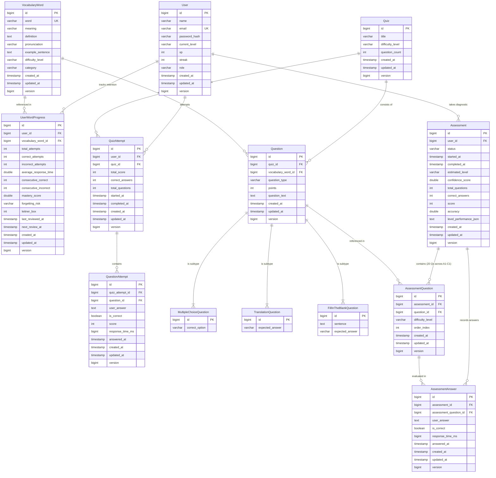

# Memora – AI Memory-Based Adaptive Vocabulary Learning Platform

An AI-powered, memory-adaptive personalized vocabulary learning platform engineered with modern enterprise Java and React, strictly adhering to **Advanced Object-Oriented Programming (OOP)** principles, design patterns, and clean architecture.

---

## 📌 Project Status

| Phase | Module | Status | Description |
| :--- | :--- | :--- | :--- |
| **Phase 1** | **Core Architecture & Scaffolding** | ✅ Completed | BaseEntity auditing, unified `ApiResponse<T>`, global exception handling, health checks. |
| **Phase 2** | **Security & Identity Management** | ✅ Completed | Stateless JWT authentication, BCrypt password hashing, Spring Security filter chain, `/api/v1/auth/*`, `/api/v1/users/me`. |
| **Phase 3** | **Vocabulary & Content Catalog** | ✅ Completed | Curated CEFR vocabulary dataset, data seeder, category filtering, `UserWordProgress` entity & progress tracking. |
| **Phase 4** | **Adaptive Memory SRS Engine** | ✅ Completed | **Strategy Pattern** (`SM2MemoryStrategy`, `LeitnerMemoryStrategy`), **Factory Pattern** (`MemoryStrategyFactory`), incremental latency tracking, mastery scoring, forgetting risk evaluation, `/api/v1/memory/*`. |
| **Phase 5** | **Quiz & Evaluation Engine** | ✅ Completed | **Polymorphic Question Models** (`MultipleChoiceQuestion`, `TranslationQuestion`, `FillInTheBlankQuestion`), **Factory Pattern** (`QuestionFactory`), **Strategy Pattern** (`QuestionEvaluatorStrategy`, `QuestionEvaluatorFactory`), attempt history, Memory Engine integration, `/api/v1/quizzes/*`. |
| **Phase 6** | **Assessment & Placement Engine** | ✅ Completed | 20-question multi-tier CEFR diagnostic assessment (`A1`–`C1`), **Strategy Pattern** (`PlacementAlgorithmStrategy`, `DefaultPlacementStrategy`, `PlacementStrategyFactory`), explainable confidence score calculation (0–100), response latency tracking, diagnostic attempt history, memory isolation, `/api/v1/assessments/*`. |
| **Phase 7** | **Adaptive Learning Path** | ⏳ Planned | Personalized learning roadmaps, weak-area remediation, and dynamic curriculum. |
| **Phase 8** | **Gamification & Event Bus** | ⏳ Planned | XP, streaks, badges, leaderboards, Spring event decoupling. |
| **Phase 9** | **AI Provider Integration** | ⏳ Planned | LLM adapters, sentence and mnemonic generation. |
| **Phase 10** | **React Frontend & UX** | ⏳ Planned | Modern responsive web application with dark mode & micro-animations. |

---

## 🛠️ Technology Stack

### Backend
* **Language & Runtime**: Java 20 / Java 21 (LTS)
* **Framework**: Spring Boot 3.3.4
* **Core Modules**: Spring Web (REST API), Spring Data JPA, Spring Security (Stateless JWT Authentication), Spring Validation
* **Database**: PostgreSQL (Production) / H2 In-Memory (Automated Testing)
* **Build Tool**: Apache Maven (`mvnw` / `mvnw.cmd`)
* **Architecture**: Layered Clean Architecture (`Controller → Service → Repository → Entity/Domain` with strict DTO boundaries)

---

## 📦 Active Backend Package Architecture (`com.memora`)

```text
com.memora/
├── MemoraApplication.java
├── common/
│   ├── controller/                 # HealthController (/api/v1/health)
│   ├── domain/                     # BaseEntity (Audit timestamps: createdAt, updatedAt, version)
│   ├── exception/                  # GlobalExceptionHandler, ResourceNotFoundException, BadRequestException, ApiException
│   └── response/                   # ApiResponse<T>, ErrorDetails, ValidationError
│
├── security/                       # Security & JWT Infrastructure
│   ├── jwt/                        # JwtTokenProvider, JwtAuthenticationFilter, JwtAuthenticationEntryPoint
│   ├── user/                       # CustomUserDetailsService, UserPrincipal
│   └── SecurityConfig.java         # Stateless security filter chain
│
└── modules/
    ├── user/                       # Identity & Learner Domain
    │   ├── domain/                 # Role, VocabularyLevel
    │   ├── dto/                    # RegistrationRequest, LoginRequest, AuthResponse, UserProfileResponse
    │   ├── entity/                 # User entity
    │   ├── repository/             # UserRepository
    │   └── service/                # UserService, UserServiceImpl
    │
    ├── vocabulary/                 # Lexical Catalog & Content
    │   ├── domain/                 # DifficultyLevel, WordCategory, ForgettingRisk
    │   ├── dto/                    # VocabularyWordRequest, VocabularyWordResponse, UserWordProgressResponse
    │   ├── entity/                 # VocabularyWord, UserWordProgress
    │   ├── repository/             # VocabularyWordRepository, UserWordProgressRepository
    │   ├── service/                # VocabularyService, UserWordProgressService
    │   └── config/                 # VocabularyDataSeeder (Initial curated dataset across CEFR levels A1-B2)
    │
    ├── memory/                     # Spaced Repetition & Retention Engine (Phase 4)
    │   ├── domain/                 # MemoryAlgorithmType (SM2, LEITNER), MemoryInput, MemoryCalculationResult
    │   ├── dto/                    # WordReviewRequest, WordReviewResponse, MemoryWordResponse
    │   ├── mapper/                 # MemoryMapper
    │   ├── service/                # MemoryService, MemoryServiceImpl
    │   ├── strategy/               # Strategy Pattern & Factory Pattern
    │   │   ├── MemoryAlgorithmStrategy.java   # Base strategy interface
    │   │   ├── SM2MemoryStrategy.java         # SuperMemo SM-2 algorithm
    │   │   ├── LeitnerMemoryStrategy.java     # 5-Box Leitner system
    │   │   └── MemoryStrategyFactory.java     # Strategy resolution factory
    │   └── controller/             # MemoryController (/api/v1/memory/*)
    │
    ├── quiz/                       # Quiz & Question Engine (Phase 5)
    │   ├── domain/                 # QuestionType (MULTIPLE_CHOICE, TRANSLATION, FILL_IN_THE_BLANK)
    │   ├── dto/                    # QuizGenerationRequest, QuizResponse, QuestionResponse, AnswerSubmissionRequest, AnswerResponse, QuizResultResponse, EvaluationResult
    │   ├── entity/                 # Polymorphic Question entities & Historical Attempts
    │   │   ├── Question.java (abstract base entity)
    │   │   ├── MultipleChoiceQuestion.java
    │   │   ├── TranslationQuestion.java
    │   │   ├── FillInTheBlankQuestion.java
    │   │   ├── Quiz.java
    │   │   ├── QuizAttempt.java
    │   │   └── QuestionAttempt.java
    │   ├── factory/                # Factory Pattern implementations
    │   │   ├── QuestionFactory.java           # Instantiates polymorphic Question subtypes
    │   │   └── QuestionEvaluatorFactory.java  # Resolves QuestionEvaluatorStrategy by QuestionType
    │   ├── repository/             # QuizRepository, QuestionRepository, QuizAttemptRepository, QuestionAttemptRepository
    │   ├── service/                # QuizService, QuizServiceImpl (orchestration & memory integration)
    │   ├── strategy/               # Strategy Pattern for polymorphic answer evaluation
    │   │   ├── QuestionEvaluatorStrategy.java # Evaluator contract
    │   │   ├── MultipleChoiceEvaluator.java
    │   │   ├── TranslationEvaluator.java
    │   │   └── FillInTheBlankEvaluator.java
    │   └── controller/             # QuizController (/api/v1/quizzes/*)
    │
    └── assessment/                 # Assessment & Diagnostic Placement Engine (Phase 6)
        ├── domain/                 # AssessmentStatus, AssessmentPerformance, PlacementResult
        ├── dto/                    # AssessmentStartResponse, AssessmentDetailResponse, AssessmentQuestionResponse, AssessmentAnswerRequest, AssessmentAnswerResponse, PlacementResultResponse
        ├── entity/                 # Diagnostic entities
        │   ├── Assessment.java                # Assessment session & final level estimation
        │   ├── AssessmentQuestion.java        # Question presentation order & CEFR level mapping
        │   └── AssessmentAnswer.java          # Learner response, correctness, & response latency
        ├── factory/                # PlacementStrategyFactory
        ├── repository/             # AssessmentRepository, AssessmentQuestionRepository, AssessmentAnswerRepository
        ├── service/                # AssessmentService, AssessmentServiceImpl, AssessmentQuestionGenerator
        ├── strategy/               # Strategy Pattern for CEFR placement algorithms
        │   ├── PlacementAlgorithmStrategy.java
        │   └── DefaultPlacementStrategy.java  # Deterministic CEFR proficiency estimation & confidence score
        └── controller/             # AssessmentController (/api/v1/assessments/*)
```

---

## 🏛️ Domain Entities & Database Schema



---

## 🧬 OOP Principles & Design Patterns Implemented

### 1. Polymorphism & Abstraction (Question Hierarchy)
* **`Question` Abstract Base Entity**: Unifies common question state (`vocabularyWord`, `points`, `questionType`, `questionText`, `quiz`) and prevents incomplete direct instantiation.
* **Concrete Subtypes**:
  * `MultipleChoiceQuestion`: Encapsulates options list (`@ElementCollection`) and `correctOption`.
  * `TranslationQuestion`: Encapsulates `expectedAnswer`.
  * `FillInTheBlankQuestion`: Encapsulates sentence structure with blank marker (`___`) and `expectedAnswer`.

### 2. Strategy Pattern (Polymorphic Question Evaluation)
* **`QuestionEvaluatorStrategy`**: Interface defining `evaluate(Question, String)` returning `EvaluationResult`.
* **Concrete Evaluators**: `MultipleChoiceEvaluator`, `TranslationEvaluator`, `FillInTheBlankEvaluator` implement type-specific validation rules, case-insensitivity, whitespace trimming, and feedback explanation.
* **`QuestionEvaluatorFactory`**: Automatically discovers and maps evaluator strategies by `QuestionType`, eliminating conditional `if-else`/`switch` branching in `QuizService`.

### 3. Factory Pattern (Question Creation)
* **`QuestionFactory`**: Encapsulates the instantiation of polymorphic `Question` subtypes, generating distractor pool choices for MCQs and sentence blanks for fill-in-the-blank questions.

### 4. Spaced Repetition Strategy & Memory Integration
* **`MemoryAlgorithmStrategy`** & **`MemoryStrategyFactory`**: Pluggable SM-2 (`SM2MemoryStrategy`) and Leitner (`LeitnerMemoryStrategy`) algorithms.
* **Quiz → Memory Flow**: Submitting each quiz answer automatically triggers `MemoryService.recordReview(...)` (defaulting to SM-2), instantly updating `UserWordProgress` (mastery score, forgetting risk, next review date) without duplicating memory logic.

### 5. Encapsulation & Historical Persistence
* Historical learner attempts are permanently preserved in `QuizAttempt` and `QuestionAttempt` (recording latency `responseTimeMs`, points, correctness, and timestamps) without overwriting past performance.
* Similarly, `Assessment`, `AssessmentQuestion`, and `AssessmentAnswer` record full diagnostic histories, allowing learners to re-assess later while preserving historical placement milestones.

### 6. Strategy Pattern & Diagnostic Placement Engine (Phase 6)
* **`PlacementAlgorithmStrategy`**: Pluggable algorithm contract `calculate(List<AssessmentPerformance>)` producing `PlacementResult`.
* **`DefaultPlacementStrategy`**: Rule-based deterministic estimation evaluating sequential CEFR mastery thresholds (`A1` → `A2` → `B1` → `B2` → `C1`) at a 75% accuracy threshold. Computes an explainable confidence score (0–100) based on sample completeness, response latency plausibility, boundary separation, and natural language decay consistency.
* **`PlacementStrategyFactory`**: Dynamically resolves placement strategies without hardcoding score branching in the service layer.
* **Separation of Concerns & Memory Isolation**: Diagnostic assessment questions isolate testing from spaced repetition retention tracking (`MemoryService` is NOT invoked during diagnostic assessments).

---

## 🌐 Implemented REST API Endpoints

### 1. Authentication (`/api/v1/auth`)
* `POST /api/v1/auth/register` — Register a new learner account
* `POST /api/v1/auth/login` — Authenticate and retrieve JWT token

### 2. User Profile (`/api/v1/users`)
* `GET  /api/v1/users/me` — Retrieve active learner profile and stats (Requires JWT)

### 3. Vocabulary Catalog (`/api/v1/vocabulary`)
* `GET  /api/v1/vocabulary` — List all vocabulary words (Public)
* `GET  /api/v1/vocabulary/{id}` — Get word definition and metadata (Public)
* `GET  /api/v1/vocabulary/search?query=...` — Search vocabulary by keyword (Public)
* `GET  /api/v1/vocabulary/level/{level}` — Filter by CEFR difficulty level (`A1`–`C2`) (Public)
* `GET  /api/v1/vocabulary/category/{category}` — Filter by topic category (Public)
* `POST /api/v1/vocabulary` — Create a new vocabulary word (Admin/Authenticated)

### 4. User Word Progress (`/api/v1/progress`)
* `GET  /api/v1/progress/words` — List all progress records for authenticated user
* `GET  /api/v1/progress/words/{wordId}` — Get progress for a specific word
* `POST /api/v1/progress/words/{wordId}/init` — Initialize progress tracking for a word
* `GET  /api/v1/progress/weak` — Retrieve learner's weak words
* `GET  /api/v1/progress/review` — Retrieve words due for review

### 5. Adaptive Memory Engine (`/api/v1/memory`)
* `POST /api/v1/memory/review` — Record learner review attempt and calculate next review schedule
* `GET  /api/v1/memory/due` — Retrieve vocabulary words due for spaced repetition review (`nextReviewAt <= now`)
* `GET  /api/v1/memory/weak` — Retrieve learner's weakest words ranked by forgetting risk and mastery score

### 6. Quiz & Question Engine (`/api/v1/quizzes`)
* `POST /api/v1/quizzes/generate` — Deterministically generate a new quiz from vocabulary pool
* `POST /api/v1/quizzes/{quizId}/start` — Start or resume a quiz attempt session
* `POST /api/v1/quizzes/{quizId}/questions/{questionId}/answer` — Submit answer, evaluate, record latency, update memory retention
* `POST /api/v1/quizzes/{quizId}/complete` — Complete quiz attempt and calculate total score/percentage
* `GET  /api/v1/quizzes/{quizId}` — Retrieve quiz details and questions (omits correct answers)
* `GET  /api/v1/quizzes/{quizId}/result` — Retrieve latest attempt score and performance summary

### 7. Assessment & Placement Engine (`/api/v1/assessments`)
* `POST /api/v1/assessments/start` — Start a new 20-question diagnostic assessment (4 questions each from A1, A2, B1, B2, C1)
* `GET  /api/v1/assessments/{assessmentId}` — Retrieve assessment details, progress, and questions without answers
* `POST /api/v1/assessments/{assessmentId}/questions/{questionId}/answer` — Submit answer and latency for a diagnostic question
* `POST /api/v1/assessments/{assessmentId}/complete` — Complete assessment, execute placement algorithm, update learner CEFR level
* `GET  /api/v1/assessments/{assessmentId}/result` — Retrieve placement result, CEFR level estimate, and confidence score
* `GET  /api/v1/assessments/history` — Retrieve all completed historical placement assessments for the learner

---

## 📝 Example Assessment Workflow API Usage

### 1. Start Assessment: `POST /api/v1/assessments/start`
**Headers**: `Authorization: Bearer <JWT_TOKEN>`  
**Response**:
```json
{
  "success": true,
  "message": "Assessment started successfully",
  "data": {
    "assessmentId": 1,
    "status": "IN_PROGRESS",
    "totalQuestions": 20,
    "questions": [
      {
        "questionId": 101,
        "questionType": "MULTIPLE_CHOICE",
        "questionText": "What is the meaning of 'ubiquitous'?",
        "options": ["present everywhere", "rare", "slow", "fragile"],
        "difficultyLevel": "C1"
      }
    ]
  }
}
```

### 2. Submit Question Answer: `POST /api/v1/assessments/1/questions/101/answer`
**Headers**: `Authorization: Bearer <JWT_TOKEN>`  
**Body**:
```json
{
  "answer": "present everywhere",
  "responseTimeMs": 1850
}
```
**Response**:
```json
{
  "success": true,
  "message": "Answer evaluated successfully",
  "data": {
    "correct": true,
    "feedback": "Correct! Well done.",
    "responseTimeMs": 1850
  }
}
```

### 3. Complete Assessment: `POST /api/v1/assessments/1/complete`
**Headers**: `Authorization: Bearer <JWT_TOKEN>`  
**Response**:
```json
{
  "success": true,
  "message": "Assessment completed successfully",
  "data": {
    "assessmentId": 1,
    "estimatedLevel": "B1",
    "confidenceScore": 85.0,
    "totalQuestions": 20,
    "correctAnswers": 14,
    "accuracy": 70.0,
    "levelPerformance": {
      "A1": 100.0,
      "A2": 100.0,
      "B1": 75.0,
      "B2": 50.0,
      "C1": 25.0
    }
  }
}
```

---

## 💻 Getting Started (Backend)

### 1. Prerequisites
* **Java**: JDK 20 or 21 installed (`java -version`)
* **Database**: PostgreSQL 14+ (or runs seamlessly on H2 in-memory for testing)
* **Build Tool**: Maven Wrapper (`.\mvnw.cmd` on Windows, `./mvnw` on Linux/macOS)

### 2. Build & Run Application
```powershell
# Compile and package
.\mvnw.cmd clean package

# Run Spring Boot backend
.\mvnw.cmd spring-boot:run
```

### 3. Running Automated Tests
```powershell
# Run the complete test suite (98 tests across Phase 1–6 modules)
.\mvnw.cmd clean test
```

### 4. Health Check Verification
```bash
curl -X GET http://localhost:8080/api/v1/health
```
