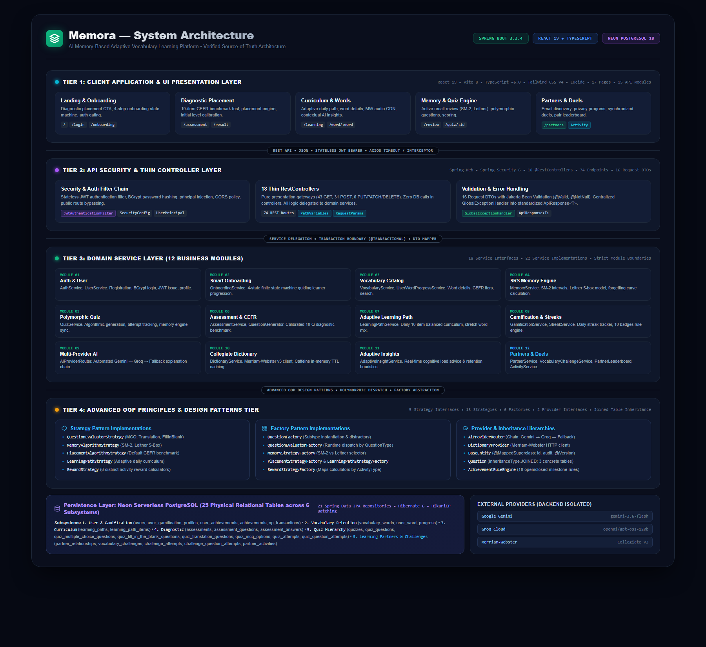
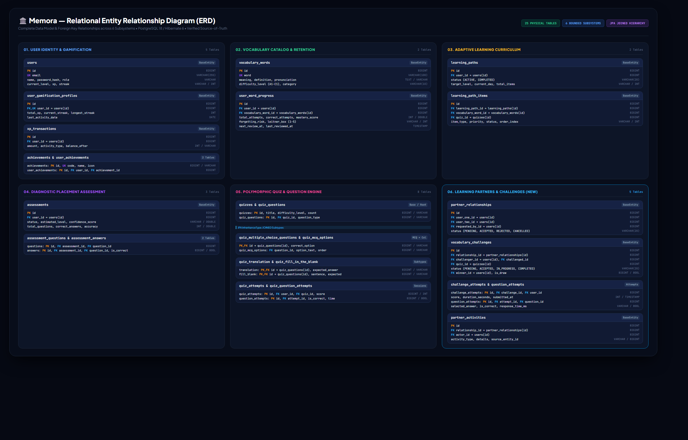

# Memora — AI Memory-Based Adaptive Vocabulary Learning Platform

> **An AI-powered, memory-adaptive personalized vocabulary learning platform engineered with modern enterprise Java and React, strictly adhering to Advanced Object-Oriented Programming (OOP) principles, design patterns, and clean layered architecture.**

---

## 📑 Table of Contents

1. [Project Overview](#-project-overview)
2. [Key Features](#-key-features)
3. [System Architecture Diagram](#-system-architecture-diagram)
4. [Entity Relationship Diagram (ERD)](#-entity-relationship-diagram-erd)
5. [Advanced OOP Concepts Implemented](#-advanced-oop-concepts-implemented)
6. [Design Patterns Implemented](#-design-patterns-implemented)
7. [Controller Layer & Request Objects](#-controller-layer--request-objects)
8. [REST API Documentation](#-rest-api-documentation)
9. [Technology Stack](#-technology-stack)
10. [Repository & Project Structure](#-repository--project-structure)
11. [Setup & Installation Instructions](#-setup--installation-instructions)
12. [Automated Testing & Verification](#-automated-testing--verification)
13. [End-to-End User Journey](#-end-to-end-user-journey)
14. [Future Scope](#-future-scope)

---

## 🌟 Project Overview

### The Problem
Traditional language and vocabulary learning applications suffer from three critical pedagogical flaws:
1. **Static, Non-Adaptive Curricula**: Learners of varying proficiencies are forced through rigid, one-size-fits-all word lists rather than receiving content tailored to their Common European Framework of Reference for Languages (CEFR) capability.
2. **The Ebbinghaus Forgetting Curve**: Without algorithmic spaced repetition, learners rapidly forget newly acquired vocabulary within 48 to 72 hours of initial study.
3. **Passive, Unmotivated Engagement**: Lack of active recall practice, immediate pedagogical feedback, and auditable gamification incentives leads to high learner drop-off.

### The Solution: Memora
**Memora** is an adaptive, memory-driven personalized vocabulary learning platform designed to optimize long-term lexical retention. By fusing cognitive spaced repetition algorithms, multi-tier diagnostic CEFR placement, polymorphic quiz evaluations, multi-provider AI pedagogical assistance, and real-time gamification, Memora adapts dynamically to each learner's unique memory state.

* **Adaptive Vocabulary Learning**: Dynamically assesses learner mastery, balances new lexical introductions against retention reviews, and incorporates advanced "stretch" vocabulary when high retention is demonstrated.
* **Memory-Based Revision (Spaced Repetition)**: Implements dual algorithms—SuperMemo-2 (SM-2) with exponential interval expansion and the 5-box Leitner partition system—calculating real-time forgetting risk (`LOW`, `MEDIUM`, `HIGH`, `CRITICAL`).
* **Diagnostic Placement Assessment**: A compact 10-question multi-tier CEFR diagnostic benchmark (A1–C1) placing learners at their calibrated diagnostic proficiency tier and difficulty frontier.
* **Personalized Daily Learning Path**: Schedules up to 10 prioritized curricular tasks per day (review items, new words, stretch vocabulary, and consolidating quizzes) dynamically regenerated from live memory metrics.
* **Auditable Gamification**: Cumulative experience points (XP), calendar-day boundary safe daily streaks, 10 unlockable milestone badges, an immutable XP transaction ledger, and a privacy-preserving global leaderboard.
* **Multi-Provider AI Learning Assistant**: Deep-dive contextual explanations, CEFR-calibrated examples, mnemonic memory tips, and collocation analyses powered by Google Gemini and Groq fast-inference with deterministic offline fallback.
* **Collegiate Dictionary Integration**: Official Merriam-Webster Collegiate Dictionary integration delivering authoritative syllabification, IPA phonetics, and native pronunciation audio CDN streams.
* **Enterprise Persistence**: Built on cloud-hosted Neon Serverless PostgreSQL 18 with high-throughput JDBC batching and optimistic locking.

---

## 🚀 Key Features

| Category | Implemented Features |
| :--- | :--- |
| **Authentication & Security** | Stateless JWT authentication, BCrypt password hashing, Spring Security 6 filter chain, account isolation, CORS configuration, server-derived user principal (`Authentication.getName()`). |
| **Diagnostic Placement** | Compact 10-question assessment across calibrated CEFR tiers (`A1`, `A2`, `B1`, `B2`, `C1`), millisecond latency tracking, sequential mastery progression (100% advances, 50% frontier halts, 0% halts), explainable confidence rating (0–100), mid-session resumption resilience. |
| **Smart Onboarding UX** | 4-state domain-driven finite state machine (`ONBOARDING_REQUIRED` → `ASSESSMENT_IN_PROGRESS` → `LEARNING_PATH_REQUIRED` → `LEARNING_ACTIVE`), locked dashboard view (`LockedOnboardingView`) with 10-Q placement preview, non-intrusive navigation locking with toast feedback, defensive route protection (`LearningRouteGuard`). |
| **Adaptive Learning Path** | Individualized daily roadmap (max 10 items), balanced review vs new word ratio, advanced stretch words for mastery >= 90%, dynamic path regeneration (`POST /regenerate`), calendar day progression. |
| **Word Study Experience** | Focused Word Study Modal (`WordStudyModal`) mounted via React Portal (`createPortal`) to isolate stacking context, responsive viewport bounds (`100dvh`), background scroll locking, Merriam-Webster native audio CDN playback, CEFR level badge, multi-sense definitions, example sentences with audio, idempotent reward feedback (+15 XP). |
| **Spaced Repetition Memory (SRS)** | Pluggable SM-2 (`SM2MemoryStrategy`) and Leitner 5-box (`LeitnerMemoryStrategy`), real-time forgetting risk evaluation (`LOW`, `MEDIUM`, `HIGH`, `CRITICAL`), mastery probability calculation (0.0–1.0), due review scheduling (`GET /api/v1/memory/due`). |
| **Spaced Repetition Review** | Active recall flashcard session (`/review`), 4 randomized definition options with keyboard accessibility (`1–4`, `Enter ↵`), immediate visual pedagogical feedback, memory delta telemetry (mastery delta, risk update, new interval), +5 XP review reward. |
| **Polymorphic Quiz Engine** | Algorithmic quiz generation from vocabulary pool, 3 polymorphic question types (Multiple Choice with distractor pool, Translation, Fill-in-the-Blank with blank indicators), server-side strategy evaluation (`QuestionEvaluatorStrategy`), answer latency tracking, automatic SRS memory sync, session completion summary with mistake review list. |
| **Gamification & Profile** | Multi-activity XP rewards (`QuizRewardStrategy`, `LessonRewardStrategy`, etc.), calendar-day safe daily streaks (`StreakService`), 10 unlockable milestone badges (`AchievementRuleEngine`), immutable XP transaction audit ledger (`XpTransaction`), global top-20 leaderboard with podium showcase, profile stats. |
| **Collegiate Dictionary** | Real-time Merriam-Webster Collegiate Dictionary lookup (`/dictionary`), HTTP/2 `RestClient`, written IPA/phonetics, syllabification dots, multi-sense definitions, etymology, alternate spelling suggestion chips, bounded thread-safe in-memory cache (30-min TTL). |
| **Multi-Provider AI Assistant** | Centralized router (`AiProviderRouter`) supporting `auto`, `gemini`, `groq`, `fallback` policies, multi-model Google Gemini fallback chain (`gemini-3.6-flash`), Groq fast-inference client (`openai/gpt-oss-120b`), deterministic offline educational generator, grammatical collocation validation (`CollocationValidator`), in-memory cache (`AiResponseCache`). |
| **Learning Partners & Social Duels** | Exact email partner search, canonical pairing state machine (`PENDING` → `ACCEPTED`/`REJECTED`/`CANCELLED`), privacy-safe progress sharing, synchronous competitive vocabulary challenges with shared question sets, pair-only partner leaderboard, and chronological partner activity feed with deterministic deduplication. |
| **Adaptive Insights** | Real-time cognitive load & retention health diagnostics (`/api/v1/insights/today`), retention probability metrics, prioritized daily study recommendations. |
| **Cloud Persistence** | Neon Serverless PostgreSQL 18 (AWS Cloud) via HikariCP, `reWriteBatchedInserts=true` multi-row statement batch rewriting, Hibernate JDBC batching (`batch_size: 50`), N+1 query elimination via JPQL `JOIN FETCH` and `@BatchSize(50)`, isolated in-memory H2 database for test execution. |

---

## 🏛️ System Architecture Diagram

The diagram below reflects the actual multi-tier enterprise architecture implemented across the frontend, stateless security layer, thin presentation controllers, domain services, design patterns, repositories, and cloud persistence:



### Architectural Tiers:
1. **Tier 1: Client Application Layer (React 19 + TypeScript + Vite 8 + Tailwind CSS v4)**:
   - Responsive presentation views: Landing Page, Dashboard, Diagnostic Assessment Runner (10-Q), Word Study Modal (React Portal), Spaced Repetition Review (`/review`), Polymorphic Quiz Runner (`/quiz/:id`), Collegiate Dictionary Explorer (`/dictionary`), Gamification Leaderboard/Achievements, and Learning Partners Hub (`/partners`) with competitive duels and activity feed.
   - State management: `AuthContext` (token persistence & user profile), `OnboardingContext` (global state & feature locking), `ToastContext` (non-intrusive notifications).
   - Audio: Native HTML5 Audio integrating Merriam-Webster pronunciation audio CDN with Web Speech API fallback.
2. **Tier 2: Security Layer & Thin Controller Gateways (Spring Web + Spring Security)**:
   - Security Filter Chain: Stateless JWT authentication filter (`JwtAuthenticationFilter`), BCrypt password encoder, CORS filter (`CORS_ALLOWED_ORIGINS`), unauthorized access handlers (`JwtAuthenticationEntryPoint`, `JwtAccessDeniedHandler`).
   - 18 `@RestController` Presentation Gateways: Strictly validate request payloads and delegate business orchestration to domain services. Zero direct database queries or algorithm logic in controllers.
   - Validation & Error Interception: 16 Request DTOs annotated with Jakarta Bean Validation (`@Valid`). Centralized `GlobalExceptionHandler` intercepting validation, resource, and authentication exceptions into standardized `ApiResponse<T>` envelopes.
3. **Tier 3: Domain Service Layer (12 Bounded Business Modules)**:
   - `AuthService`, `UserService`, `OnboardingService`, `VocabularyService`, `UserWordProgressService`, `MemoryService`, `QuizService`, `AssessmentService`, `LearningPathService`, `GamificationService`, `StreakService`, `AchievementService`, `PartnerService`, `PartnerLeaderboardService`, `PartnerActivityService`, `VocabularyChallengeService`, `AIExplanationService`, `DictionaryService`, `AdaptiveInsightService`.
4. **Tier 4: Advanced OOP Principles & Design Patterns Layer**:
   - Strategy Pattern implementations for question evaluation, memory algorithms, placement estimation, curriculum generation, XP rewards, and milestone rules.
   - Factory Pattern implementations for polymorphic question creation and strategy resolution.
   - Multi-Provider Router & Chain of Responsibility for cloud AI failover.
   - Provider / Adapter Pattern for dictionary integration.
   - JPA Joined Table Inheritance for polymorphic database entities.
5. **Tier 5: Persistence & Cloud Infrastructure Layer**:
   - 21 Spring Data JPA Repositories interacting with Neon PostgreSQL 18 via HikariCP connection pool.
   - High-throughput JDBC batch rewriting (`reWriteBatchedInserts=true`, `hibernate.jdbc.batch_size=50`) batching multi-row statement inserts to minimize database round-trips.
   - Isolated in-memory H2 database executing automated unit and integration tests with zero external cloud dependencies.

---

## 🗄️ Entity Relationship Diagram (ERD)

The following ERD represents the current persistent relational data model of Memora across all **25 database tables** and 6 subsystems, managed by Hibernate / JPA 3.x on PostgreSQL:



### Database Schema Breakdown (25 Tables Across 6 Subsystems):

```text
1. User Management & Gamification Subsystem (5 Tables)
   ├── users (Core learner accounts, credentials, CEFR level, XP, streak, role)
   ├── user_gamification_profiles (1:1 with users; cumulative total XP, current & longest streaks)
   ├── xp_transactions (Immutable audit ledger recording all XP awards, activity types, and balance snapshots)
   ├── achievements (Master catalog of milestone badges, requirements, Lucide icons, XP bonuses)
   └── user_achievements (Junction table enforcing unique, idempotent badge unlock timestamps)

2. Vocabulary & Spaced Repetition Subsystem (2 Tables)
   ├── vocabulary_words (Master lexical dictionary, normalized headwords, CEFR level A1–C2, meanings, definitions, phonetics)
   └── user_word_progress (Spaced repetition retention state: Leitner box 1–5, mastery score 0–1, forgetting risk, review dates)

3. Polymorphic Quiz Engine Subsystem (8 Tables)
   ├── quizzes (Quiz session metadata, target difficulty level, total question count)
   ├── quiz_questions (Abstract polymorphic base table; FK to quiz, FK to vocabulary word, points, prompt text)
   ├── quiz_multiple_choice_questions (InheritanceType.JOINED; shared PK with quiz_questions, correct option)
   ├── quiz_mcq_options (@ElementCollection table; stores MCQ choice strings with 0-indexed order)
   ├── quiz_translation_questions (InheritanceType.JOINED; shared PK with quiz_questions, expected translation)
   ├── quiz_fill_in_the_blank_questions (InheritanceType.JOINED; shared PK with quiz_questions, sentence blank, expected word)
   ├── quiz_attempts (Learner quiz session attempts, total score, correct count, start & completion timestamps)
   └── quiz_question_attempts (Granular question-by-question attempt logs: user answer, correctness, score, response time ms)

4. Diagnostic Placement Assessment Subsystem (3 Tables)
   ├── assessments (Diagnostic session: status, estimated CEFR level, confidence score, total questions, accuracy, JSON breakdown)
   ├── assessment_questions (Calibrated 10-item diagnostic benchmark questions, CEFR tier A1–C1, sequential order index)
   └── assessment_answers (Granular diagnostic answer submissions: user answer, evaluation correctness, response time ms)

5. Adaptive Learning Path Curriculum Subsystem (2 Tables)
   ├── learning_paths (Learner daily roadmap: target level, current day index, total items, completed items)
   └── learning_path_items (Scheduled curriculum items: NEW_WORD, REVIEW_WORD, QUIZ_CHECKPOINT, priority, scheduled timestamp)

6. Learning Partner & Competitive Challenge Subsystem (5 Tables)
   ├── partner_relationships (Canonical pair ordering userOne.id < userTwo.id, status PENDING/ACCEPTED/REJECTED/CANCELLED)
   ├── vocabulary_challenges (Head-to-head competitive duels, CEFR tier, question count, shared quiz reference, scores, winner)
   ├── challenge_attempts (Participant-specific duel attempt tracking, score, correct count, start & completion timestamps)
   ├── challenge_question_attempts (Granular question-by-question duel answers, correctness, score, and response latency ms)
   └── partner_activities (Privacy-safe social activity feed, deterministic event identity, XP awards, and audit trail)
```

### Relational Integrity & Key Constraints:
* **`BaseEntity` Foundation**: Every primary entity inherits from `BaseEntity` (`@MappedSuperclass`), providing auto-incrementing identity primary keys (`IDENTITY`), UTC audit timestamps (`created_at`, `updated_at`), and optimistic concurrency locking (`@Version bigint version`).
* **JPA Joined Table Inheritance (`InheritanceType.JOINED`)**: `quiz_questions` serves as the shared base table, while child tables (`quiz_multiple_choice_questions`, `quiz_translation_questions`, `quiz_fill_in_the_blank_questions`) share the identical primary key (`id PK, FK -> quiz_questions.id`), eliminating nullable sparse columns and ensuring database normalization.
* **Idempotent Constraints**: Composite unique constraint `UNIQUE (user_id, achievement_id)` prevents duplicate badge unlocks; `UNIQUE (word)` prevents duplicate lexical headwords; `UNIQUE (email)` enforces unique learner logins.
* **Cascade Deletion**: Gamification profiles (`user_gamification_profiles`), XP transaction ledgers (`xp_transactions`), and earned achievements (`user_achievements`) cascade delete on user account removal (`ON DELETE CASCADE`).

---

## 🧬 Advanced OOP Concepts Implemented

As an **Advanced Object-Oriented Programming Laboratory** project, Memora is engineered to rigorously demonstrate the core tenets of OOP:

### 1. Encapsulation
* **Domain Entity State Protection**: Domain entities declare all instance fields `private` and provide controlled access through validated getters and domain mutation methods.
  - `Assessment.recordAnswer(boolean isCorrect, int points)` encapsulates score accumulation and accuracy recalculation within the entity rather than allowing external services to manipulate raw numeric counters.
  - `UserWordProgress` encapsulates Leitner box transitions (advancing on correct recall, resetting to Box 1 on failure) and consecutive streak updates.
  - `XpTransaction` encapsulates an immutable audit snapshot: once persisted, transaction amounts, activity types, and resulting balances cannot be altered.
* **Request DTO Encapsulation**: Client-submitted HTTP payloads are encapsulated within strongly typed Request DTOs (e.g., `WordReviewRequest`, `AnswerSubmissionRequest`) annotated with Jakarta Bean Validation, preventing loose parameter pollution across controller signatures.

### 2. Abstraction
* **Layer Supertype (`BaseEntity`)**: Defines the abstract contract for persistent entities (`@MappedSuperclass`), abstracting auto-generated primary keys, creation/modification timestamps, and optimistic locking logic (`@Version`) from child entities.
* **Abstract Base Entity (`Question`)**: Abstract class `Question` defines the foundational contract for quiz items (`vocabularyWord`, `points`, `questionType`, `questionText`, `quiz`). It cannot be directly instantiated, enforcing concrete polymorphic specializations.
* **Service Interfaces**: Across the platform, 18 clean service interface contracts (`AuthService`, `UserService`, `MemoryService`, `QuizService`, `AssessmentService`, `LearningPathService`, `GamificationService`, `DictionaryService`, `AIExplanationService`, `OnboardingService`, `PartnerService`, `VocabularyChallengeService`, etc.) separate client callers from concrete implementation details (`*ServiceImpl`).
* **External Provider Abstractions**: `AiProvider` and `DictionaryProvider` abstract third-party cloud APIs, allowing external vendors to be swapped or mocked with zero disruption to domain services.

### 3. Inheritance
* **JPA Joined Table Inheritance Hierarchy**:
  ```text
  BaseEntity (@MappedSuperclass)
      └── Question (@Entity, @Inheritance(strategy = InheritanceType.JOINED))
            ├── MultipleChoiceQuestion (@Entity, @Table("quiz_multiple_choice_questions"))
            ├── TranslationQuestion (@Entity, @Table("quiz_translation_questions"))
            └── FillInTheBlankQuestion (@Entity, @Table("quiz_fill_in_the_blank_questions"))
  ```
  - Subclasses inherit common properties (`points`, `questionText`, `vocabularyWord`) while declaring subtype-specific properties (`options` list, `correctOption`, `sentence`, `expectedAnswer`).
* **Class Hierarchies**: All 24 persistent domain entities inherit from `BaseEntity`. Custom application exceptions inherit from `ApiException` which extends `RuntimeException`.

### 4. Polymorphism
* **Runtime Polymorphic Dispatch in Evaluation**:
  - `QuestionEvaluatorStrategy.evaluate(Question question, String answer)` operates polymorphically on concrete `Question` subtypes. At runtime, the caller invokes `evaluator.evaluate(...)` without needing to cast or verify the concrete subtype.
* **Polymorphic XP Reward Calculations**:
  - `RewardStrategy.calculateXp(RewardContext context)` is invoked polymorphically across 6 distinct reward calculation algorithms (Quiz, Lesson, Review, Daily Path, Streak, Assessment) based on the triggering activity.
* **Polymorphic Spaced Repetition**:
  - `MemoryAlgorithmStrategy.calculate(MemoryInput input)` polymorphically selects between SuperMemo-2 (`SM2MemoryStrategy`) interval calculations and Leitner 5-box partition updates (`LeitnerMemoryStrategy`).
* **Multi-Provider AI Execution**:
  - `AiProvider.generate(String prompt, String targetLevel)` is polymorphically dispatched across `GeminiAiProvider`, `GroqAiProvider`, and `FallbackAiProvider`.

### 5. Interfaces
* **Interface-Driven Architecture**: Used extensively across the platform to enforce contracts, promote loose coupling, and enable dependency inversion (SOLID principles). Key interfaces include:
  - `QuestionEvaluatorStrategy`, `MemoryAlgorithmStrategy`, `PlacementAlgorithmStrategy`, `LearningPathStrategy`, `RewardStrategy`, `AchievementRule`.
  - `AiProvider`, `DictionaryProvider`.
  - Spring Data JPA Repository interfaces (`UserRepository`, `QuizRepository`, etc.) extending `JpaRepository<T, ID>`.

### 6. Composition
* **Entity Composition with Lifecycle Cascades**:
  - `Quiz` is composed of a `List<Question>` (`@OneToMany(cascade = CascadeType.ALL, orphanRemoval = true)`).
  - `Assessment` is composed of `List<AssessmentQuestion>` and `List<AssessmentAnswer>`.
  - `LearningPath` is composed of `List<LearningPathItem>`.
  - `User` is composed with `UserGamificationProfile` via a strict `1:1` relationship (`@OneToOne(cascade = CascadeType.ALL, orphanRemoval = true)`).
  - Composition is preferred over inheritance for behavioral integration: `QuizService` *has-a* `MemoryService`, `GamificationService`, and `QuestionEvaluatorFactory`.

---

## 🎨 Design Patterns Implemented

> ⚠️ **Architectural Honesty Note**: Only design patterns genuinely implemented in the Memora codebase are documented below. Patterns that were merely considered or planned (such as *Observer Pattern* or *Command Pattern*) were searched across the repository and are **NOT** claimed.

### 1. Strategy Pattern
* **Where Used**:
  1. `QuestionEvaluatorStrategy`: Answer evaluation across question types (`MultipleChoiceEvaluator`, `TranslationEvaluator`, `FillInTheBlankEvaluator`).
  2. `MemoryAlgorithmStrategy`: Spaced repetition algorithms (`SM2MemoryStrategy`, `LeitnerMemoryStrategy`).
  3. `PlacementAlgorithmStrategy`: Diagnostic placement scoring (`DefaultPlacementStrategy`).
  4. `LearningPathStrategy`: Adaptive curriculum generation (`AdaptiveLearningPathStrategy`).
  5. `RewardStrategy`: Gamification XP calculation across activities (`QuizRewardStrategy`, `LessonRewardStrategy`, `ReviewRewardStrategy`, `DailyPathRewardStrategy`, `StreakRewardStrategy`, `AssessmentRewardStrategy`).
  6. `AchievementRule`: Milestone badge qualification rules (10 concrete rules in `com.memora.modules.gamification.rule`).
* **Why Used**: Enables algorithms to vary independently from the clients that use them, eliminating rigid `if-else` and `switch` statements and adhering to the Open/Closed Principle.
* **Example Contract**:
  ```java
  public interface QuestionEvaluatorStrategy {
      EvaluationResult evaluate(Question question, String submittedAnswer);
      QuestionType getSupportedQuestionType();
  }
  ```

### 2. Factory Pattern
* **Where Used**:
  1. `QuestionFactory`: Encapsulates instantiation of polymorphic `Question` subclasses (`MultipleChoiceQuestion`, `TranslationQuestion`, `FillInTheBlankQuestion`), generating distractor choices from vocabulary pools.
  2. `QuestionEvaluatorFactory`: Discovers and maps `QuestionEvaluatorStrategy` beans by `QuestionType`.
  3. `MemoryStrategyFactory`: Maps and returns `MemoryAlgorithmStrategy` by `MemoryAlgorithmType` (`SM2`, `LEITNER`).
  4. `PlacementStrategyFactory`: Resolves `PlacementAlgorithmStrategy` implementations.
  5. `LearningPathStrategyFactory`: Resolves `LearningPathStrategy` implementations.
  6. `RewardStrategyFactory`: Injects and maps `RewardStrategy` beans by `RewardActivityType`.
* **Why Used**: Centralizes object creation and strategy resolution logic, ensuring callers remain decoupled from concrete classes.
* **Example Implementation**:
  ```java
  @Component
  public class QuestionEvaluatorFactory {
      private final Map<QuestionType, QuestionEvaluatorStrategy> evaluators;

      public QuestionEvaluatorFactory(List<QuestionEvaluatorStrategy> strategyList) {
          this.evaluators = strategyList.stream()
                  .collect(Collectors.toMap(QuestionEvaluatorStrategy::getSupportedQuestionType, s -> s));
      }

      public QuestionEvaluatorStrategy getEvaluator(QuestionType type) {
          QuestionEvaluatorStrategy evaluator = evaluators.get(type);
          if (evaluator == null) {
              throw new IllegalArgumentException("Unsupported question type: " + type);
          }
          return evaluator;
      }
  }
  ```

### 3. Multi-Provider Router & Chain of Responsibility Pattern
* **Where Used**: Multi-provider AI architecture (`com.memora.modules.ai.provider`).
* **Why Used**: Orchestrates multi-cloud AI generation with safe, zero-loop fallback. When configured to `auto`, `AiProviderRouter` attempts Google Gemini (`gemini-3.6-flash`); if rate-limited (HTTP 429) or unavailable, it automatically falls back to Groq Cloud (`openai/gpt-oss-120b`); if Groq fails or is unconfigured, it gracefully falls back to the deterministic offline `FallbackAiProvider`. Guarantees a maximum of 2 cloud attempts per request with zero duplicate calls.
* **Example Classes**: `AiProviderRouter` (`@Primary`), `GeminiAiProvider`, `GroqAiProvider`, `FallbackAiProvider`.

### 4. Provider / Adapter Pattern
* **Where Used**: Collegiate Dictionary integration (`com.memora.modules.dictionary.client`).
* **Why Used**: The `DictionaryProvider` interface defines a vendor-neutral contract (`fetchWordEntries(String word)`), while `MerriamWebsterDictionaryApiClient` adapts the official Merriam-Webster Collegiate HTTP/2 JSON API into normalized internal domain DTOs (`DictionaryResponse`).
* **Example Interface**: `DictionaryProvider.java` implemented by `MerriamWebsterDictionaryApiClient.java`.

### 5. Layer Supertype / MappedSuperclass Pattern
* **Where Used**: `com.memora.common.domain.BaseEntity`.
* **Why Used**: Centralizes primary key generation (`id`), audit timestamp tracking (`createdAt`, `updatedAt`), and optimistic concurrency control (`@Version version`) across all 24 persistent domain entities without table duplication.

### 6. Data Transfer Object (DTO) & Mapper Pattern
* **Where Used**: Across all domain modules (`com.memora.modules.*.dto` and `mapper`).
* **Why Used**: Decouples internal database entities from external REST API contracts. Mappers (`VocabularyWordMapper`, `UserWordProgressMapper`, `MemoryMapper`, `PartnerMapper`, `ChallengeMapper`) ensure sensitive or internal state (e.g., password hashes, entity versions) is never leaked to the client.

---

## 🎮 Controller Layer & Request Objects

Memora strictly follows modern enterprise Spring Boot and RESTful API standards. The entire controller layer has been audited and verified:

> 📖 **Comprehensive Audit Document**: For the complete endpoint-by-endpoint audit, constraint declarations, and architectural justifications, refer to [`CONTROLLER_REQUEST_OBJECT.md`](./CONTROLLER_REQUEST_OBJECT.md) (formerly `CONTROLLER_REQUEST_OBJECT_AUDIT.md`).

### Controller Inventory Summary:
* **Total `@RestController` Classes**: Exactly **18 controllers** across 10 modules.
* **Total REST Endpoints**: Exactly **74 distinct handler methods** (**75 mapped HTTP route paths**: 43 GET methods [44 mapped paths], 31 POST methods, 0 PUT, 0 PATCH, 0 DELETE).
* **Dedicated Request DTOs**: Exactly **16 Request DTO classes** mapped directly to endpoints accepting structured request bodies (14 mandatory, 2 optional), plus 1 child item DTO (`ChallengeAnswerRequest`) making 17 total Request DTO classes:
  - **14 Mandatory Request-Body Endpoints (`required = true`)**: `RegistrationRequest`, `LoginRequest`, `VocabularyWordRequest`, `WordReviewRequest`, `AnswerSubmissionRequest`, `AssessmentAnswerRequest`, `AiExplanationRequest`, `AiExampleRequest`, `AiMemoryTipRequest`, `AiUsageRequest`, `AiWordRelationsRequest`, `SendPartnerRequestDto`, `CreateChallengeRequest`, `SubmitChallengeRequest`.
  - **2 Optional Request-Body Endpoints (`@Valid @RequestBody(required = false)`)**: `QuizGenerationRequest` (defaults to A1 with 5 questions if omitted), `LearningItemCompletionRequest` (allows simple curriculum item completion without body or optional review telemetry).
* **No Primitive Parameter Anti-Patterns**: No endpoint accepts loose primitive arguments for data-submission endpoints.
* **Path Variables (`@PathVariable`)**: 23 handler methods utilize path variables strictly for discrete resource identification or lifecycle action triggers on existing entities.
* **Query Parameters (`@RequestParam`)**: Retained strictly on idempotent HTTP `GET` endpoints for search filtering, pagination, and limits.
* **Authentication Derived from Security Context**: All authenticated endpoints resolve learner identity strictly from Spring Security's authenticated principal (`Authentication.getName()`). Request DTOs never accept client-supplied `userId` fields, preventing identity spoofing.
* **Thin Controller Architecture**: Controllers contain zero business algorithms, memory math, or direct database queries; they act solely as presentation gateways delegating to domain services and wrapping responses in `ApiResponse<T>`.

## 🌐 REST API Documentation

Below is the concise catalog of all 74 implemented endpoints (75 mapped route paths) organized by domain module:

### 1. System Health
* `GET  /api/v1/health` — Liveness diagnostic probe & service version metadata (Public)

### 2. Authentication & Identity (`/api/v1/auth`, `/api/v1/users`)
* `POST /api/v1/auth/register` — Register a new learner account (`RegistrationRequest`)
* `POST /api/v1/auth/login` — Authenticate and retrieve JWT token (`LoginRequest`)
* `GET  /api/v1/users/me` — Retrieve active learner profile and identity (JWT required)

### 3. Smart Onboarding Flow (`/api/v1/onboarding`)
* `GET  /api/v1/onboarding/state` — Derive active learner onboarding state (`ONBOARDING_REQUIRED`, `ASSESSMENT_IN_PROGRESS`, `LEARNING_PATH_REQUIRED`, `LEARNING_ACTIVE`) (JWT required)

### 4. Vocabulary Catalog (`/api/v1/vocabulary`)
* `GET  /api/v1/vocabulary` — List all vocabulary words (Public)
* `GET  /api/v1/vocabulary/{id}` — Get word definition and metadata by ID (Public)
* `GET  /api/v1/vocabulary/search` — Search vocabulary by query parameter keyword (Public)
* `GET  /api/v1/vocabulary/level/{level}` — Filter by CEFR difficulty level (`A1`–`C1`) (Public)
* `GET  /api/v1/vocabulary/category/{category}` — Filter by topic category (Public)
* `GET  /api/v1/vocabulary/random` — Sample random vocabulary words (Public)
* `POST /api/v1/vocabulary` — Create a new vocabulary word (`VocabularyWordRequest`) (Admin)

### 5. User Word Progress (`/api/v1/progress`)
* `GET  /api/v1/progress/words` — List all progress records for authenticated user (JWT required)
* `GET  /api/v1/progress/words/{wordId}` — Get progress for a specific word (JWT required)
* `POST /api/v1/progress/words/{wordId}/init` — Initialize progress tracking for a word (JWT required)
* `GET  /api/v1/progress/weak` — Retrieve learner's weak words (JWT required)
* `GET  /api/v1/progress/review` — Retrieve words due for spaced repetition review (JWT required)

### 6. Adaptive Memory SRS Engine (`/api/v1/memory`)
* `POST /api/v1/memory/review` — Record review attempt and calculate next review schedule (`WordReviewRequest`) (JWT required)
* `GET  /api/v1/memory/due` — Retrieve vocabulary words due for review (`nextReviewAt <= now`) (JWT required)
* `GET  /api/v1/memory/weak` — Retrieve weakest words ranked by forgetting risk (JWT required)

### 7. Polymorphic Quiz Engine (`/api/v1/quizzes`)
* `POST /api/v1/quizzes/generate` — Generate quiz from vocabulary pool (`QuizGenerationRequest`, optional) (Public)
* `POST /api/v1/quizzes/{quizId}/start` — Start or resume quiz attempt session (JWT required)
* `POST /api/v1/quizzes/{quizId}/questions/{questionId}/answer` — Submit answer, evaluate, update SRS (`AnswerSubmissionRequest`) (JWT required)
* `POST /api/v1/quizzes/{quizId}/complete` — Complete quiz attempt and award XP/achievements (JWT required)
* `GET  /api/v1/quizzes/{quizId}` — Retrieve quiz details and questions (omits correct answers) (Public)
* `GET  /api/v1/quizzes/{quizId}/result` — Retrieve attempt score and performance summary (JWT required)

### 8. Diagnostic Placement Assessment (`/api/v1/assessments`)
* `POST /api/v1/assessments/start` — Start or resume compact 10-Q diagnostic assessment (JWT required)
* `GET  /api/v1/assessments/{assessmentId}` — Retrieve assessment questions without answers (JWT required)
* `POST /api/v1/assessments/{assessmentId}/questions/{questionId}/answer` — Submit diagnostic answer (`AssessmentAnswerRequest`) (JWT required)
* `POST /api/v1/assessments/{assessmentId}/complete` — Complete assessment, execute CEFR placement, award XP (JWT required)
* `GET  /api/v1/assessments/{assessmentId}/result` — Retrieve placement result, CEFR level, confidence score (JWT required)
* `GET  /api/v1/assessments/history` — Retrieve completed historical assessments (JWT required)

### 9. Adaptive Learning Path (`/api/v1/learning-path`)
* `POST /api/v1/learning-path/start` — Start or resume active personalized learning path (JWT required)
* `GET  /api/v1/learning-path/current` — Retrieve active learning path summary and item status (JWT required)
* `GET  /api/v1/learning-path/today` — Retrieve today's prioritized learning tasks (JWT required)
* `POST /api/v1/learning-path/items/{itemId}/start` — Mark learning item as in-progress (JWT required)
* `POST /api/v1/learning-path/items/{itemId}/complete` — Mark item completed (`LearningItemCompletionRequest`, optional) (JWT required)
* `POST /api/v1/learning-path/regenerate` — Dynamically regenerate pending items based on memory state (JWT required)
* `POST /api/v1/learning-path/advance` — Advance curriculum to next calendar day (JWT required)
* `GET  /api/v1/learning-path/history` — Retrieve historical learning path records (JWT required)

### 10. Profile & Gamification (`/api/v1/profile`, `/api/v1/leaderboard`, `/api/v1/achievements`)
* `GET  /api/v1/profile` — Retrieve gamification profile (total XP, level, streaks) (JWT required)
* `GET  /api/v1/profile/xp-history` — Retrieve paginated immutable XP audit ledger (`page`, `size`) (JWT required)
* `GET  /api/v1/profile/achievements` — Retrieve achievements with user unlock status (JWT required)
* `GET  /api/v1/profile/stats` — Retrieve aggregated learner statistics (JWT required)
* `GET  /api/v1/leaderboard` — Retrieve global privacy-preserving leaderboard (`limit`) (Public)
* `GET  /api/v1/achievements` — List master catalog of all available achievements (Public)

### 11. Multi-Provider AI & Insights (`/api/v1/ai`, `/api/v1/insights`)
* `POST /api/v1/ai/word-explanation` — Contextual AI word explanation (`AiExplanationRequest`) (JWT required)
* `POST /api/v1/ai/example` — CEFR-calibrated example sentence generation (`AiExampleRequest`) (JWT required)
* `POST /api/v1/ai/memory-tip` — Cognitive mnemonic retention tip generation (`AiMemoryTipRequest`) (JWT required)
* `POST /api/v1/ai/contextual-usage` — Contextual register & collocation analysis (`AiUsageRequest`) (JWT required)
* `POST /api/v1/ai/word-relations` — Linguistic relations (synonyms, antonyms, word families) (`AiWordRelationsRequest`) (JWT required)
* `GET  /api/v1/insights/today` — Deterministic adaptive learner insights & memory health diagnosis (JWT required)

### 12. Collegiate Dictionary (`/api/v1/dictionary`)
* `GET  /api/v1/dictionary/{word}` — Real-time Merriam-Webster lookup with phonetics and native audio CDN stream (JWT required)
* `GET  /api/v1/dictionary/public/{word}` — Public dictionary lookup without authentication (alias: `/api/v1/dictionary/public-lookup/{word}`) (Public)

### 13. Learning Partners, Competitive Duels & Activity Feed (`/api/v1/partners`)
* `GET  /api/v1/partners` — List all active accepted learning partners (JWT required)
* `GET  /api/v1/partners/search` — Search users by query string or exact email (`query` or `email` param) (JWT required)
* `POST /api/v1/partners/requests` — Send partner connection request (`SendPartnerRequestDto`) (JWT required)
* `GET  /api/v1/partners/requests` — List incoming and outgoing partner requests (returns `PartnerRequestsSummaryResponse`) (JWT required)
* `POST /api/v1/partners/requests/{id}/accept` — Accept partner invitation (JWT required)
* `POST /api/v1/partners/requests/{id}/reject` — Reject partner invitation (JWT required)
* `POST /api/v1/partners/requests/{id}/cancel` — Cancel sent partner request (JWT required)
* `POST /api/v1/partners/{partnerId}/terminate` — Terminate an accepted learning partnership (JWT required)
* `GET  /api/v1/partners/{partnerId}/progress` — View privacy-safe partner progress (JWT required)
* `GET  /api/v1/partners/leaderboard` — Pair-only learning partner leaderboard ranked by Total XP (JWT required)
* `GET  /api/v1/partners/activity` — Chronological partner activity feed with deterministic deduplication (JWT required)
* `POST /api/v1/partners/challenges` — Initiate competitive vocabulary duel (`CreateChallengeRequest`) (JWT required)
* `GET  /api/v1/partners/challenges` — List user's active/historical challenges (`status` optional) (JWT required)
* `GET  /api/v1/partners/challenges/{id}` — Get challenge details (JWT required)
* `POST /api/v1/partners/challenges/{id}/accept` — Accept pending challenge invitation (JWT required)
* `POST /api/v1/partners/challenges/{id}/decline` — Decline pending challenge invitation (JWT required)
* `POST /api/v1/partners/challenges/{id}/cancel` — Cancel created challenge (JWT required)
* `GET  /api/v1/partners/challenges/{id}/questions` — Retrieve challenge questions with answer keys hidden (JWT required)
* `POST /api/v1/partners/challenges/{id}/submit` — Submit duel attempt (`SubmitChallengeRequest`) (JWT required)
* `GET  /api/v1/partners/challenges/{id}/result` — Retrieve duel outcome, winner/draw, score breakdown (JWT required)

## 🛠️ Technology Stack

### Backend
* **Language & Runtime**: Java 20 / Java 21 (LTS)
* **Framework**: Spring Boot 3.3.4
* **Security**: Spring Security 6 (Stateless JWT with HMAC-SHA256, BCrypt password hashing)
* **Data Access**: Spring Data JPA, Hibernate 6
* **Database**: Neon Serverless PostgreSQL 18 (AWS Cloud, SSL enabled)
  - Connection Pool: HikariCP (`maximum-pool-size: 10`, `minimum-idle: 2`)
  - WAN Optimization: `reWriteBatchedInserts=true` multi-row statement rewriting
  - Hibernate Batching: `batch_size: 50`, `order_inserts: true`, `order_updates: true`
* **Test Database**: Embedded H2 In-Memory (`MODE=PostgreSQL`, `ddl-auto: create-drop`)
* **Build Tool**: Apache Maven (`mvnw` / `mvnw.cmd`)
* **Validation**: Jakarta Bean Validation (`@Valid`, constraints)

### Frontend
* **Core Runtime**: React 19, TypeScript 5.5, Vite 8
* **Styling & Design System**: Tailwind CSS v4, PostCSS, Google Fonts (*Plus Jakarta Sans*, *JetBrains Mono*)
* **Routing & State**: React Router DOM v7, React Context API (`AuthContext`, `OnboardingContext`, `ToastContext`)
* **HTTP Client**: Axios (Bearer token interceptor, automated 401 handling, unified unwrap)
* **Audio & Media**: HTML5 Web Audio API integrating Merriam-Webster pronunciation audio CDN
* **Icons & Visualization**: Lucide React, Recharts (retention decay visualizations)
* **Utilities**: clsx, tailwind-merge

### AI & External Integrations
* **Primary Cloud AI**: Google Gemini Generative Language API (`gemini-3.6-flash`)
* **Secondary Fast-Inference Cloud AI**: Groq Cloud Chat Completions API (`openai/gpt-oss-120b`)
* **Deterministic Fallback**: Local rule-based educational generator for zero-outage offline resilience
* **Collegiate Dictionary**: Merriam-Webster Collegiate Dictionary API (HTTP/2 via Spring `RestClient`)

---

## 📁 Repository & Project Structure

```text
Memora/
├── src/                                        # Spring Boot backend source code
│   ├── main/
│   │   ├── java/com/memora/
│   │   │   ├── MemoraApplication.java          # Application entry point
│   │   │   ├── common/                         # BaseEntity, ApiResponse, GlobalExceptionHandler
│   │   │   ├── security/                       # SecurityConfig, JWT services, UserPrincipal
│   │   │   └── modules/
│   │   │       ├── user/                       # Identity, AuthController, UserRepository
│   │   │       ├── onboarding/                 # OnboardingController, OnboardingService
│   │   │       ├── vocabulary/                 # VocabularyWord, UserWordProgress, DataSeeder
│   │   │       ├── memory/                     # SM-2 & Leitner strategies, MemoryService
│   │   │       ├── quiz/                       # Polymorphic Question entities, Evaluator strategies
│   │   │       ├── assessment/                 # Calibrated 10-Q diagnostic assessment & placement
│   │   │       ├── learningpath/               # AdaptiveLearningPathStrategy, daily curriculum
│   │   │       ├── gamification/               # Streaks, AchievementRuleEngine, XP audit ledger
│   │   │       ├── partner/                    # PartnerRelationship, PartnerController, Pair Leaderboard, Activity Feed
│   │   │       │   └── challenge/              # VocabularyChallenge, Duels, Attempt Evaluation, ChallengeController
│   │   │       ├── ai/                         # Multi-provider router (Gemini, Groq, Fallback)
│   │   │       └── dictionary/                 # Merriam-Webster Collegiate API client & caching
│   │   └── resources/
│   │       ├── application.yml                 # Core config with env var placeholders
│   │       └── application-dev.yml             # Dev profile settings
│   └── test/                                   # 58 test classes (384 automated tests, H2 DB)
├── pom.xml                                     # Maven dependencies and build plugins
├── mvnw / mvnw.cmd                             # Maven wrapper executables
├── run-backend.ps1 / run-backend.cmd           # Local development runner scripts
│
├── frontend/                                   # React 19 + TypeScript + Vite Application
│   ├── public/                                 # Static assets, hero illustrations, avatars
│   ├── src/
│   │   ├── api/                                # Axios client modules for API endpoints (15 API modules)
│   │   ├── components/
│   │   │   ├── ui/                             # Reusable Button, Card, Badge, Modal, ProgressBar
│   │   │   ├── layout/                         # AppShell, Sidebar, TopHeader, MobileNav, Navbar
│   │   │   ├── vocabulary/                     # WordStudyModal, WordStudyAiActions
│   │   │   ├── dashboard/                      # LockedOnboardingView, AiLearningInsightCard
│   │   │   └── landing/                        # HeroSection (3D ecosystem), HowItWorks, Stats
│   │   ├── context/                            # AuthContext, OnboardingContext, ToastContext
│   │   ├── pages/                              # Landing, Dashboard, Assessment, LearnPath, Review, Quiz, Partners, Profile
│   │   ├── routes/                             # ProtectedRoute, LearningRouteGuard, AppRoutes
│   │   └── types/                              # TypeScript interfaces matching backend DTOs
│   ├── index.html                              # HTML entry with font imports
│   ├── package.json                            # Dependencies & scripts
│   ├── tsconfig.json                           # Strict TypeScript configuration
│   └── vite.config.ts                          # Vite build & API proxy setup
│
├── docs/
│   └── diagrams/
│       ├── system-architecture.png             # Rendered 2x System Architecture Diagram
│       └── memora-erd.png                      # Rendered 2x Relational ERD Diagram (25 tables across 6 subsystems)
│
├── CONTROLLER_REQUEST_OBJECT.md                # 18-controller, 74-endpoint, 16-Request DTO compliance report
├── ERD.md                                      # Complete data dictionary & database specification (25 tables across 6 subsystems)
├── .env.example                                # Safe environment variable template (No secrets)
├── .gitignore                                  # Git exclusion rules (.env, target, dist, node_modules)
└── README.md                                   # Master project documentation
```

---

## 💻 Setup & Installation Instructions

### 1. Prerequisites
* **Java Development Kit**: JDK 20 or JDK 21 installed (`java -version`)
* **Node.js & npm**: Node.js v18+ and npm 9+ installed (`node -v`, `npm -v`)
* **Git**: Installed and configured

### 2. Environment Configuration
Create a local `.env` file at the repository root based on `.env.example`:
```bash
cp .env.example .env
```
Populate `.env` with your credentials (the file is strictly excluded by `.gitignore`):
```env
# Neon PostgreSQL Database Configuration
DB_URL=jdbc:postgresql://<neon-host>/<database>?sslmode=require
DB_USERNAME=<neon-username>
DB_PASSWORD=<neon-password>

# Memora Multi-Provider AI Configuration
MEMORA_AI_PROVIDER=auto # auto, gemini, groq, fallback

# Primary Provider (Google Gemini)
MEMORA_GEMINI_API_KEY=<gemini-api-key>
MEMORA_AI_MODEL=gemini-3.6-flash

# Secondary Provider (Groq Fast Inference)
MEMORA_GROQ_API_KEY=<groq-api-key>
MEMORA_GROQ_MODEL=openai/gpt-oss-120b

# Merriam-Webster Collegiate Dictionary API
MEMORA_MERRIAM_WEBSTER_API_KEY=<merriam-webster-api-key>
MEMORA_DICTIONARY_PROVIDER=merriam-webster
```
*(Note: If external AI or dictionary keys are omitted, Memora automatically falls back to its deterministic offline educational provider).*

### 3. Running the Backend
#### Recommended (PowerShell / Windows):
```powershell
.\run-backend.ps1
```
#### Windows CMD:
```cmd
.\run-backend.cmd
```
#### Standard Maven Command:
```bash
# Windows
.\mvnw.cmd spring-boot:run

# Linux / macOS
./mvnw spring-boot:run
```
The backend initializes on `http://localhost:8080`. Verify liveness via:
```bash
curl http://localhost:8080/api/v1/health
```

### 4. Running the Frontend
```bash
# Navigate to frontend directory
cd frontend

# Install dependencies
npm install

# Start development server with hot-reload
npm run dev
```
The application will open at `http://localhost:5173`. Network requests to `/api/*` are automatically proxied to `http://localhost:8080`.

---

## 🧪 Automated Testing & Verification

The Memora platform has undergone complete regression and end-to-end verification:

### 1. Backend Automated Test Suite
```bash
.\mvnw.cmd test
```
* **Verified Test Results**:
  ```text
  [INFO] -------------------------------------------------------
  [INFO]  T E S T S
  [INFO] -------------------------------------------------------
  [INFO] Tests run: 384, Failures: 0, Errors: 0, Skipped: 0
  [INFO] -------------------------------------------------------
  [INFO] BUILD SUCCESS
  [INFO] -------------------------------------------------------
  ```
* **Coverage**: All 58 test classes across all domain modules passed cleanly, including core module controller integration test suites, partner integration tests, horizontal privilege escalation isolation tests, and MockMvc controller test suites.
* **Test Isolation**: All tests execute on embedded in-memory H2 database (`MODE=PostgreSQL`) with zero external network or database calls. External AI and dictionary HTTP clients are mocked using `MockRestServiceServer`.

### 2. Frontend TypeScript Compilation
```bash
npx tsc --noEmit
```
* **Result**: **0 errors**, clean exit code 0. All frontend types strictly mirror backend DTO schemas.

### 3. Production Build Validation
```bash
npm run build
```
* **Result**: **2536 modules transformed**, production bundle compiled in `dist/` with exit code 0.

### 4. Runtime Cloud Persistence
* Normal application runtime has been verified against remote cloud **Neon Serverless PostgreSQL 18** with active statement batching (`reWriteBatchedInserts=true`).

---

## 🔄 End-to-End User Journey

The complete learner progression flow is illustrated below:

```text
┌─────────────────────────┐
│     Learner Signs Up    │  POST /api/v1/auth/register (JWT issued)
└────────────┬────────────┘
             ▼
┌─────────────────────────┐
│ Locked Onboarding View  │  GET /api/v1/onboarding/state -> ONBOARDING_REQUIRED
│ (Editorial Hero + CTA)  │  Features locked (🔒) with toast notifications
└────────────┬────────────┘
             ▼
┌─────────────────────────┐
│ Compact 10-Q Assessment │  POST /api/v1/assessments/start (A1–C1 tiers, ~2 min)
│ (Diagnostic Benchmark)  │  Deterministic MCQ, Translation, Fill-in-Blank cycling
└────────────┬────────────┘
             ▼
┌─────────────────────────┐
│ CEFR Placement & Score  │  POST /api/v1/assessments/{id}/complete
│ (Mastery & Confidence)  │  DefaultPlacementStrategy assigns level + XP bonus
└────────────┬────────────┘
             ▼
┌─────────────────────────┐
│ "Build My Learning Path"│  POST /api/v1/learning-path/start
│ (Platform Full Unlock)  │  Unlocks dashboard, sidebar, and all learning routes
└────────────┬────────────┘
             ▼
┌─────────────────────────┐
│ Daily Curriculum Roadmap│  GET /api/v1/learning-path/today (Balanced max 10 tasks)
└──────┬───────────┬──────┘
       │           │
       ▼           ▼
┌──────────────┐ ┌──────────────┐
│  Word Study  │ │  SRS Review  │  Interactive flashcards (/review), active recall,
│ (WordStudy   │ │ (Active      │  SM-2 interval expansion, Leitner box transitions,
│  Modal)      │ │  Recall)     │  real-time forgetting risk recalculation (+5 XP)
└──────┬───────┘ └──────┬───────┘
       │                │
       └───────┬────────┘
               ▼
┌─────────────────────────┐
│ Consolidating Quiz Run  │  POST /api/v1/quizzes/{id}/questions/{id}/answer
│ (Polymorphic Questions) │  Immediate feedback, memory retention sync, +10 XP
└────────────┬────────────┘
             ▼
┌─────────────────────────┐
│ Gamification Rewards    │  XpTransaction ledger, streak incrementation,
│ & Milestone Badges      │  AchievementRuleEngine evaluates 10 unlockable badges
└────────────┬────────────┘
             ▼
┌─────────────────────────┐
│ Dictionary & AI Assist  │  Merriam-Webster native audio CDN playback,
│ (Deep-Dive Exploration) │  Multi-provider AI mnemonics, collocations, register
└────────────┬────────────┘
             ▼
┌─────────────────────────┐
│ Learning Partners &     │  POST /api/v1/partners/requests (Email/search discovery)
│ Synchronous Duels       │  GET  /api/v1/partners/{partnerId}/progress (Privacy-safe)
│ (Collaborative Growth)  │  POST /api/v1/partners/challenges (Synchronized duels)
└────────────┬────────────┘  GET  /api/v1/partners/leaderboard & /activity feed
             ▼
┌─────────────────────────┐
│ Profile, Stats & Rank   │  Retention curves, CEFR distribution, paginated
│ (Adaptive Insights)     │  XP history, global privacy-preserving leaderboard
└─────────────────────────┘
```

---

## 🔮 Future Scope

The following architectural and product enhancements are identified for future development iterations (clearly designated as future work):

1. **Native Mobile Applications**: Developing cross-platform mobile applications using React Native or Flutter, utilizing background sync for offline spaced repetition reviews.
2. **Expanded Target Languages**: Extending beyond English vocabulary acquisition to include Spanish, French, German, Japanese, and Mandarin Chinese with language-specific morphological parsers.
3. **AI Speech Recognition & Pronunciation Assessment**: Integrating OpenAI Whisper or WebRTC audio streaming to evaluate learner spoken pronunciation against native phonetic models in real time.
4. **Graph-Based Lexical Knowledge Network**: Implementing a Neo4j graph database to model semantic relationships, antonyms, synonyms, and etymological root trees for contextual word clustering.
5. **Advanced Bayesian Knowledge Tracing (BKT)**: Enhancing the spaced repetition engine with Bayesian Knowledge Tracing to model latent cognitive retention probability across multi-skill linguistic domains.

---

## 👨‍💻 Course & Project Metadata

* **Institution**: United International University (UIU)
* **Course**: Advanced Object-Oriented Programming Laboratory
* **Platform**: Memora (Adaptive Personalized Vocabulary Learning Platform)
* **Status**: **Fully Verified & Ready for University Submission**
* **Verification**: 384/384 Backend Tests Passed • TypeScript 0 Errors • Production Build Passed • Neon PostgreSQL Runtime Verified
