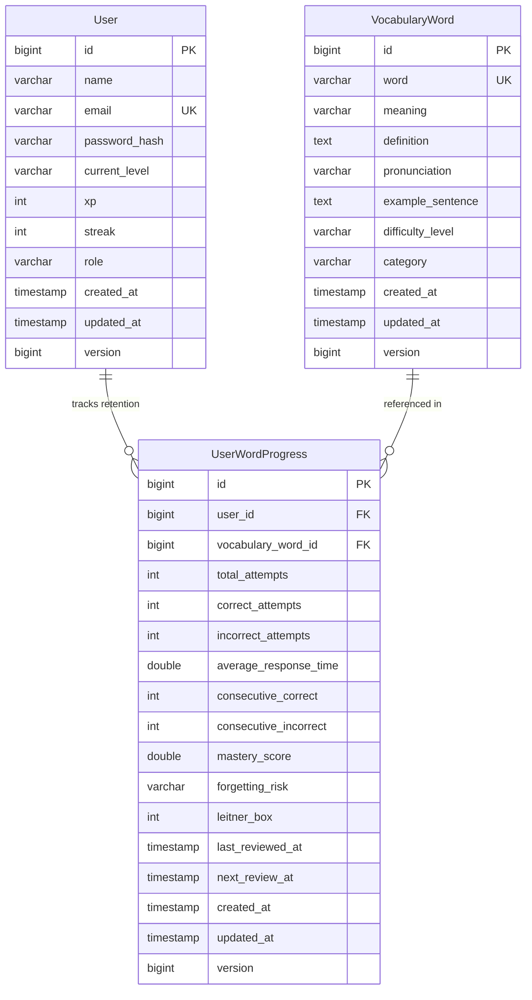

# Memora – AI Memory-Based Adaptive Vocabulary Learning Platform

An AI-powered, memory-adaptive personalized vocabulary learning platform engineered with modern enterprise Java and React, strictly adhering to **Advanced Object-Oriented Programming (OOP)** principles, design patterns, and clean architecture.

---

## 📌 Project Status

| Phase | Module | Status | Description |
| :--- | :--- | :--- | :--- |
| **Phase 1** | **Core Architecture & Scaffolding** | ✅ Completed | BaseEntity auditing, unified `ApiResponse<T>`, global exception handling, health checks. |
| **Phase 2** | **Security & Identity Management** | ✅ Completed | Stateless JWT authentication, BCrypt password hashing, Spring Security filter chain, `/api/v1/auth/*`, `/api/v1/users/me`. |
| **Phase 3** | **Vocabulary & Content Catalog** | ✅ Completed | Curated CEFR vocabulary dataset, data seeder, category filtering, `UserWordProgress` entity & progress tracking. |
| **Phase 4** | **Adaptive Memory SRS Engine** | ✅ Completed | **Strategy Pattern** (`SM2MemoryStrategy`, `LeitnerMemoryStrategy`), **Factory Pattern** (`MemoryStrategyFactory`), incremental latency tracking, mastery scoring, forgetting risk evaluation, `/api/v1/memory/*`. |
| **Phase 5** | **Quiz & Evaluation Engine** | ⏳ Planned | Polymorphic question models, evaluators, session workflows. |
| **Phase 6** | **Placement Test & Learning Paths** | ⏳ Planned | Diagnostic assessment and dynamic learning roadmaps. |
| **Phase 7** | **Gamification & Event Bus** | ⏳ Planned | XP, streaks, badges, leaderboards, Spring event decoupling. |
| **Phase 8** | **AI Provider Integration** | ⏳ Planned | LLM adapters, sentence and mnemonic generation. |
| **Phase 9** | **React Frontend & UX** | ⏳ Planned | Modern responsive web application with dark mode & micro-animations. |

---

## 🛠️ Technology Stack

### Backend
* **Language & Runtime**: Java 20 / Java 21 (LTS)
* **Framework**: Spring Boot 3.3.4
* **Core Modules**: Spring Web (REST API), Spring Data JPA, Spring Security (Stateless JWT Authentication), Spring Validation
* **Database**: PostgreSQL (Production) / H2 In-Memory (Automated Testing)
* **Build Tool**: Apache Maven (`mvnw` / `mvnw.cmd`)
* **Architecture**: Layered Clean Architecture (`Controller → Service → Repository → Entity/Domain` with strict DTO boundaries)

---

## 📦 Active Backend Package Architecture (`com.memora`)

```text
com.memora/
├── MemoraApplication.java
├── common/
│   ├── controller/                 # HealthController (/api/v1/health)
│   ├── domain/                     # BaseEntity (Audit timestamps: createdAt, updatedAt, version)
│   ├── exception/                  # GlobalExceptionHandler, ResourceNotFoundException, BadRequestException, ApiException
│   └── response/                   # ApiResponse<T>, ErrorDetails, ValidationError
│
├── security/                       # Security & JWT Infrastructure
│   ├── jwt/                        # JwtTokenProvider, JwtAuthenticationFilter, JwtAuthenticationEntryPoint
│   ├── user/                       # CustomUserDetailsService, UserPrincipal
│   └── SecurityConfig.java         # Stateless security filter chain
│
└── modules/
    ├── user/                       # Identity & Learner Domain
    │   ├── domain/                 # Role, VocabularyLevel
    │   ├── dto/                    # RegistrationRequest, LoginRequest, AuthResponse, UserProfileResponse
    │   ├── entity/                 # User entity
    │   ├── repository/             # UserRepository
    │   └── service/                # UserService, UserServiceImpl
    │
    ├── vocabulary/                 # Lexical Catalog & Content
    │   ├── domain/                 # DifficultyLevel, WordCategory, ForgettingRisk
    │   ├── dto/                    # VocabularyWordRequest, VocabularyWordResponse, UserWordProgressResponse
    │   ├── entity/                 # VocabularyWord, UserWordProgress
    │   ├── repository/             # VocabularyWordRepository, UserWordProgressRepository
    │   ├── service/                # VocabularyService, UserWordProgressService
    │   └── config/                 # VocabularyDataSeeder (Initial curated dataset across CEFR levels A1-B2)
    │
    └── memory/                     # Spaced Repetition & Retention Engine (Phase 4)
        ├── domain/                 # MemoryAlgorithmType (SM2, LEITNER), MemoryInput, MemoryCalculationResult
        ├── dto/                    # WordReviewRequest, WordReviewResponse, MemoryWordResponse
        ├── mapper/                 # MemoryMapper
        ├── service/                # MemoryService, MemoryServiceImpl
        ├── strategy/               # Strategy Pattern & Factory Pattern
        │   ├── MemoryAlgorithmStrategy.java   # Base strategy interface
        │   ├── SM2MemoryStrategy.java         # SuperMemo SM-2 algorithm
        │   ├── LeitnerMemoryStrategy.java     # 5-Box Leitner system
        │   └── MemoryStrategyFactory.java     # Strategy resolution factory
        └── controller/             # MemoryController (/api/v1/memory/*)
```

---

## 🏛️ Domain Entities & Database Schema



---

## 🧬 OOP Principles & Design Patterns Implemented

### 1. Strategy Pattern & Polymorphism (Memory Engine)
* **`MemoryAlgorithmStrategy`**: Defines the abstraction for calculating spaced repetition schedules and retention decay.
* **`SM2MemoryStrategy`**: Implements SuperMemo SM-2 algorithm, adjusting intervals based on consecutive correct streaks, accuracy, and response speed modifiers.
* **`LeitnerMemoryStrategy`**: Implements a 5-box Leitner system with box promotions/demotions and exponential review schedules.
* **Decoupled Value Objects**: `MemoryInput` and `MemoryCalculationResult` completely isolate mathematical calculations from JPA entity details.

### 2. Factory Pattern & Dependency Inversion
* **`MemoryStrategyFactory`**: Automatically aggregates all `MemoryAlgorithmStrategy` Spring beans into an unmodifiable map indexed by `MemoryAlgorithmType`.
* **Zero `instanceof` Checks**: `MemoryServiceImpl` delegates purely through the strategy abstraction without conditional branching.

### 3. Encapsulation & Single Responsibility
* **Controller**: Handles HTTP request parsing, payload validation, and responses.
* **Service**: Orchestrates authentication context, entity state transitions, incremental metrics, and persistence.
* **Strategy**: Encapsulates spaced repetition mathematics and forgetting curve modeling.
* **Repository**: Handles database interactions with indexed queries (`user_id + next_review_at`, `user_id + forgetting_risk`).

---

## 🌐 Implemented REST API Endpoints

### 1. Authentication (`/api/v1/auth`)
* `POST /api/v1/auth/register` — Register a new learner account
* `POST /api/v1/auth/login` — Authenticate and retrieve JWT token

### 2. User Profile (`/api/v1/users`)
* `GET  /api/v1/users/me` — Retrieve active learner profile and stats (Requires JWT)

### 3. Vocabulary Catalog (`/api/v1/vocabulary`)
* `GET  /api/v1/vocabulary` — List all vocabulary words (Public)
* `GET  /api/v1/vocabulary/{id}` — Get word definition and metadata (Public)
* `GET  /api/v1/vocabulary/search?query=...` — Search vocabulary by keyword (Public)
* `GET  /api/v1/vocabulary/level/{level}` — Filter by CEFR difficulty level (`A1`–`C2`) (Public)
* `GET  /api/v1/vocabulary/category/{category}` — Filter by topic category (Public)
* `POST /api/v1/vocabulary` — Create a new vocabulary word (Admin/Authenticated)

### 4. User Word Progress (`/api/v1/progress`)
* `GET  /api/v1/progress/words` — List all progress records for authenticated user
* `GET  /api/v1/progress/words/{wordId}` — Get progress for a specific word
* `POST /api/v1/progress/words/{wordId}/init` — Initialize progress tracking for a word
* `GET  /api/v1/progress/weak` — Retrieve learner's weak words
* `GET  /api/v1/progress/review` — Retrieve words due for review

### 5. Adaptive Memory Engine (`/api/v1/memory`)
* `POST /api/v1/memory/review` — Record learner review attempt and calculate next review schedule
* `GET  /api/v1/memory/due` — Retrieve vocabulary words due for spaced repetition review (`nextReviewAt <= now`)
* `GET  /api/v1/memory/weak` — Retrieve learner's weakest words ranked by forgetting risk and mastery score

---

## 📝 Example Memory Review API Usage

### Request: `POST /api/v1/memory/review`
**Headers**: `Authorization: Bearer <JWT_TOKEN>`  
**Body**:
```json
{
  "vocabularyWordId": 1,
  "correct": true,
  "responseTimeMs": 1800,
  "algorithm": "SM2"
}
```

### Response:
```json
{
  "success": true,
  "message": "Review recorded and memory schedule updated successfully",
  "data": {
    "wordId": 1,
    "word": "serendipity",
    "correct": true,
    "masteryScore": 76.5,
    "forgettingRisk": "LOW",
    "nextReviewAt": "2026-09-03T12:30:00Z",
    "reviewIntervalDays": 3,
    "algorithm": "SM2"
  },
  "timestamp": "2026-08-31T12:30:00Z"
}
```

---

## 💻 Getting Started (Backend)

### 1. Prerequisites
* **Java**: JDK 20 or 21 installed (`java -version`)
* **Database**: PostgreSQL 14+ (or runs seamlessly on H2 in-memory for testing)
* **Build Tool**: Maven Wrapper (`.\mvnw.cmd` on Windows, `./mvnw` on Linux/macOS)

### 2. Build & Run Application
```powershell
# Compile and package
.\mvnw.cmd clean package

# Run Spring Boot backend
.\mvnw.cmd spring-boot:run
```

### 3. Running Automated Tests
```powershell
# Run the complete test suite (65 tests across all modules)
.\mvnw.cmd clean test
```

### 4. Health Check Verification
```bash
curl -X GET http://localhost:8080/api/v1/health
```
