# Memora – AI Memory-Based Adaptive Vocabulary Learning Platform

An AI-powered, memory-adaptive personalized vocabulary learning platform engineered with modern enterprise Java and React, strictly adhering to **Advanced Object-Oriented Programming (OOP)** principles, design patterns, and clean architecture.

---

## 📌 Project Status

| Phase | Module | Status | Description |
| :--- | :--- | :--- | :--- |
| **Phase 1** | **Core Architecture & Scaffolding** | ✅ Completed | BaseEntity auditing, unified `ApiResponse<T>`, global exception handling, health checks. |
| **Phase 2** | **Security & Identity Management** | ✅ Completed | Stateless JWT authentication, BCrypt password hashing, Spring Security filter chain, `/api/v1/auth/*`, `/api/v1/users/me`. |
| **Phase 3** | **Vocabulary & Content Catalog** | ✅ Completed | Curated CEFR vocabulary dataset, data seeder, category filtering, `UserWordProgress` entity & progress tracking. |
| **Phase 4** | **Adaptive Memory SRS Engine** | ✅ Completed | **Strategy Pattern** (`SM2MemoryStrategy`, `LeitnerMemoryStrategy`), **Factory Pattern** (`MemoryStrategyFactory`), incremental latency tracking, mastery scoring, forgetting risk evaluation, `/api/v1/memory/*`. |
| **Phase 5** | **Quiz & Evaluation Engine** | ✅ Completed | **Polymorphic Question Models** (`MultipleChoiceQuestion`, `TranslationQuestion`, `FillInTheBlankQuestion`), **Factory Pattern** (`QuestionFactory`), **Strategy Pattern** (`QuestionEvaluatorStrategy`, `QuestionEvaluatorFactory`), attempt history, Memory Engine integration, `/api/v1/quizzes/*`. |
| **Phase 6** | **Assessment & Placement Engine** | ✅ Completed | 20-question multi-tier CEFR diagnostic assessment (`A1`–`C1`), **Strategy Pattern** (`PlacementAlgorithmStrategy`, `DefaultPlacementStrategy`, `PlacementStrategyFactory`), explainable confidence score calculation (0–100), response latency tracking, diagnostic attempt history, memory isolation, `/api/v1/assessments/*`. |
| **Phase 7** | **Adaptive Learning Path Engine** | ✅ Completed | Personalized daily curriculum (max 10 items), **Strategy Pattern** (`LearningPathStrategy`, `AdaptiveLearningPathStrategy`), **Factory Pattern** (`LearningPathStrategyFactory`), dynamic review/new word balancing, CEFR stretch words, consolidating quizzes, progress tracking, dynamic regeneration, `/api/v1/learning-path/*`. |
| **Phase 8** | **Gamification & Learner Profile** | ✅ Completed | Extensible XP reward system via **Strategy & Factory Patterns** (`RewardStrategy`, `RewardStrategyFactory`), calendar-day boundary safe daily streaks (`StreakService`), extensible **Achievement Rule Engine** (`AchievementRule`, `AchievementRuleEngine`) with 10 unlockable badges, immutable XP audit ledger (`XpTransaction`), deterministic privacy-preserving leaderboard, learner profile & stats endpoints (`/api/v1/profile/*`, `/api/v1/leaderboard`, `/api/v1/achievements`). |
| **Phase 9** | **React Frontend & Full API Integration** | ✅ Completed | Production React 19 + TypeScript + Vite + Tailwind CSS application matching approved visual design reference, complete REST API integration with Spring Boot backend, interactive 3D Floating Memory Ecosystem, live Memory Map widget, smooth-scrolling navigation with sticky offset, unified Plus Jakarta Sans typography, 20-question CEFR diagnostic placement (A1–C1), adaptive learning path dashboard, SRS flashcards, polymorphic quiz runner, gamification streaks & badges, auditable XP ledger, and global leaderboard. |
| **Future** | **AI Provider Integration** | ⏳ Planned | LLM adapters, sentence and mnemonic generation. |

---

## 🛠️ Technology Stack

### Backend
* **Language & Runtime**: Java 20 / Java 21 (LTS)
* **Framework**: Spring Boot 3.3.4
* **Core Modules**: Spring Web (REST API), Spring Data JPA, Spring Security (Stateless JWT Authentication), Spring Validation
* **Database**: PostgreSQL (Production) / H2 In-Memory (Automated Testing)
* **Build Tool**: Apache Maven (`mvnw` / `mvnw.cmd`)
* **Architecture**: Layered Clean Architecture (`Controller → Service → Repository → Entity/Domain` with strict DTO boundaries)

### Frontend
* **Core & Runtime**: React 19, TypeScript, Vite 6
* **Styling & Design System**: Tailwind CSS v4, PostCSS, Google Font (*Plus Jakarta Sans* — unified modern typography system)
* **Routing & State**: React Router DOM v7, React Context API (`AuthContext`, `ToastContext`)
* **HTTP & API Client**: Axios (with Bearer token interceptor, automated 401 handling, and response unwrap)
* **Icons & Visuals**: Lucide React (feather-style modern icons), Recharts (data visualizations & retention decay curves)
* **Design Language**: Warm off-white background (`#FBFBF9`), Memora forest green accents (`#6A8D2F`, `#557224`), dark surface contrast (`#141A14`, `#171F17`), glassmorphism card surfaces, and dynamic micro-animations.

---

## 📦 Active Backend Package Architecture (`com.memora`)

```text
com.memora/
├── MemoraApplication.java
├── common/
│   ├── controller/                 # HealthController (/api/v1/health)
│   ├── domain/                     # BaseEntity (Audit timestamps: createdAt, updatedAt, version)
│   ├── exception/                  # GlobalExceptionHandler, ResourceNotFoundException, BadRequestException, ApiException
│   └── response/                   # ApiResponse<T>, ErrorDetails, ValidationError
│
├── security/                       # Security & JWT Infrastructure
│   ├── jwt/                        # JwtTokenProvider, JwtAuthenticationFilter, JwtAuthenticationEntryPoint
│   ├── user/                       # CustomUserDetailsService, UserPrincipal
│   └── SecurityConfig.java         # Stateless security filter chain
│
└── modules/
    ├── user/                       # Identity & Learner Domain
    │   ├── domain/                 # Role, VocabularyLevel
    │   ├── dto/                    # RegistrationRequest, LoginRequest, AuthResponse, UserProfileResponse
    │   ├── entity/                 # User entity (with cascade mappings to gamification profile & ledger)
    │   ├── repository/             # UserRepository
    │   └── service/                # UserService, UserServiceImpl
    │
    ├── vocabulary/                 # Lexical Catalog & Content
    │   ├── domain/                 # DifficultyLevel, WordCategory, ForgettingRisk
    │   ├── dto/                    # VocabularyWordRequest, VocabularyWordResponse, UserWordProgressResponse
    │   ├── entity/                 # VocabularyWord, UserWordProgress
    │   ├── repository/             # VocabularyWordRepository, UserWordProgressRepository
    │   └── service/                # VocabularyService, UserWordProgressService
    │
    ├── memory/                     # Adaptive Spaced Repetition Engine (Phase 4)
    │   ├── domain/                 # MemoryAlgorithmType (SM2, LEITNER), MemoryCalculationResult
    │   ├── dto/                    # WordReviewRequest, WordReviewResponse, MemoryWordResponse
    │   ├── service/                # MemoryService, MemoryServiceImpl (orchestration layer)
    │   ├── strategy/               # Strategy Pattern for SRS algorithms
    │   │   ├── MemoryAlgorithmStrategy.java   # Strategy interface contract
    │   │   ├── SM2MemoryStrategy.java         # SuperMemo-2 implementation (E-Factor & interval expansion)
    │   │   ├── LeitnerMemoryStrategy.java     # 5-Box Leitner system implementation
    │   │   └── MemoryStrategyFactory.java     # Strategy resolution factory
    │   └── controller/             # MemoryController (/api/v1/memory/*)
    │
    ├── quiz/                       # Quiz & Question Engine (Phase 5)
    │   ├── domain/                 # QuestionType (MULTIPLE_CHOICE, TRANSLATION, FILL_IN_THE_BLANK)
    │   ├── dto/                    # QuizGenerationRequest, QuizResponse, QuestionResponse, AnswerSubmissionRequest, AnswerResponse, QuizResultResponse, EvaluationResult
    │   ├── entity/                 # Polymorphic Question entities & Historical Attempts
    │   │   ├── Question.java (abstract base entity)
    │   │   ├── MultipleChoiceQuestion.java
    │   │   ├── TranslationQuestion.java
    │   │   ├── FillInTheBlankQuestion.java
    │   │   ├── Quiz.java
    │   │   ├── QuizAttempt.java
    │   │   └── QuestionAttempt.java
    │   ├── factory/                # Factory Pattern implementations
    │   │   ├── QuestionFactory.java           # Instantiates polymorphic Question subtypes
    │   │   └── QuestionEvaluatorFactory.java  # Resolves QuestionEvaluatorStrategy by QuestionType
    │   ├── repository/             # QuizRepository, QuestionRepository, QuizAttemptRepository, QuestionAttemptRepository
    │   ├── service/                # QuizService, QuizServiceImpl (orchestration, memory & gamification integration)
    │   ├── strategy/               # Strategy Pattern for polymorphic answer evaluation
    │   │   ├── QuestionEvaluatorStrategy.java # Evaluator contract
    │   │   ├── MultipleChoiceEvaluator.java
    │   │   ├── TranslationEvaluator.java
    │   │   └── FillInTheBlankEvaluator.java
    │   └── controller/             # QuizController (/api/v1/quizzes/*)
    │
    ├── assessment/                 # Assessment & Diagnostic Placement Engine (Phase 6)
    │   ├── domain/                 # AssessmentStatus, AssessmentPerformance, PlacementResult
    │   ├── dto/                    # AssessmentStartResponse, AssessmentDetailResponse, AssessmentQuestionResponse, AssessmentAnswerRequest, AssessmentAnswerResponse, PlacementResultResponse
    │   ├── entity/                 # Diagnostic entities
    │   │   ├── Assessment.java                # Assessment session & final level estimation
    │   │   ├── AssessmentQuestion.java        # Question presentation order & CEFR level mapping
    │   │   └── AssessmentAnswer.java          # Learner response, correctness, & response latency
    │   ├── factory/                # PlacementStrategyFactory
    │   ├── repository/             # AssessmentRepository, AssessmentQuestionRepository, AssessmentAnswerRepository
    │   ├── service/                # AssessmentService, AssessmentServiceImpl, AssessmentQuestionGenerator
    │   ├── strategy/               # Strategy Pattern for CEFR placement algorithms
    │   │   ├── PlacementAlgorithmStrategy.java
    │   │   └── DefaultPlacementStrategy.java  # Deterministic CEFR proficiency estimation & confidence score
    │   └── controller/             # AssessmentController (/api/v1/assessments/*)
    │
    ├── learningpath/               # Adaptive Learning Path Engine (Phase 7)
    │   ├── domain/                 # LearningPathStatus, LearningItemType, LearningItemStatus, LearningItemPriority, LearningPathStrategyType, VocabularyWordSummary, LearningPathItemCandidate, LearningPathContext, LearningPathResult
    │   ├── dto/                    # LearningPathResponse, TodayLearningPathResponse, LearningPathItemResponse, LearningItemCompletionRequest, LearningItemCompletionResponse
    │   ├── entity/                 # LearningPath, LearningPathItem
    │   ├── factory/                # LearningPathStrategyFactory
    │   ├── repository/             # LearningPathRepository, LearningPathItemRepository
    │   ├── service/                # LearningPathService, LearningPathServiceImpl (orchestration & gamification integration)
    │   ├── strategy/               # Strategy Pattern for curriculum generation
    │   │   ├── LearningPathStrategy.java
    │   │   └── AdaptiveLearningPathStrategy.java # Dynamic review/new word ratio balancing & stretch word logic
    │   └── controller/             # LearningPathController (/api/v1/learning-path/*)
    │
    └── gamification/               # Gamification & Learner Profile (Phase 8)
        ├── config/                 # AchievementDataSeeder (seeds 10 standard achievements)
        ├── domain/                 # RewardActivityType, RewardContext, AchievementCode, AchievementEvaluationContext
        ├── dto/                    # LearnerProfileResponse, LearnerStatsResponse, XpTransactionResponse, UserAchievementResponse, LeaderboardEntryResponse, GamificationActivityResultResponse
        ├── entity/                 # Gamification & Ledger Entities
        │   ├── UserGamificationProfile.java   # 1:1 with User; tracks total XP, current/longest streaks, activity counters
        │   ├── XpTransaction.java             # Immutable audit ledger of all XP grants
        │   ├── Achievement.java               # Milestone catalog with badge category & XP bonus
        │   └── UserAchievement.java           # User-achievement join table enforcing unique unlocks
        ├── factory/                # RewardStrategyFactory (resolves RewardStrategy by RewardActivityType)
        ├── repository/             # UserGamificationProfileRepository, XpTransactionRepository, AchievementRepository, UserAchievementRepository
        ├── rule/                   # Extensible Achievement Rule Engine
        │   ├── AchievementRule.java           # Strategy rule contract
        │   ├── AchievementRuleEngine.java     # Engine evaluating context against unlocked rules
        │   ├── FirstLessonAchievementRule.java
        │   ├── FirstQuizAchievementRule.java
        │   ├── WordStarterAchievementRule.java
        │   ├── VocabularyExplorerAchievementRule.java
        │   ├── CenturyAchievementRule.java
        │   ├── PerfectScoreAchievementRule.java
        │   ├── QuizMasterAchievementRule.java
        │   ├── SevenDayStreakAchievementRule.java
        │   ├── ThirtyDayStreakAchievementRule.java
        │   └── MemoryMasterAchievementRule.java
        ├── service/                # Gamification orchestration & streak services
        │   ├── StreakService.java / StreakServiceImpl.java
        │   ├── AchievementService.java / AchievementServiceImpl.java
        │   └── GamificationService.java / GamificationServiceImpl.java
        ├── strategy/               # Strategy Pattern for XP reward calculation
        │   ├── RewardStrategy.java            # Strategy interface contract
        │   ├── QuizRewardStrategy.java        # Base 10 + 5 per correct + 15 perfect bonus
        │   ├── LessonRewardStrategy.java      # Base 20 + 2 per item (capped at 50)
        │   ├── ReviewRewardStrategy.java      # Base 15 + 3 per reviewed word
        │   ├── DailyPathRewardStrategy.java   # Base 40 + 10 all-mastered bonus
        │   ├── StreakRewardStrategy.java      # Base 10 + min(streak, 30)*2 bonus
        │   └── AssessmentRewardStrategy.java  # Base 50 + CEFR level tier bonuses (A1:10 -> C1:75)
        └── controller/             # ProfileController, LeaderboardController, AchievementController
```

---

## 🎨 Active Frontend Package Architecture (`frontend/src`)

```text
frontend/
├── index.html                      # Entry HTML with Google Fonts & root viewport
├── vite.config.ts                  # Vite + React plugin + /api proxy to Spring Boot (:8080)
├── tailwind.config.js              # Theme config: colors, typography, border-radius, shadows
├── postcss.config.js               # PostCSS setup with @tailwindcss/postcss & autoprefixer
├── package.json                    # Dependencies: React 19, TypeScript, Tailwind, Lucide, Recharts
└── src/
    ├── main.tsx                    # Application entry point mounting BrowserRouter & Providers
    ├── App.tsx                     # Top-level route provider (Toast, Auth)
    ├── index.css                   # Tailwind base imports, design system tokens, utility classes
    ├── vite-env.d.ts               # Vite client types & CSS module declarations
    │
    ├── types/                      # Complete TypeScript Interfaces matching Backend DTOs
    │   ├── common.ts               # ApiResponse<T>, PaginatedResponse<T>
    │   ├── auth.ts                 # AuthResponse, LoginRequest, RegistrationRequest, UserProfile
    │   ├── vocabulary.ts           # VocabularyWord, UserWordProgress
    │   ├── memory.ts               # ReviewRequest, ReviewResponse, MemoryStats
    │   ├── assessment.ts           # AssessmentStart, Question, SubmitAnswer, DiagnosticResult
    │   ├── learningPath.ts         # LearningPath, LearningItem, CompleteItemResponse
    │   ├── quiz.ts                 # Quiz, Polymorphic Question, QuizAttempt, EvaluationResult
    │   └── gamification.ts         # LearnerProfile, XpTransaction, LeaderboardEntry, Achievement
    │
    ├── api/                        # Centralized Axios Client & Service Modules
    │   ├── axios.ts                # Axios instance with JWT Bearer interceptor & 401 handling
    │   ├── authApi.ts              # /api/v1/auth/*, /api/v1/users/me
    │   ├── vocabularyApi.ts        # /api/v1/vocabulary/*, /api/v1/progress/words
    │   ├── memoryApi.ts            # /api/v1/memory/* (due, review, stats)
    │   ├── assessmentApi.ts        # /api/v1/assessments/* (start, questions, answer, result)
    │   ├── learningPathApi.ts      # /api/v1/learning-path/* (today, regenerate, complete)
    │   ├── quizApi.ts              # /api/v1/quizzes/* (generate, start, submit, results)
    │   ├── profileApi.ts           # /api/v1/profile/* (stats, xp-history)
    │   ├── achievementApi.ts       # /api/v1/achievements
    │   └── leaderboardApi.ts       # /api/v1/leaderboard
    │
    ├── context/                    # Global React Contexts
    │   ├── AuthContext.tsx         # User authentication state, token persistence, login/logout
    │   └── ToastContext.tsx        # Toast notification system (success, error, warning, info)
    │
    ├── components/
    │   ├── ui/                     # Reusable Core UI Components
    │   │   ├── Button.tsx          # Polymorphic variants: primary, secondary, outline, ghost, danger
    │   │   ├── Card.tsx            # Styled container card with glassmorphism support
    │   │   ├── Badge.tsx           # Status & CEFR level indicator chips
    │   │   ├── ProgressBar.tsx     # Animated progress bar with smooth transition
    │   │   ├── LoadingSpinner.tsx  # Brand spinner & centered loading overlay
    │   │   ├── EmptyState.tsx      # Visual empty state with action slot
    │   │   ├── ErrorState.tsx      # Visual error display with retry trigger
    │   │   └── Modal.tsx           # Accessible modal dialog with backdrop blur
    │   │
    │   ├── layout/                 # Application Layout & Navigation
    │   │   ├── Navbar.tsx          # Public landing page navigation
    │   │   ├── TopHeader.tsx       # Authenticated dashboard top navigation with streak & XP badge
    │   │   ├── Sidebar.tsx         # Collapsible desktop sidebar with active route indicator
    │   │   ├── MobileNav.tsx       # Bottom mobile tab navigation
    │   │   └── AppShell.tsx        # Responsive application wrapper (Sidebar + TopHeader + Content)
    │   │
    │   └── landing/                # Landing Page Components (matching approved design reference)
    │       ├── HeroSection.tsx     # Hero banner + 3D floating memory ecosystem cards
    │       ├── HowItWorksSection.tsx # 4-step learning journey + interactive Memory Map widget
    │       ├── StatisticsSection.tsx # Live metrics: 12.5K+ learners, 420K+ words, 85% retention
    │       ├── GamificationSection.tsx # Dark card (#171F17): streak counter, 3D gem, leaderboard
    │       ├── TrustSection.tsx    # Institutional trust logos (UIU, BRAC, DIU, NSU, IUB)
    │       ├── FinalCtaSection.tsx # High-conversion CTA banner
    │       └── Footer.tsx          # Brand footer with navigation & copyright
    │
    ├── pages/                      # Application Route Views
    │   ├── LandingPage.tsx         # Editorial landing page matching design reference
    │   ├── LoginPage.tsx           # Authentication sign-in with validation & error alerts
    │   ├── RegisterPage.tsx        # Account registration with auto CEFR onboarding redirect
    │   ├── DashboardPage.tsx       # Main hub: daily path, streak, XP status, memory stats, quick actions
    │   ├── AssessmentPage.tsx      # 20-question diagnostic test runner (A1–C1) with latency tracking
    │   ├── AssessmentResultPage.tsx# CEFR placement result showcase with confidence score
    │   ├── LearningPathPage.tsx    # Daily curriculum roadmap (/learn-path) with dynamic item completion & regenerate
    │   ├── ReviewPage.tsx          # Interactive SRS flashcard flip with SuperMemo-2 quality ratings
    │   ├── QuizPage.tsx            # Polymorphic quiz runner (/quiz, /quiz/:quizId) with instant feedback
    │   ├── AchievementsPage.tsx    # Unlocked & locked badge gallery with XP progress
    │   ├── LeaderboardPage.tsx     # Global learner ranking with top-3 podium & privacy display
    │   ├── ProfilePage.tsx         # User profile, statistics, and paginated XP audit ledger
    │   └── ProgressPage.tsx        # Retention curves, CEFR distribution, and vocabulary status
    │
    └── routes/                     # Application Route Configurations
        ├── ProtectedRoute.tsx      # Auth guard redirecting unauthenticated users to /login
        └── AppRoutes.tsx           # Declarative React Router setup with canonical routes (/learn-path, /quiz, /assessment) & aliases
```

---

## 🏛️ Domain Entities & Database Schema

```mermaid
erDiagram
    User ||--o{ UserWordProgress : "tracks retention"
    VocabularyWord ||--o{ UserWordProgress : "referenced in"
    
    User ||--o{ QuizAttempt : "attempts"
    Quiz ||--o{ QuizAttempt : "attempted in"
    QuizAttempt ||--o{ QuestionAttempt : "contains"
    Quiz ||--o{ Question : "consists of"
    VocabularyWord ||--o{ Question : "evaluates"
    
    Question ||--|{ MultipleChoiceQuestion : "is subtype"
    Question ||--|{ TranslationQuestion : "is subtype"
    Question ||--|{ FillInTheBlankQuestion : "is subtype"

    User ||--o{ Assessment : "takes diagnostic"
    Assessment ||--o{ AssessmentQuestion : "contains (20 Qs across A1-C1)"
    Assessment ||--o{ AssessmentAnswer : "records answers"
    Question ||--o{ AssessmentQuestion : "referenced in"
    AssessmentQuestion ||--o{ AssessmentAnswer : "evaluated in"

    User ||--o{ LearningPath : "enrolled in"
    LearningPath ||--o{ LearningPathItem : "schedules (daily curriculum)"
    VocabularyWord ||--o{ LearningPathItem : "studied in"
    Quiz ||--o{ LearningPathItem : "consolidated in"

    User ||--|| UserGamificationProfile : "maintains stats & streak"
    User ||--o{ XpTransaction : "audits XP changes"
    User ||--o{ UserAchievement : "unlocks"
    Achievement ||--o{ UserAchievement : "unlocked as"

    User {
        bigint id PK
        varchar name
        varchar email UK
        varchar password_hash
        varchar current_level
        int xp
        int streak
        varchar role
        timestamp created_at
        timestamp updated_at
        bigint version
    }

    UserGamificationProfile {
        bigint id PK
        bigint user_id FK,UK
        int total_xp
        int current_streak
        int longest_streak
        date last_activity_date
        int quizzes_completed
        int lessons_completed
        int reviews_completed
        int assessments_completed
        int perfect_quizzes_count
        timestamp created_at
        timestamp updated_at
        bigint version
    }

    XpTransaction {
        bigint id PK
        bigint user_id FK
        int xp_earned
        int resulting_total_xp
        varchar source_activity
        varchar source_id
        varchar description
        timestamp created_at
        timestamp updated_at
        bigint version
    }

    Achievement {
        bigint id PK
        varchar code UK
        varchar title
        varchar description
        varchar icon_url
        int xp_bonus
        varchar badge_category
        int order_index
        timestamp created_at
        timestamp updated_at
        bigint version
    }

    UserAchievement {
        bigint id PK
        bigint user_id FK
        bigint achievement_id FK
        timestamp unlocked_at
        timestamp created_at
        timestamp updated_at
        bigint version
    }

    VocabularyWord {
        bigint id PK
        varchar word UK
        varchar meaning
        text definition
        varchar pronunciation
        text example_sentence
        varchar difficulty_level
        varchar category
        timestamp created_at
        timestamp updated_at
        bigint version
    }

    UserWordProgress {
        bigint id PK
        bigint user_id FK
        bigint vocabulary_word_id FK
        double mastery_score
        varchar forgetting_risk
        int total_attempts
        int correct_attempts
        int incorrect_attempts
        int consecutive_correct
        double ease_factor
        int review_interval_days
        int leitner_box
        timestamp next_review_at
        timestamp last_reviewed_at
        double average_response_time
        timestamp created_at
        timestamp updated_at
        bigint version
    }

    Quiz {
        bigint id PK
        varchar title
        varchar difficulty_level
        int total_questions
        timestamp created_at
        timestamp updated_at
        bigint version
    }

    Question {
        bigint id PK
        bigint quiz_id FK
        bigint vocabulary_word_id FK
        varchar question_type
        int points
        text question_text
        timestamp created_at
        timestamp updated_at
        bigint version
    }

    MultipleChoiceQuestion {
        bigint id PK
        varchar correct_option
    }

    TranslationQuestion {
        bigint id PK
        varchar expected_answer
    }

    FillInTheBlankQuestion {
        bigint id PK
        text sentence
        varchar expected_answer
    }

    QuizAttempt {
        bigint id PK
        bigint user_id FK
        bigint quiz_id FK
        int total_score
        int correct_answers
        int total_questions
        timestamp started_at
        timestamp completed_at
        timestamp created_at
        timestamp updated_at
        bigint version
    }

    QuestionAttempt {
        bigint id PK
        bigint quiz_attempt_id FK
        bigint question_id FK
        text user_answer
        boolean is_correct
        int score
        bigint response_time_ms
        timestamp answered_at
        timestamp created_at
        timestamp updated_at
        bigint version
    }

    Assessment {
        bigint id PK
        bigint user_id FK
        varchar status
        timestamp started_at
        timestamp completed_at
        varchar estimated_level
        double confidence_score
        int total_questions
        int correct_answers
        int score
        double accuracy
        text level_performance_json
        timestamp created_at
        timestamp updated_at
        bigint version
    }

    AssessmentQuestion {
        bigint id PK
        bigint assessment_id FK
        bigint question_id FK
        varchar difficulty_level
        int order_index
        timestamp created_at
        timestamp updated_at
        bigint version
    }

    AssessmentAnswer {
        bigint id PK
        bigint assessment_id FK
        bigint assessment_question_id FK
        text user_answer
        boolean is_correct
        bigint response_time_ms
        timestamp answered_at
        timestamp created_at
        timestamp updated_at
        bigint version
    }

    LearningPath {
        bigint id PK
        bigint user_id FK
        varchar status
        varchar target_level
        int current_day
        int total_items
        int completed_items
        timestamp created_at
        timestamp updated_at
        bigint version
    }

    LearningPathItem {
        bigint id PK
        bigint learning_path_id FK
        bigint vocabulary_word_id FK
        bigint quiz_id FK
        varchar item_type
        varchar priority
        varchar status
        timestamp scheduled_at
        timestamp completed_at
        int order_index
        text notes
        timestamp created_at
        timestamp updated_at
        bigint version
    }
```



---

## 🧬 OOP Principles & Design Patterns Implemented

### 1. Polymorphism & Abstraction (Question Hierarchy)
* **`Question` Abstract Base Entity**: Unifies common question state (`vocabularyWord`, `points`, `questionType`, `questionText`, `quiz`) and prevents incomplete direct instantiation.
* **Concrete Subtypes**:
  * `MultipleChoiceQuestion`: Encapsulates options list (`@ElementCollection`) and `correctOption`.
  * `TranslationQuestion`: Encapsulates `expectedAnswer`.
  * `FillInTheBlankQuestion`: Encapsulates sentence structure with blank marker (`___`) and `expectedAnswer`.

### 2. Strategy Pattern (Polymorphic Question Evaluation)
* **`QuestionEvaluatorStrategy`**: Interface defining `evaluate(Question, String)` returning `EvaluationResult`.
* **Concrete Evaluators**: `MultipleChoiceEvaluator`, `TranslationEvaluator`, `FillInTheBlankEvaluator` implement type-specific validation rules, case-insensitivity, whitespace trimming, and feedback explanation.
* **`QuestionEvaluatorFactory`**: Automatically discovers and maps evaluator strategies by `QuestionType`, eliminating conditional `if-else`/`switch` branching in `QuizService`.

### 3. Factory Pattern (Question Creation)
* **`QuestionFactory`**: Encapsulates the instantiation of polymorphic `Question` subtypes, generating distractor pool choices for MCQs and sentence blanks for fill-in-the-blank questions.

### 4. Spaced Repetition Strategy & Memory Integration
* **`MemoryAlgorithmStrategy`** & **`MemoryStrategyFactory`**: Pluggable SM-2 (`SM2MemoryStrategy`) and Leitner (`LeitnerMemoryStrategy`) algorithms.
* **Quiz → Memory Flow**: Submitting each quiz answer automatically triggers `MemoryService.recordReview(...)` (defaulting to SM-2), instantly updating `UserWordProgress` (mastery score, forgetting risk, next review date) without duplicating memory logic.

### 5. Encapsulation & Historical Persistence
* Historical learner attempts are permanently preserved in `QuizAttempt` and `QuestionAttempt` (recording latency `responseTimeMs`, points, correctness, and timestamps) without overwriting past performance.
* Similarly, `Assessment`, `AssessmentQuestion`, and `AssessmentAnswer` record full diagnostic histories, allowing learners to re-assess later while preserving historical placement milestones.
* All XP gains are permanently appended to the immutable `XpTransaction` audit ledger.

### 6. Strategy Pattern & Diagnostic Placement Engine (Phase 6)
* **`PlacementAlgorithmStrategy`**: Pluggable algorithm contract `calculate(List<AssessmentPerformance>)` producing `PlacementResult`.
* **`DefaultPlacementStrategy`**: Rule-based deterministic estimation evaluating sequential CEFR mastery thresholds (`A1` → `A2` → `B1` → `B2` → `C1`) at a 75% accuracy threshold. Computes an explainable confidence score (0–100) based on sample completeness, response latency plausibility, boundary separation, and natural language decay consistency.
* **`PlacementStrategyFactory`**: Dynamically resolves placement strategies without hardcoding score branching in the service layer.
* **Separation of Concerns & Memory Isolation**: Diagnostic assessment questions isolate testing from spaced repetition retention tracking (`MemoryService` is NOT invoked during diagnostic assessments).

### 7. Strategy & Factory Pattern in Adaptive Learning Path Engine (Phase 7)
* **`LearningPathStrategy`**: Strategy interface defining `generatePath(LearningPathContext)`.
* **`AdaptiveLearningPathStrategy`**: Adaptive curriculum generation balancing up to 10 daily items:
  - Dynamically computes ratio between reviews, new vocabulary, and consolidating quizzes based on live `forgettingRisk`, `masteryScore`, and `dueReviews`.
  - Introduces advanced "stretch" vocabulary from `targetLevel + 1` when learner demonstrates >= 90% mastery.
  - Automatically appends a consolidating daily quiz task linked to `QuizService`.
* **`LearningPathStrategyFactory`**: Resolves learning path strategies via Spring dependency injection without conditional branching or `instanceof` checks.
* **Dynamic Regeneration**: Pending items can be regenerated on-demand (`POST /api/v1/learning-path/regenerate`) based on real-time memory metrics without deleting completed learning history.

### 8. Strategy & Factory Pattern in Reward & Gamification Engine (Phase 8)
* **`RewardStrategy`**: Strategy interface defining `calculateXp(RewardContext)` and `supports(RewardActivityType)`.
* **Concrete Strategies**:
  * `QuizRewardStrategy`: Base 10 XP + 5 XP per correct answer + 15 XP perfect score bonus.
  * `LessonRewardStrategy`: Base 20 XP + 2 XP per item completed (capped at 50 XP).
  * `ReviewRewardStrategy`: Base 15 XP + 3 XP per retained/reviewed word.
  * `DailyPathRewardStrategy`: Base 40 XP + 10 XP all-mastered bonus.
  * `StreakRewardStrategy`: Base 10 XP + `min(currentStreak, 30) * 2` XP streak bonus.
  * `AssessmentRewardStrategy`: Base 50 XP + CEFR level tier bonuses (A1: +10, A2: +20, B1: +35, B2: +50, C1: +75).
* **`RewardStrategyFactory`**: Injects and maps all `RewardStrategy` beans by `RewardActivityType`, safely resolving calculators without tight coupling.

### 9. Open/Closed Principle & Rule Engine for Milestone Achievements (Phase 8)
* **`AchievementRule`**: Rule interface defining `evaluate(AchievementEvaluationContext)` and `getAchievementCode()`.
* **10 Concrete Rules**:
  * `FirstLessonAchievementRule`: Awarded upon finishing the first lesson.
  * `FirstQuizAchievementRule`: Awarded upon completing the first quiz.
  * `WordStarterAchievementRule`: Awarded upon learning 5 words.
  * `VocabularyExplorerAchievementRule`: Awarded upon learning 25 words.
  * `CenturyAchievementRule`: Awarded upon learning 100 words.
  * `PerfectScoreAchievementRule`: Awarded upon achieving a 100% quiz score.
  * `QuizMasterAchievementRule`: Awarded upon completing 10 quizzes.
  * `SevenDayStreakAchievementRule`: Awarded upon reaching a 7-day streak.
  * `ThirtyDayStreakAchievementRule`: Awarded upon reaching a 30-day streak.
  * `MemoryMasterAchievementRule`: Awarded upon achieving mastery (score >= 80%) on 10 words.
* **`AchievementRuleEngine`**: Evaluates active rules against the user's latest stats, filtering out previously unlocked badges.
* **Idempotent Storage**: Unique database constraint on `(user_id, achievement_id)` prevents duplicate unlock entries or duplicate bonus XP rewards.

### 10. Calendar-Safe Daily Learning Streak Engine & Audit Ledger (Phase 8)
* **`StreakService`**: Uses calendar-day comparison (`LocalDate.now()`) rather than sliding 24-hour clocks:
  * Consecutive day (`today - 1`): Increments `currentStreak` and updates `longestStreak = max(longestStreak, currentStreak)`.
  * Same day (`today`): Preserves current streak idempotently across multiple sessions.
  * Skipped day (`< today - 1`): Resets `currentStreak` to 1.
* **`XpTransaction` Audit Ledger**: Every XP award records an immutable ledger entry with delta, resulting balance, activity type, source ID, and explanation.

---

## 🌐 Implemented REST API Endpoints

### 1. Authentication (`/api/v1/auth`)
* `POST /api/v1/auth/register` — Register a new learner account
* `POST /api/v1/auth/login` — Authenticate and retrieve JWT token

### 2. User Profile (`/api/v1/users`)
* `GET  /api/v1/users/me` — Retrieve active learner profile and identity (Requires JWT)

### 3. Vocabulary Catalog (`/api/v1/vocabulary`)
* `GET  /api/v1/vocabulary` — List all vocabulary words (Public)
* `GET  /api/v1/vocabulary/{id}` — Get word definition and metadata (Public)
* `GET  /api/v1/vocabulary/search?query=...` — Search vocabulary by keyword (Public)
* `GET  /api/v1/vocabulary/level/{level}` — Filter by CEFR difficulty level (`A1`–`C2`) (Public)
* `GET  /api/v1/vocabulary/category/{category}` — Filter by topic category (Public)
* `POST /api/v1/vocabulary` — Create a new vocabulary word (Admin/Authenticated)

### 4. User Word Progress (`/api/v1/progress`)
* `GET  /api/v1/progress/words` — List all progress records for authenticated user
* `GET  /api/v1/progress/words/{wordId}` — Get progress for a specific word
* `POST /api/v1/progress/words/{wordId}/init` — Initialize progress tracking for a word
* `GET  /api/v1/progress/weak` — Retrieve learner's weak words
* `GET  /api/v1/progress/review` — Retrieve words due for review

### 5. Adaptive Memory Engine (`/api/v1/memory`)
* `POST /api/v1/memory/review` — Record learner review attempt and calculate next review schedule
* `GET  /api/v1/memory/due` — Retrieve vocabulary words due for spaced repetition review (`nextReviewAt <= now`)
* `GET  /api/v1/memory/weak` — Retrieve learner's weakest words ranked by forgetting risk and mastery score

### 6. Quiz & Question Engine (`/api/v1/quizzes`)
* `POST /api/v1/quizzes/generate` — Deterministically generate a new quiz from vocabulary pool
* `POST /api/v1/quizzes/{quizId}/start` — Start or resume a quiz attempt session
* `POST /api/v1/quizzes/{quizId}/questions/{questionId}/answer` — Submit answer, evaluate, record latency, update memory retention
* `POST /api/v1/quizzes/{quizId}/complete` — Complete quiz attempt, calculate score, and award XP/achievements
* `GET  /api/v1/quizzes/{quizId}` — Retrieve quiz details and questions (omits correct answers)
* `GET  /api/v1/quizzes/{quizId}/result` — Retrieve latest attempt score and performance summary

### 7. Assessment & Placement Engine (`/api/v1/assessments`)
* `POST /api/v1/assessments/start` — Start a new 20-question diagnostic assessment (4 questions each from A1, A2, B1, B2, C1)
* `GET  /api/v1/assessments/{assessmentId}` — Retrieve assessment details, progress, and questions without answers
* `POST /api/v1/assessments/{assessmentId}/questions/{questionId}/answer` — Submit answer and latency for a diagnostic question
* `POST /api/v1/assessments/{assessmentId}/complete` — Complete assessment, execute placement algorithm, update learner CEFR level, award XP
* `GET  /api/v1/assessments/{assessmentId}/result` — Retrieve placement result, CEFR level estimate, and confidence score
* `GET  /api/v1/assessments/history` — Retrieve all completed historical placement assessments for the learner

### 8. Adaptive Learning Path Engine (`/api/v1/learning-path`)
* `POST /api/v1/learning-path/start` — Start or resume the active personalized learning path
* `GET  /api/v1/learning-path/current` — Retrieve active learning path summary and item status
* `GET  /api/v1/learning-path/today` — Retrieve today's prioritized learning tasks
* `POST /api/v1/learning-path/items/{itemId}/start` — Mark a learning path item as in-progress
* `POST /api/v1/learning-path/items/{itemId}/complete` — Mark an item as completed, trigger Memory Engine review, and award XP
* `POST /api/v1/learning-path/regenerate` — Dynamically regenerate pending items based on latest memory state
* `GET  /api/v1/learning-path/history` — Retrieve historical learning path records for the learner

### 9. Learner Profile & Gamification (`/api/v1/profile`)
* `GET  /api/v1/profile` — Retrieve current learner gamification profile (total XP, level, current/longest streaks, activity counters) (Requires JWT)
* `GET  /api/v1/profile/xp-history` — Retrieve paginated immutable audit ledger of all XP transactions (`page`, `size`) (Requires JWT)
* `GET  /api/v1/profile/achievements` — Retrieve all achievements with the user's unlock status and unlock timestamp (Requires JWT)
* `GET  /api/v1/profile/stats` — Retrieve aggregated learner statistics (vocabulary counts, quiz performance, streaks) (Requires JWT)

### 10. Global Leaderboard (`/api/v1/leaderboard`)
* `GET  /api/v1/leaderboard?limit=20` — Retrieve deterministic, privacy-preserving leaderboard (Public)

### 11. Achievement Catalog (`/api/v1/achievements`)
* `GET  /api/v1/achievements` — List full master catalog of all available achievements (Public)

---

## 📝 Example API Usage

### 1. Learner Profile: `GET /api/v1/profile`
**Headers**: `Authorization: Bearer <JWT_TOKEN>`  
**Response**:
```json
{
  "success": true,
  "message": "Learner profile retrieved successfully",
  "data": {
    "userId": 1,
    "fullName": "Jane Doe",
    "email": "jane@example.com",
    "totalXp": 385,
    "level": 3,
    "currentStreak": 5,
    "longestStreak": 12,
    "lastActivityDate": "2026-09-04",
    "quizzesCompleted": 6,
    "lessonsCompleted": 10,
    "reviewsCompleted": 15,
    "assessmentsCompleted": 1,
    "perfectQuizzesCount": 2
  }
}
```

### 2. Auditable XP History: `GET /api/v1/profile/xp-history?page=0&size=2`
**Headers**: `Authorization: Bearer <JWT_TOKEN>`  
**Response**:
```json
{
  "success": true,
  "message": "XP history retrieved successfully",
  "data": {
    "content": [
      {
        "id": 18,
        "xpEarned": 40,
        "resultingTotalXp": 385,
        "sourceActivity": "QUIZ_COMPLETION",
        "sourceId": "7",
        "description": "Completed Quiz #7 (Perfect Score)",
        "createdAt": "2026-09-04T13:20:00"
      },
      {
        "id": 17,
        "xpEarned": 25,
        "resultingTotalXp": 345,
        "sourceActivity": "LESSON_COMPLETION",
        "sourceId": "14",
        "description": "Completed Stage Item #14",
        "createdAt": "2026-09-04T12:45:10"
      }
    ],
    "totalElements": 18,
    "totalPages": 9,
    "number": 0,
    "size": 2
  }
}
```

### 3. Global Leaderboard: `GET /api/v1/leaderboard?limit=3`
**Response**:
```json
{
  "success": true,
  "message": "Leaderboard retrieved successfully",
  "data": [
    {
      "rank": 1,
      "userId": 4,
      "displayName": "Alice Smith",
      "totalXp": 1250,
      "currentStreak": 14
    },
    {
      "rank": 2,
      "userId": 1,
      "displayName": "Jane Doe",
      "totalXp": 385,
      "currentStreak": 5
    },
    {
      "rank": 3,
      "userId": 7,
      "displayName": "Bob Johnson",
      "totalXp": 290,
      "currentStreak": 2
    }
  ]
}
```

---

## 💻 Getting Started (Backend)

### 1. Prerequisites
* **Java**: JDK 20 or 21 installed (`java -version`)
* **Database**: PostgreSQL 14+ (or runs seamlessly on H2 in-memory for testing)
* **Build Tool**: Maven Wrapper (`.\mvnw.cmd` on Windows, `./mvnw` on Linux/macOS)

### 2. Build & Run Application
```powershell
# Compile and package
.\mvnw.cmd clean package

# Run Spring Boot backend
.\mvnw.cmd spring-boot:run
```

### 3. Running Automated Tests
```powershell
# Run the complete test suite (133 tests across Phase 1–8 modules)
.\mvnw.cmd clean test
```

### 4. Health Check Verification
```bash
curl -X GET http://localhost:8080/api/v1/health
```

---

## 💻 Getting Started (Frontend)

### 1. Prerequisites
* **Node.js**: Node.js 18+ (tested on Node v20.20.0, `node -v`)
* **npm**: npm 9+ (tested on npm 11.16.0, `npm -v`)
* **Backend**: Spring Boot backend running on `http://localhost:8080`

### 2. Installation & Setup
```bash
# Navigate to frontend directory
cd frontend

# Install dependencies
npm install
```

### 3. Development Server
```bash
# Start Vite development server with hot-module replacement
npm run dev
```
The application will be accessible at `http://localhost:5173`.  
All `/api/*` network requests are automatically proxied to the Spring Boot backend at `http://localhost:8080`.

### 4. Production Build
```bash
# Typecheck with tsc and compile optimized bundle with Vite
npm run build

# Preview production build locally
npm run preview
```

---

## 🌐 End-to-End System Integration Flow

1. **Editorial Landing Page (`/`)**:
   - Matches the approved visual design: warm background (`#FBFBF9`), unified typography (*Plus Jakarta Sans*), Memora green accents (`#6A8D2F`, `#557224`), 3D Floating Memory Ecosystem with interactive word nodes (`curious`, `explore`, `focus`, `improve`, `achieve`), interactive Memory Map widget, 4-stage learning pipeline, and institutional trust badges.
   - **Smooth-Scrolling Navigation**: Clicking the Memora brand logo smoothly navigates to the top hero section (`#home`), and nav links (`Home`, `Features`, `How it works`, `About us`) animate smoothly with an 80px offset accounting for the sticky navigation bar.
2. **Authentication & Placement Onboarding (`/register` & `/login`)**:
   - Learner registers and is immediately directed to the diagnostic placement assessment (`/assessment`) if their CEFR level is uncalibrated.
   - Stateless JWT is persisted in `localStorage` and automatically injected into all Axios headers via Bearer token interceptor.
3. **Diagnostic Assessment & CEFR Placement (`/assessment`, `/assessment/:assessmentId` & `/assessment/result`)**:
   - Learner answers 20 dynamically presented questions across calibrated CEFR tiers `A1` through `C1` (4 questions per level) with millisecond response latency tracking and zero uncalibrated `C2` claims.
   - Evaluated by `DefaultPlacementStrategy`, awarding diagnostic XP and placing the learner at their calibrated CEFR level with confidence score and breakdown.
4. **Adaptive Learning Path Dashboard (`/dashboard` & `/learn-path`)**:
   - Canonical route `/learn-path` (with `/learning-path`, `/learn`, and `/learning` aliases) renders the daily curriculum (up to 10 balanced items: review words, new words, stretch vocabulary, and consolidating quizzes).
   - Dynamic item status tracking with instant regeneration capabilities and item completion.
5. **Memory Engine Spaced Repetition (`/review`)**:
   - Interactive 3D flip flashcards displaying word details, IPA phonetics, parts of speech, CEFR level, definitions, and contextual examples.
   - Submits ratings (Again=1, Hard=3, Good=4, Easy=5) to `POST /api/v1/memory/review` using SuperMemo-2 / Leitner algorithms, dynamically recalculating easiness factors and review intervals.
6. **Polymorphic Quiz Engine (`/quiz` & `/quiz/:quizId`)**:
   - Accessing `/quiz` automatically generates and starts an active quiz session, while `/quiz/:quizId` loads an existing session.
   - Presents Multiple Choice, Translation, and Fill-in-the-blank questions with immediate feedback, timer tracking, score breakdown, and XP rewards.
7. **Gamification, Streaks & Global Leaderboard (`/achievements`, `/leaderboard`, `/profile`, `/progress`)**:
   - Real-time streak tracking with calendar-day boundary safety.
   - Visual achievement badges (unlocked vs. locked) with condition criteria and bonus XP.
   - Global leaderboard with top-3 podium and deterministic ranking.
   - Profile view with comprehensive learning statistics and paginated, auditable XP transaction ledger.
   - Progress dashboard visualizing memory retention curves, CEFR vocabulary distribution, and mastery metrics.
