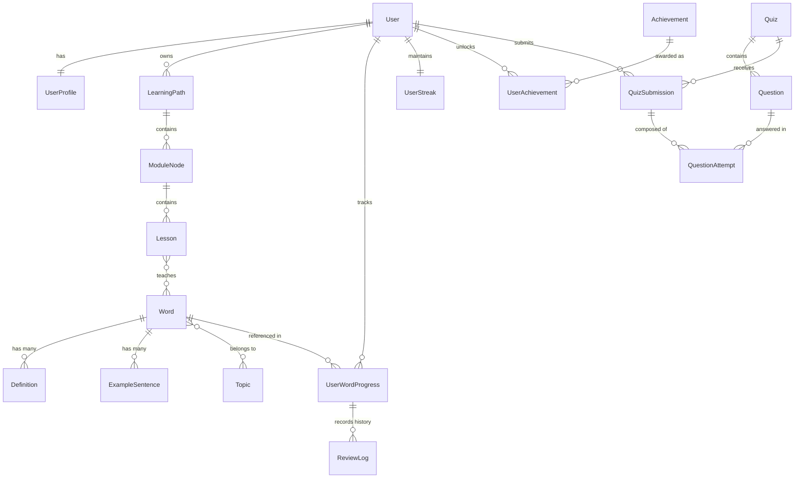
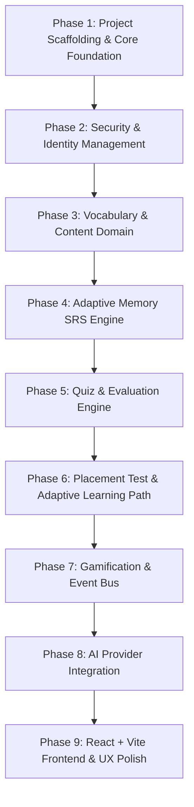

# Memora – AI Memory-Based Adaptive Vocabulary Learning Platform

An AI-powered, memory-adaptive personalized vocabulary learning platform engineered with modern enterprise Java and React, strictly adhering to **Advanced Object-Oriented Programming (OOP)** principles, design patterns, and clean architecture.

---

## 📌 Project Overview

Memora is designed to optimize long-term vocabulary acquisition through cognitive memory modeling (Spaced Repetition Systems - SRS), adaptive placement testing, personalized dynamic learning paths, gamification mechanics, and generative AI enrichment.

### Core Capabilities
1. **Initial Diagnostic Placement**: Assesses baseline vocabulary proficiency (CEFR A1–C2) through an adaptive testing engine.
2. **Dynamic Learning Roadmaps**: Generates structured, evolving learning paths tailored to learner goals and mastery levels.
3. **Adaptive Memory Engine (SRS)**: Models the human forgetting curve (SuperMemo SM-2, Leitner, and FSRS algorithms) to predict memory decay and schedule timely revisions.
4. **Interactive Multi-Modal Quizzes**: Features polymorphic assessment formats (Multiple Choice, Cloze Sentence, Audio/Spelling, and Definition Matching).
5. **Word-Level Cognitive Analytics**: Tracks retention stability, lapse frequency, response latencies, and mistake patterns.
6. **Gamification & Engagement**: Rewards consistency via XP systems, streak tracking, achievement badges, and tiered leaderboards.
7. **AI-Assisted Learning**: Generates contextual example sentences, mnemonic breakdowns, and personalized explanations.

---

## 🛠️ Technology Stack

### Backend
* **Language & Runtime**: Java 21 (LTS)
* **Framework**: Spring Boot 3.x
* **Core Modules**: Spring Web (REST API), Spring Data JPA, Spring Security (JWT-based Stateless Authentication), Spring Validation
* **Database**: PostgreSQL
* **Build Tool**: Apache Maven
* **Architecture**: Layered Clean Architecture (`Controller → Service → Repository → Entity/Domain` with strict DTO boundaries)

### Frontend
* **Core**: React (TypeScript/JavaScript)
* **Build Tool**: Vite
* **Styling**: Tailwind CSS
* **State & Routing**: React Context / Zustand, React Router DOM
* **HTTP Client**: Axios (with centralized JWT interceptors)

---

## 🏗️ High-Level Project Structure

```
memora/
├── README.md
├── pom.xml                      # Spring Boot 3.x Maven descriptor (Java 21)
├── mvnw / mvnw.cmd              # Maven wrapper executables
└── src/
    ├── main/
    │   ├── java/com/memora/     # Backend application codebase
    │   └── resources/           # Configuration profiles & application.yml
    └── test/                    # Automated unit & integration test suites
```

---

## 📦 Backend Package Architecture (`com.memora`)

```
com.memora/
├── MemoraApplication.java
├── common/
│   ├── config/                     # WebConfig, SecurityConfig, SwaggerConfig, AsyncConfig
│   ├── controller/                 # HealthController (/api/v1/health)
│   ├── exception/                  # GlobalExceptionHandler, ResourceNotFoundException, ApiException
│   ├── response/                   # ApiResponse<T>, ErrorDetails, ValidationError
│   └── domain/                     # BaseEntity (Audit timestamps: createdAt, updatedAt, version)
│
├── security/                       # Security & JWT infrastructure
└── modules/
    ├── user/                       # User profile, preferences, roles
    ├── vocabulary/                 # Words, definitions, sentences, topics
    ├── assessment/                 # Placement test & level diagnostics
    ├── learning/                   # Learning paths, module nodes, lessons
    ├── memory/                     # Spaced repetition algorithms (SM-2, Leitner, FSRS)
    ├── quiz/                       # Polymorphic question types & evaluation
    ├── gamification/               # XP, streaks, badges, leaderboard
    └── ai/                         # LLM adapters, sentence & mnemonic generation
```

---

## 🏛️ Domain Entities & Relational Schema



---

## 🧬 OOP Principles & Design Patterns

### 1. Object-Oriented Principles Applied
* **Encapsulation**: Strict private fields, validated mutators, immutable DTO records, and protected domain invariants.
* **Abstraction**: High-level service contracts (`MemoryAlgorithmStrategy`, `AiLanguageModelAdapter`, `QuestionEvaluatorStrategy`) hiding complex mathematical calculations and external API interactions.
* **Inheritance & Polymorphism**: Polymorphic `Question` hierarchy mapped using JPA `@Inheritance(strategy = InheritanceType.JOINED)`, dynamically grading different question types without `instanceof` checks.
* **SOLID Compliance**:
  * *Single Responsibility (SRP)*: Memory scheduling, quiz grading, gamification calculations, and AI generation reside in dedicated, isolated services.
  * *Open/Closed (OCP)*: New memory algorithms (e.g., FSRS) or question types can be integrated by adding new strategy implementations without altering existing code.
  * *Liskov Substitution (LSP)*: All question and memory strategy subtypes are completely interchangeable through their base interfaces.
  * *Interface Segregation (ISP)*: Small, focused interfaces for scoring, scheduling, and notifications.
  * *Dependency Inversion (DIP)*: Core services depend strictly on abstract strategy and repository interfaces.

### 2. Design Patterns

| Pattern | Type | Application in Memora | Justification |
| :--- | :--- | :--- | :--- |
| **Strategy** | Behavioral | `MemoryAlgorithmStrategy` (SM-2, Leitner, FSRS), `QuestionEvaluatorStrategy` | Allows runtime switching of spaced repetition algorithms and assessment grading logic based on user settings or experiment criteria. |
| **Factory Method / Abstract Factory** | Creational | `QuestionFactory`, `QuizBuilder` | Encapsulates the instantiation of diverse, complex question variants from database records or AI-generated prompts. |
| **Observer (Event-Driven)** | Behavioral | Spring `@EventListener` & `ApplicationEventPublisher` | Decouples core quiz/lesson completion workflows from side-effects (XP calculation, streak incrementing, badge checks, audit logging). |
| **Template Method** | Behavioral | `AbstractSessionWorkflow` | Standardizes the multi-step evaluation sequence (Validate → Calculate Score → Update SRS Memory → Publish Events → Build DTO). |
| **State** | Behavioral | `WordMasteryState` (`New`, `Learning`, `Reviewing`, `Mastered`) | Models word transition mechanics throughout the user's learning lifecycle. |
| **Adapter / Bridge** | Structural | `AiLanguageModelAdapter` | Unifies various AI provider backends (OpenAI, Anthropic, Ollama, DeepSeek) behind a standardized interface. |
| **Builder** | Creational | `QuizConfigurationBuilder` | Constructs flexible, multi-parameter quiz requests (e.g., 60% weak words, 20% due words, 20% new words). |

---

## 🌐 REST API Module Overview

All endpoints follow standard RESTful conventions, leverage HTTP response codes, and return standardized envelopes: `ApiResponse<T>`.

### 1. Authentication & User Management
* `POST /api/v1/auth/register` — Register a new learner account
* `POST /api/v1/auth/login` — Authenticate and retrieve JWT token
* `GET  /api/v1/users/me` — Retrieve active learner profile, goals, and stats
* `PUT  /api/v1/users/me/settings` — Update preferences (daily goal, default SRS algorithm, notifications)

### 2. Diagnostic Placement Assessment
* `POST /api/v1/placement/start` — Initialize a placement test session
* `GET  /api/v1/placement/session/{id}/next` — Fetch next adaptive diagnostic question
* `POST /api/v1/placement/session/{id}/submit` — Submit placement responses and determine baseline CEFR level

### 3. Vocabulary Catalog & Topics
* `GET  /api/v1/words` — Search/filter vocabulary by CEFR level, topic, or search term
* `GET  /api/v1/words/{id}` — Get word definition, audio URL, examples, and user memory status
* `GET  /api/v1/topics` — List all curated topic categories

### 4. Adaptive Learning Paths & Lessons
* `GET  /api/v1/learning-paths/current` — Retrieve active learning roadmap and unlocked module nodes
* `POST /api/v1/learning-paths/generate` — Regenerate/recalibrate path based on updated proficiency
* `GET  /api/v1/lessons/{id}` — Fetch lesson vocabulary and instructional content
* `POST /api/v1/lessons/{id}/complete` — Submit lesson completion and transition word mastery states

### 5. Memory & Spaced Repetition (SRS) Engine
* `GET  /api/v1/memory/daily-queue` — Fetch today's due revision items (weak words + scheduled repetitions)
* `GET  /api/v1/memory/stats` — Retrieve memory retention metrics, forgetting curve data, and mastered word counts
* `POST /api/v1/memory/review` — Submit SRS review grading (`AGAIN`, `HARD`, `GOOD`, `EASY`) with response latency
* `GET  /api/v1/memory/weak-words` — List high-decay / frequently lapsed vocabulary items

### 6. Interactive Quizzes & Assessments
* `POST /api/v1/quizzes/generate` — Generate dynamic practice quizzes (SRS Review, Topic Drill, Speed Quiz)
* `GET  /api/v1/quizzes/{id}` — Fetch quiz content with polymorphic question DTOs
* `POST /api/v1/quizzes/{id}/submit` — Submit answers, calculate score, evaluate performance, and log analytics

### 7. Gamification & Community
* `GET  /api/v1/gamification/dashboard` — Retrieve total XP, current streak, active badges, and rank
* `GET  /api/v1/gamification/leaderboard` — View weekly/all-time leaderboards
* `GET  /api/v1/gamification/achievements` — List all badges with user unlock timestamps

### 8. AI-Powered Content Generation
* `POST /api/v1/ai/explain-word` — Request an AI mnemonic explanation and contextual breakdown
* `POST /api/v1/ai/generate-examples` — Generate dynamic CEFR-calibrated example sentences

---

## 🚀 Step-by-Step Implementation Roadmap



---

## 💻 Getting Started (Backend)

### 1. Prerequisites
* **Java**: JDK 21 or higher installed (`java -version`)
* **Database**: PostgreSQL 14+ running locally or in Docker
* **Build Tool**: Maven 3.9+ (or use the provided Maven Wrapper `./mvnw` / `.\mvnw.cmd`)

### 2. PostgreSQL Configuration
Create a database in PostgreSQL:
```sql
CREATE DATABASE memora_db;
```

Configure your credentials using environment variables:
| Variable | Description | Default Value |
| :--- | :--- | :--- |
| `DB_URL` | PostgreSQL JDBC connection URL | `jdbc:postgresql://localhost:5432/memora_db` |
| `DB_USERNAME` | PostgreSQL database user | `postgres` |
| `DB_PASSWORD` | PostgreSQL user password | `postgres` |
| `SERVER_PORT` | Application HTTP port | `8080` |
| `JPA_DDL_AUTO` | Hibernate schema management | `update` |
| `SHOW_SQL` | Print formatted SQL statements | `true` |

Alternatively, export them in your terminal before launching:
```powershell
# Windows PowerShell
$env:DB_URL="jdbc:postgresql://localhost:5432/memora_db"
$env:DB_USERNAME="postgres"
$env:DB_PASSWORD="your_password"
```

### 3. Build & Run Application
```bash
# Clean and compile
.\mvnw.cmd clean package

# Run Spring Boot backend
.\mvnw.cmd spring-boot:run
```

### 4. Running Automated Tests
```bash
# Run unit & integration test suite (uses self-contained H2 in-memory DB)
.\mvnw.cmd test
```

### 5. Health Check Verification
Once the backend is running, verify the health status:
```bash
curl -X GET http://localhost:8080/api/v1/health
```
Response:
```json
{
  "success": true,
  "message": "Memora backend is running normally",
  "data": {
    "status": "UP",
    "service": "Memora Backend Platform",
    "version": "1.0.0",
    "timestamp": "2026-08-31T01:22:00Z"
  },
  "timestamp": "2026-08-31T01:22:00Z"
}
```
