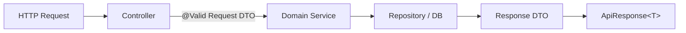

# Memora – AI Memory-Based Adaptive Vocabulary Learning Platform

An AI-powered, memory-adaptive personalized vocabulary learning platform engineered with modern enterprise Java and React, strictly adhering to **Advanced Object-Oriented Programming (OOP)** principles, design patterns, and clean architecture.

---

## 📌 Project Status

| Phase | Module | Status | Description |
| :--- | :--- | :--- | :--- |
| **Phase 1** | **Core Architecture & Scaffolding** | ✅ Completed | BaseEntity auditing (`createdAt`, `updatedAt`, `version`), unified `ApiResponse<T>`, global exception handling (`GlobalExceptionHandler`), health checks. |
| **Phase 2** | **Security & Identity Management** | ✅ Completed | Stateless JWT authentication, BCrypt password hashing, Spring Security filter chain, `/api/v1/auth/*`, `/api/v1/users/me`. |
| **Phase 3** | **Vocabulary & Content Catalog** | ✅ Completed | Curated CEFR vocabulary dataset, automated data seeder, category filtering, `UserWordProgress` entity & progress tracking. |
| **Phase 4** | **Adaptive Memory SRS Engine** | ✅ Completed | **Strategy Pattern** (`SM2MemoryStrategy`, `LeitnerMemoryStrategy`), **Factory Pattern** (`MemoryStrategyFactory`), incremental latency tracking, mastery scoring, forgetting risk evaluation, `/api/v1/memory/*`. |
| **Phase 5** | **Quiz & Evaluation Engine** | ✅ Completed | **Polymorphic Question Models** (`MultipleChoiceQuestion`, `TranslationQuestion`, `FillInTheBlankQuestion`), **Factory Pattern** (`QuestionFactory`), **Strategy Pattern** (`QuestionEvaluatorStrategy`, `QuestionEvaluatorFactory`), attempt history, Memory Engine integration, `/api/v1/quizzes/*`. |
| **Phase 6** | **Assessment & Placement Engine** | ✅ Completed | Compact 10-question multi-tier CEFR diagnostic assessment (`A1`–`C1`, 2 questions per tier), **Strategy Pattern** (`PlacementAlgorithmStrategy`, `DefaultPlacementStrategy`, `PlacementStrategyFactory`), calibrated 10-question placement math (100% advances, 50% frontier halts, 0% halts), explainable confidence score calculation (0–100), response latency tracking, diagnostic attempt history, memory isolation, `/api/v1/assessments/*`. |
| **Phase 7** | **Adaptive Learning Path Engine** | ✅ Completed | Personalized daily curriculum (max 10 items), **Strategy Pattern** (`LearningPathStrategy`, `AdaptiveLearningPathStrategy`), **Factory Pattern** (`LearningPathStrategyFactory`), dynamic review/new word balancing, CEFR stretch words, consolidating quizzes, progress tracking, dynamic regeneration, `/api/v1/learning-path/*`. |
| **Phase 8** | **Gamification & Learner Profile** | ✅ Completed | Extensible XP reward system via **Strategy & Factory Patterns** (`RewardStrategy`, `RewardStrategyFactory`), calendar-day boundary safe daily streaks (`StreakService`), extensible **Achievement Rule Engine** (`AchievementRule`, `AchievementRuleEngine`) with 10 unlockable badges, immutable XP audit ledger (`XpTransaction`), deterministic privacy-preserving leaderboard, learner profile & stats endpoints (`/api/v1/profile/*`, `/api/v1/leaderboard`, `/api/v1/achievements`). |
| **Phase 9** | **React Frontend & Full API Integration** | ✅ Completed | Production React 19 + TypeScript + Vite + Tailwind CSS application matching approved visual design reference, complete REST API integration with Spring Boot backend, interactive 3D Floating Memory Ecosystem, live Memory Map widget, smooth-scrolling navigation with sticky offset, unified Plus Jakarta Sans typography, compact 10-question CEFR diagnostic placement (A1–C1), adaptive learning path dashboard, SRS flashcards, polymorphic quiz runner, gamification streaks & badges, auditable XP ledger, and global leaderboard. |
| **Phase 10** | **AI Contextual Learning & Gemini Integration** | ✅ Completed | **Provider & Chain of Responsibility Patterns** (`GeminiAiProvider`, `FallbackAiProvider`), multi-model fallback (`gemini-3.6-flash` → `gemini-3.7-flash` → `gemini-3.5-flash`), in-memory caching (`AiResponseCache`), AI mnemonics, contextual collocations, register analysis, adaptive insights (`/api/v1/ai/*`, `/api/v1/insights/*`), and frontend Word Study modal (`WordStudyAiActions`). |
| **Phase 10.5** | **Multi-Provider AI (Groq + Gemini + Fallback Router)** | ✅ Completed | Multi-provider architecture with **Groq** (`openai/gpt-oss-120b`) via Spring `RestClient`, centralized `AiProviderRouter` (`auto`, `gemini`, `groq`, `fallback`), safe zero-loop fallback chain (Gemini → Groq → Deterministic Fallback), rate-limit safety (max 2 attempts in auto), and context-isolated caching. |
| **Phase 11 (Infra)** | **Cloud Database Migration (Neon PostgreSQL)** | ✅ Completed | Normal runtime migrated to cloud-hosted **Neon PostgreSQL 18** (`ddl-auto: update`), permanent data persistence across backend restarts, safe environment configuration (`.env` ignored by Git), and isolated in-memory H2 database retained for automated tests. |
| **Phase 11 (UX & Placement)** | **New User Onboarding UX & Compact 10-Question Assessment** | ✅ Completed | Streamlined new user onboarding directly to locked Dashboard (`/dashboard`), eliminating jarring intermediate redirects. Features editorial locked onboarding view (`LockedOnboardingView`) with 10-question diagnostic CTA (~2 min duration), locked feature cards with 🔒 badges, non-intrusive toast notification click prevention, frontend route protection (`LearningRouteGuard`), compact 10-question assessment generation (2 per tier A1–C1), adapted placement strategy (100% mastery advances, 50% emerging frontier stops, 0% unreached stops), mid-session reload resilience, and automatic full platform unlock upon learning path generation. |
| **Phase 11 Step 2** | **Real Learning / Word Study Experience & UI Stabilization** | ✅ Completed | Dedicated `NEW_WORD` Word Study Modal (`WordStudyModal`) rendered via `createPortal(..., document.body)` with isolated stacking context above mobile navigation (`MobileNav`), responsive viewport bounds (`100dvh`), background scroll-locking, and automatic scroll-to-top reset. Features authentic Merriam-Webster pronunciation audio CDN playback, CEFR level badge, parts of speech, numbered definitions, contextual example sentences with audio, deep-dive AI Learning Assistant (`WordStudyAiActions`) with multi-provider failover routing (Gemini → Groq → Fallback), Spaced-Repetition Memory Engine review integration (`MemoryService.recordReview`), duplicate completion idempotency protection, and real gamification reward feedback (+15 XP). |
| **Phase 12** | **Collegiate Dictionary Integration (Merriam-Webster)** | ✅ Completed | Production integration with official **Merriam-Webster Collegiate Dictionary API** via Spring `RestClient` (HTTP/2), headword syllabification, written IPA/phonetics, native audio CDN playback, part-of-speech categorization, multi-sense numbered definitions, usage examples, historical etymology, typo spelling suggestions fallback, thread-safe bounded in-memory caching (`DictionaryServiceImpl`), and an interactive frontend `/dictionary` explorer with audio playback and quick discovery chips. |
| **Phase 13** | **Controller Layer Audit & Request Object Completion** | ✅ Completed | Comprehensive audit across all 16 `@RestController` classes (52 endpoints). Strict encapsulation of structured client payloads via dedicated Request DTOs (`@Valid @RequestBody`), Jakarta validation constraints, natural REST Path Variables & Query Parameters, thin controller design, and server-derived Spring Security context. |

---

## 🛠️ Technology Stack

### Backend
* **Language & Runtime**: Java 20 / Java 21 (LTS)
* **Framework**: Spring Boot 3.3.4
* **Core Modules**: Spring Web (REST API), Spring Data JPA, Spring Security (Stateless JWT Authentication), Spring Validation
* **Runtime Database**: Neon PostgreSQL 18 (AWS Cloud) via HikariCP connection pool (`ddl-auto: update`):
  * **PostgreSQL Driver Optimization**: `reWriteBatchedInserts=true` multi-row statement batch rewriting
  * **Hibernate JDBC Batching**: `batch_size: 50`, `order_inserts: true`, `order_updates: true`, `batch_versioned_data: true`
* **Test Database**: H2 In-Memory (`jdbc:h2:mem:memoradb;DB_CLOSE_DELAY=-1;MODE=PostgreSQL`, `ddl-auto: create-drop`)
* **AI & LLM Integration**: Multi-Provider Router (`auto`, `gemini`, `groq`, `fallback`):
  * **Primary Provider**: Google Gemini Generative Language API (`gemini-3.6-flash`)
  * **Secondary Provider**: Groq OpenAI-compatible Chat Completions API (`openai/gpt-oss-120b`)
  * **Deterministic Fallback**: Offline educational learning engine
  * **Routing Chain (AUTO)**: Gemini → Groq → Deterministic Fallback (zero duplicate calls, max 2 cloud attempts)
* **Dictionary Service**: Merriam-Webster Collegiate Dictionary API (HTTP/2 via Spring `RestClient`, connection & read timeouts, pronunciation audio CDN URL resolution, bounded in-memory caching with 30-min TTL)
* **Build Tool**: Apache Maven (`mvnw` / `mvnw.cmd`)
* **Architecture**: Layered Clean Architecture (`Controller → Service → Repository → Entity/Domain` with strict DTO boundaries)

### Frontend
* **Core & Runtime**: React 19, TypeScript, Vite 8
* **Styling & Design System**: Tailwind CSS v4, PostCSS, Google Font (*Plus Jakarta Sans* — unified modern typography system)
* **Routing & State**: React Router DOM v7, React Context API (`AuthContext`, `ToastContext`)
* **HTTP & API Client**: Axios (with Bearer token interceptor, automated 401 handling, and response unwrap)
* **Audio & Media**: HTML5 Web Audio API integrating Merriam-Webster high-fidelity CDN pronunciation tracks
* **Icons & Visuals**: Lucide React (feather-style modern icons), Recharts (data visualizations & retention decay curves)
* **Utility Libraries**: clsx, tailwind-merge
* **Design Language**: Warm off-white background (`#FBFBF9`), Memora forest green accents (`#6A8D2F`, `#557224`), dark surface contrast (`#141A14`, `#171F17`), glassmorphism card surfaces, and dynamic micro-animations.

---

## 📦 Active Backend Package Architecture (`com.memora`)

```text
com.memora/
├── MemoraApplication.java           # Main entry point with secure loadDotEnv() initialization
├── common/
│   ├── controller/                 # HealthController (/api/v1/health)
│   ├── domain/                     # BaseEntity (Audit timestamps: createdAt, updatedAt, version)
│   ├── exception/                  # GlobalExceptionHandler, ResourceNotFoundException, BadRequestException,
│   │                               # ApiException, DuplicateVocabularyWordException, EmailAlreadyExistsException,
│   │                               # InvalidCredentialsException, UserNotFoundException
│   └── response/                   # ApiResponse<T>, ErrorDetails, ValidationError
│
├── security/                       # Security & JWT Infrastructure
│   ├── SecurityConfig.java         # Stateless security filter chain & CORS configuration
│   ├── package-info.java
│   ├── jwt/                        # JwtService, JwtAuthenticationFilter, JwtAuthenticationEntryPoint, JwtAccessDeniedHandler
│   └── user/                       # CustomUserDetailsService, UserPrincipal
│
└── modules/
    ├── user/                       # Identity & Learner Domain
    │   ├── controller/             # AuthController (/api/v1/auth/*), UserController (/api/v1/users/me)
    │   ├── domain/                 # Role, VocabularyLevel
    │   ├── dto/                    # RegistrationRequest, LoginRequest, AuthResponse, UserResponse
    │   ├── entity/                 # User entity (with cascade mappings to gamification profile & ledger)
    │   ├── repository/             # UserRepository
    │   └── service/                # UserService, UserServiceImpl, AuthService, AuthServiceImpl
    │
    ├── onboarding/                 # Smart Onboarding Flow (Phase 11 Step 1)
    │   ├── controller/             # OnboardingController (/api/v1/onboarding/state)
    │   ├── domain/                 # OnboardingState (ONBOARDING_REQUIRED, ASSESSMENT_IN_PROGRESS, LEARNING_PATH_REQUIRED, LEARNING_ACTIVE)
    │   ├── dto/                    # OnboardingStateResponse
    │   └── service/                # OnboardingService, OnboardingServiceImpl (domain-driven state derivation)
    │
    ├── vocabulary/                 # Lexical Catalog & Content
    │   ├── config/                 # VocabularyDataSeeder (curated CEFR word dataset auto-seeding)
    │   ├── controller/             # VocabularyController (/api/v1/vocabulary/*), UserWordProgressController (/api/v1/progress/*)
    │   ├── domain/                 # DifficultyLevel, WordCategory, ForgettingRisk
    │   ├── dto/                    # VocabularyWordRequest, VocabularyWordResponse, UserWordProgressResponse
    │   ├── entity/                 # VocabularyWord, UserWordProgress
    │   ├── mapper/                 # VocabularyWordMapper, UserWordProgressMapper
    │   ├── repository/             # VocabularyWordRepository, UserWordProgressRepository
    │   └── service/                # VocabularyService, VocabularyServiceImpl, UserWordProgressService, UserWordProgressServiceImpl
    │
    ├── memory/                     # Adaptive Spaced Repetition Engine (Phase 4)
    │   ├── controller/             # MemoryController (/api/v1/memory/*)
    │   ├── domain/                 # MemoryAlgorithmType (SM2, LEITNER), MemoryCalculationResult, MemoryInput
    │   ├── dto/                    # WordReviewRequest, WordReviewResponse, MemoryWordResponse
    │   ├── mapper/                 # MemoryMapper
    │   ├── service/                # MemoryService, MemoryServiceImpl (orchestration layer)
    │   └── strategy/               # Strategy Pattern for SRS algorithms
    │       ├── MemoryAlgorithmStrategy.java   # Strategy interface contract
    │       ├── SM2MemoryStrategy.java         # SuperMemo-2 implementation (E-Factor & interval expansion)
    │       ├── LeitnerMemoryStrategy.java     # 5-Box Leitner system implementation
    │       └── MemoryStrategyFactory.java     # Strategy resolution factory
    │
    ├── quiz/                       # Quiz & Question Engine (Phase 5)
    │   ├── controller/             # QuizController (/api/v1/quizzes/*)
    │   ├── domain/                 # QuestionType (MULTIPLE_CHOICE, TRANSLATION, FILL_IN_THE_BLANK)
    │   ├── dto/                    # QuizGenerationRequest, QuizResponse, QuestionResponse, AnswerSubmissionRequest, AnswerResponse, QuizResultResponse, EvaluationResult
    │   ├── entity/                 # Polymorphic Question entities & Historical Attempts
    │   │   ├── Question.java (abstract base entity)
    │   │   ├── MultipleChoiceQuestion.java    # @ElementCollection options with @BatchSize(50)
    │   │   ├── TranslationQuestion.java
    │   │   ├── FillInTheBlankQuestion.java
    │   │   ├── Quiz.java
    │   │   ├── QuizAttempt.java
    │   │   └── QuestionAttempt.java
    │   ├── factory/                # Factory Pattern implementations
    │   │   ├── QuestionFactory.java           # Instantiates polymorphic Question subtypes
    │   │   └── QuestionEvaluatorFactory.java  # Resolves QuestionEvaluatorStrategy by QuestionType
    │   ├── repository/             # QuizRepository, QuestionRepository, QuizAttemptRepository, QuestionAttemptRepository
    │   ├── service/                # QuizService, QuizServiceImpl (orchestration, memory & gamification integration)
    │   └── strategy/               # Strategy Pattern for polymorphic answer evaluation
    │       ├── QuestionEvaluatorStrategy.java # Evaluator contract
    │       ├── MultipleChoiceEvaluator.java
    │       ├── TranslationEvaluator.java
    │       └── FillInTheBlankEvaluator.java
    │
    ├── assessment/                 # Assessment & Diagnostic Placement Engine (Phase 6 & 11 Step 1)
    │   ├── controller/             # AssessmentController (/api/v1/assessments/*)
    │   ├── domain/                 # AssessmentStatus, AssessmentPerformance, PlacementResult
    │   ├── dto/                    # AssessmentStartResponse (with answeredQuestions), AssessmentDetailResponse, AssessmentQuestionResponse, AssessmentAnswerRequest, AssessmentAnswerResponse, PlacementResultResponse
    │   ├── entity/                 # Diagnostic entities
    │   │   ├── Assessment.java                # Session entity with recordAnswer() score updating
    │   │   ├── AssessmentQuestion.java        # Question presentation order & CEFR level mapping
    │   │   └── AssessmentAnswer.java          # Learner response, correctness, & latency
    │   ├── factory/                # PlacementStrategyFactory
    │   ├── repository/             # AssessmentRepository, AssessmentQuestionRepository (JPQL JOIN FETCH), AssessmentAnswerRepository (countByAssessmentId)
    │   ├── service/                # AssessmentService, AssessmentServiceImpl (idempotent start & session resumption), AssessmentQuestionGenerator
    │   └── strategy/               # Strategy Pattern for CEFR placement algorithms
    │       ├── PlacementAlgorithmStrategy.java
    │       └── DefaultPlacementStrategy.java  # Deterministic CEFR proficiency estimation & confidence score
    │
    ├── learningpath/               # Adaptive Learning Path Engine (Phase 7)
    │   ├── controller/             # LearningPathController (/api/v1/learning-path/*)
    │   ├── domain/                 # LearningPathStatus, LearningItemType, LearningItemStatus, LearningItemPriority, LearningPathStrategyType, VocabularyWordSummary, LearningPathItemCandidate, LearningPathContext, LearningPathResult
    │   ├── dto/                    # LearningPathResponse, TodayLearningPathResponse, LearningPathItemResponse, LearningItemCompletionRequest, LearningItemCompletionResponse
    │   ├── entity/                 # LearningPath, LearningPathItem
    │   ├── factory/                # LearningPathStrategyFactory
    │   ├── repository/             # LearningPathRepository, LearningPathItemRepository
    │   ├── service/                # LearningPathService, LearningPathServiceImpl (orchestration & gamification integration)
    │   └── strategy/               # Strategy Pattern for curriculum generation
    │       ├── LearningPathStrategy.java
    │       └── AdaptiveLearningPathStrategy.java # Dynamic review/new word ratio balancing & stretch word logic
    │
    ├── gamification/               # Gamification & Learner Profile (Phase 8)
    │   ├── config/                 # AchievementDataSeeder (seeds 10 standard achievements)
    │   ├── controller/             # ProfileController (/api/v1/profile/*), LeaderboardController (/api/v1/leaderboard), AchievementController (/api/v1/achievements)
    │   ├── domain/                 # RewardActivityType, RewardContext, AchievementCode, AchievementEvaluationContext
    │   ├── dto/                    # LearnerProfileResponse, LearnerStatsResponse, XpTransactionResponse, UserAchievementResponse, LeaderboardEntryResponse, GamificationActivityResultResponse
    │   ├── entity/                 # Gamification & Ledger Entities
    │   │   ├── UserGamificationProfile.java   # 1:1 with User; tracks total XP, current/longest streaks, activity counters
    │   │   ├── XpTransaction.java             # Immutable audit ledger of all XP grants
    │   │   ├── Achievement.java               # Milestone catalog with badge category & XP bonus
    │   │   └── UserAchievement.java           # User-achievement join table enforcing unique unlocks
    │   ├── factory/                # RewardStrategyFactory (resolves RewardStrategy by RewardActivityType)
    │   ├── repository/             # UserGamificationProfileRepository, XpTransactionRepository, AchievementRepository, UserAchievementRepository
    │   ├── rule/                   # Extensible Achievement Rule Engine
    │   │   ├── AchievementRule.java           # Strategy rule contract
    │   │   ├── AchievementRuleEngine.java     # Engine evaluating context against unlocked rules
    │   │   ├── FirstLessonAchievementRule.java
    │   │   ├── FirstQuizAchievementRule.java
    │   │   ├── WordStarterAchievementRule.java
    │   │   ├── VocabularyExplorerAchievementRule.java
    │   │   ├── CenturyAchievementRule.java
    │   │   ├── PerfectScoreAchievementRule.java
    │   │   ├── QuizMasterAchievementRule.java
    │   │   ├── SevenDayStreakAchievementRule.java
    │   │   ├── ThirtyDayStreakAchievementRule.java
    │   │   └── MemoryMasterAchievementRule.java
    │   ├── service/                # Gamification orchestration & streak services
    │   │   ├── StreakService.java / StreakServiceImpl.java
    │   │   ├── AchievementService.java / AchievementServiceImpl.java
    │   │   └── GamificationService.java / GamificationServiceImpl.java
    │   └── strategy/               # Strategy Pattern for XP reward calculation
    │       ├── RewardStrategy.java            # Strategy interface contract
    │       ├── QuizRewardStrategy.java        # Base 10 + 5 per correct + 15 perfect bonus
    │       ├── LessonRewardStrategy.java      # Base 20 + 2 per item (capped at 50)
    │       ├── ReviewRewardStrategy.java      # Base 15 + 3 per reviewed word
    │       ├── DailyPathRewardStrategy.java   # Base 40 + 10 all-mastered bonus
    │       ├── StreakRewardStrategy.java      # Base 10 + min(streak, 30)*2 bonus
    │       └── AssessmentRewardStrategy.java  # Base 50 + CEFR level tier bonuses (A1:10 -> C1:75)
    │
    ├── ai/                         # Multi-Provider AI & Contextual Vocabulary Learning (Phase 10 & 10.5)
    │   ├── cache/                  # AiResponseCache (thread-safe in-memory bounded cache with TTL)
    │   ├── config/                 # AiConfig (multi-provider properties, timeouts, RestClient bean)
    │   ├── controller/             # AiController (/api/v1/ai/*), AdaptiveInsightController (/api/v1/insights/*)
    │   ├── dto/                    # AiExplanationRequest/Response, AiExampleRequest/Response, AiMemoryTipRequest/Response, AiUsageRequest/Response, AdaptiveInsightResponse
    │   ├── provider/               # Provider Pattern & Multi-Provider Architecture
    │   │   ├── AiProvider.java                # Core provider interface contract (generate, generateDirect, isAvailable)
    │   │   ├── AiProviderRouter.java          # Central router with safe zero-loop fallback (AUTO: Gemini -> Groq -> Fallback)
    │   │   ├── GeminiAiProvider.java          # Google Gemini implementation with single-attempt & resilient upgrade
    │   │   ├── GroqAiProvider.java            # Groq OpenAI-compatible RestClient implementation (openai/gpt-oss-120b)
    │   │   ├── FallbackAiProvider.java        # Deterministic offline generator for resilience
    │   │   └── AiGenerationResult.java        # Generation payload with provider and model metadata
    │   └── service/                # AI orchestration and prompt calibration
    │       ├── AIExplanationService.java      # Service interface contract
    │       ├── GeminiExplanationService.java  # Main explanation orchestrator with caching & multi-provider routing
    │       ├── FallbackExplanationService.java# Local rule-based explanation service
    │       ├── AdaptiveInsightService.java    # Real-time learner insight & memory health analysis
    │       ├── AiPromptBuilder.java           # Structured prompt construction
    │       └── CollocationValidator.java     # Grammatical and register quality validation
    │
    └── dictionary/                 # Merriam-Webster Collegiate Dictionary Integration (Phase 12)
        ├── client/                 # External API Integration & Provider Pattern
        │   ├── DictionaryProvider.java                # Provider interface contract
        │   └── MerriamWebsterDictionaryApiClient.java # Official Merriam-Webster Collegiate API client via RestClient
        ├── config/                 # DictionaryConfig.java (API key, endpoint URL, HTTP/2 RestClient bean, timeouts)
        ├── controller/             # DictionaryController.java (/api/v1/dictionary/*)
        ├── dto/                    # DefinitionDto, DictionaryResponse, PartOfSpeechDto
        ├── exception/              # Domain exceptions (DictionaryWordNotFoundException, DictionaryRateLimitException,
        │                           # DictionaryAuthenticationException, DictionaryServiceUnavailableException, DictionaryTimeoutException)
        └── service/                # Dictionary orchestration & caching
            ├── DictionaryService.java                 # Service interface contract
            └── DictionaryServiceImpl.java             # Bounded in-memory cache, token sanitization, audio CDN URL resolution, spelling suggestions
```

---

## 🎨 Active Frontend Package Architecture (`frontend/src`)

```text
frontend/
├── index.html                      # Entry HTML with Google Fonts & root viewport
├── vite.config.ts                  # Vite + React plugin + /api proxy to Spring Boot (:8080)
├── tailwind.config.js              # Theme config: colors, typography, border-radius, shadows
├── postcss.config.js               # PostCSS setup with @tailwindcss/postcss & autoprefixer
├── package.json                    # Dependencies: React 19, TypeScript, Tailwind, Lucide, Recharts
└── src/
    ├── main.tsx                    # Application entry point mounting BrowserRouter & Providers
    ├── App.tsx                     # Top-level route provider (Toast, Auth)
    ├── index.css                   # Tailwind base imports, design system tokens, utility classes
    ├── vite-env.d.ts               # Vite client types & CSS module declarations
    │
    ├── assets/                     # Static assets (hero.png, typescript.svg, vite.svg)
    │
    ├── types/                      # Complete TypeScript Interfaces matching Backend DTOs
    │   ├── common.ts               # ApiResponse<T>, PaginatedResponse<T>
    │   ├── auth.ts                 # AuthResponse, LoginRequest, RegistrationRequest, UserProfile
    │   ├── onboarding.ts           # OnboardingState, OnboardingStateResponse
    │   ├── vocabulary.ts           # VocabularyWord, UserWordProgress
    │   ├── memory.ts               # ReviewRequest, ReviewResponse, MemoryStats
    │   ├── assessment.ts           # AssessmentStartResponse, AssessmentDetailResponse, AssessmentQuestionResponse, AssessmentAnswerResponse
    │   ├── learningPath.ts         # LearningPath, LearningItem, CompleteItemResponse
    │   ├── quiz.ts                 # Quiz, Polymorphic Question, QuizAttempt, EvaluationResult
    │   ├── gamification.ts         # LearnerProfile, XpTransaction, LeaderboardEntry, Achievement
    │   ├── ai.ts                   # AiExplanationResponse, AiExampleResponse, AiMemoryTipResponse, AiUsageResponse, AiActionType
    │   ├── insight.ts              # AdaptiveInsight, MemoryHealthMetrics, InsightRecommendation
    │   └── dictionary.ts           # DictionaryResponse, PartOfSpeechItem, DefinitionItem
    │
    ├── api/                        # Centralized Axios Client & Service Modules
    │   ├── axios.ts                # Axios instance with JWT Bearer interceptor & 401 handling
    │   ├── authApi.ts              # /api/v1/auth/*, /api/v1/users/me
    │   ├── onboardingApi.ts        # /api/v1/onboarding/state & getDestinationForOnboardingState mapper
    │   ├── vocabularyApi.ts        # /api/v1/vocabulary/*, /api/v1/progress/words
    │   ├── memoryApi.ts            # /api/v1/memory/* (due, review, stats)
    │   ├── assessmentApi.ts        # /api/v1/assessments/* (start, questions, answer, result)
    │   ├── learningPathApi.ts      # /api/v1/learning-path/* (today, regenerate, complete)
    │   ├── quizApi.ts              # /api/v1/quizzes/* (generate, start, submit, results)
    │   ├── profileApi.ts           # /api/v1/profile/* (stats, xp-history)
    │   ├── achievementApi.ts       # /api/v1/achievements
    │   ├── leaderboardApi.ts       # /api/v1/leaderboard
    │   ├── aiApi.ts                # /api/v1/ai/* (word explanations, mnemonics, contextual study)
    │   ├── insightApi.ts           # /api/v1/insights/* (adaptive learner recommendations)
    │   └── dictionaryApi.ts        # /api/v1/dictionary/* (lookupWord with AbortSignal)
    │
    ├── context/                    # Global React Contexts
    │   ├── AuthContext.tsx         # User authentication state, token persistence, login/logout
    │   ├── OnboardingContext.tsx   # Global onboarding state derivation, feature locking, refresh trigger
    │   └── ToastContext.tsx        # Toast notification system (success, error, warning, info)
    │
    ├── components/
    │   ├── ui/                     # Reusable Core UI Components
    │   │   ├── Button.tsx          # Polymorphic variants: primary, secondary, outline, ghost, danger
    │   │   ├── Card.tsx            # Styled container card with glassmorphism support
    │   │   ├── Badge.tsx           # Status & CEFR level indicator chips
    │   │   ├── ProgressBar.tsx     # Animated progress bar with smooth transition
    │   │   ├── LoadingSpinner.tsx  # Brand spinner & centered loading overlay
    │   │   ├── EmptyState.tsx      # Visual empty state with action slot
    │   │   ├── ErrorState.tsx      # Visual error display with retry trigger
    │   │   └── Modal.tsx           # Accessible modal dialog with backdrop blur
    │   │
    │   ├── layout/                 # Application Layout & Navigation
    │   │   ├── Navbar.tsx          # Public landing page navigation
    │   │   ├── TopHeader.tsx       # Authenticated dashboard top navigation with streak & XP badge
    │   │   ├── Sidebar.tsx         # Collapsible desktop sidebar with active route indicator, lock indicators (🔒) & toast prevention
    │   │   ├── MobileNav.tsx       # Bottom mobile tab navigation with active route indicator, lock indicators (🔒) & toast prevention
    │   │   └── AppShell.tsx        # Responsive application wrapper (Sidebar + TopHeader + Content)
    │   │
    │   ├── vocabulary/             # Vocabulary Study & AI Components
    │   │   ├── WordStudyModal.tsx      # Focused word study dialog (createPortal, 100dvh, scroll lock, audio playback)
    │   │   └── WordStudyAiActions.tsx  # Deep-dive tabs (Explanation, Example, Memory Tip, Contextual Usage) with multi-provider AI
    │   │
    │   ├── dashboard/              # Learner Dashboard Widgets
    │   │   ├── LockedOnboardingView.tsx  # Editorial locked onboarding view with 10-question placement CTA & feature lock chips
    │   │   ├── AiLearningInsightCard.tsx # Real-time adaptive AI learning insights & recommendations
    │   │   └── MemoryHealthWidget.tsx    # Spaced repetition retention health & due review status
    │   │
    │   └── landing/                # Landing Page Components (matching approved design reference)
    │       ├── HeroSection.tsx     # Hero banner + 3D floating memory ecosystem cards
    │       ├── HowItWorksSection.tsx # 4-step learning journey + interactive Memory Map widget
    │       ├── StatisticsSection.tsx # Live metrics: 12.5K+ learners, 420K+ words, 85% retention
    │       ├── GamificationSection.tsx # Dark card (#171F17): streak counter, 3D gem, leaderboard
    │       ├── TrustSection.tsx    # Institutional trust logos (UIU, BRAC, DIU, NSU, IUB)
    │       ├── FinalCtaSection.tsx # High-conversion CTA banner
    │       └── Footer.tsx          # Brand footer with navigation & copyright
    │
    ├── pages/                      # Application Route Views
    │   ├── LandingPage.tsx         # Editorial landing page matching design reference
    │   ├── LoginPage.tsx           # Sign-in with smart onboarding redirection
    │   ├── RegisterPage.tsx        # Registration with direct-to-dashboard onboarding navigation
    │   ├── OnboardingPage.tsx      # Dedicated smart onboarding view (Phase 11 Step 1)
    │   ├── DashboardPage.tsx       # Main hub: locked onboarding view OR daily path, streak, XP status, memory stats, quick actions
    │   ├── AssessmentPage.tsx      # Compact 10-question diagnostic placement test runner with unified state machine (loading, intro, question, error)
    │   ├── AssessmentResultPage.tsx# CEFR placement result showcase with "Build My Learning Path" CTA
    │   ├── LearningPathPage.tsx    # Daily curriculum roadmap (/learn-path) with WordStudyModal integration & dynamic completion
    │   ├── ReviewPage.tsx          # Interactive SRS flashcard flip with SuperMemo-2 quality ratings & AI tips
    │   ├── QuizPage.tsx            # Polymorphic quiz runner (/quiz, /quiz/:quizId) with instant feedback
    │   ├── DictionaryPage.tsx      # Interactive collegiate dictionary (/dictionary) with native audio playback & suggestions
    │   ├── AchievementsPage.tsx    # Unlocked & locked badge gallery with XP progress
    │   ├── LeaderboardPage.tsx     # Global learner ranking with top-3 podium & privacy display
    │   ├── ProfilePage.tsx         # User profile, statistics, and paginated XP audit ledger
    │   └── ProgressPage.tsx        # Retention curves, CEFR distribution, and vocabulary status
    │
    └── routes/                     # Application Route Configurations
        ├── ProtectedRoute.tsx      # Auth guard redirecting unauthenticated users to /login
        ├── LearningRouteGuard      # Guard redirecting uncalibrated learners away from locked routes to /dashboard
        └── AppRoutes.tsx           # Declarative React Router setup (/onboarding, /dictionary, canonical routes, and aliases)
```

---

## 🏛️ Domain Entities & Database Schema

The database consists of **20 relational tables** managed by Hibernate JPA in PostgreSQL:

```mermaid
erDiagram
    users ||--|| user_gamification_profiles : "maintains (1:1)"
    users ||--o{ xp_transactions : "audits (1:N)"
    users ||--o{ user_achievements : "earns (1:N)"
    achievements ||--o{ user_achievements : "awarded_in (1:N)"

    users ||--o{ user_word_progress : "tracks (1:N)"
    vocabulary_words ||--o{ user_word_progress : "tracked_for (1:N)"

    quizzes ||--o{ quiz_questions : "comprises (1:N)"
    vocabulary_words ||--o{ quiz_questions : "evaluates (1:N)"

    quiz_questions ||--|| quiz_multiple_choice_questions : "specializes (JOINED)"
    quiz_questions ||--|| quiz_translation_questions : "specializes (JOINED)"
    quiz_questions ||--|| quiz_fill_in_the_blank_questions : "specializes (JOINED)"
    quiz_multiple_choice_questions ||--o{ quiz_mcq_options : "has (1:N)"

    users ||--o{ quiz_attempts : "attempts (1:N)"
    quizzes ||--o{ quiz_attempts : "attempted_in (1:N)"
    quiz_attempts ||--o{ quiz_question_attempts : "contains (1:N)"
    quiz_questions ||--o{ quiz_question_attempts : "answered_in (1:N)"

    users ||--o{ assessments : "takes (1:N)"
    assessments ||--o{ assessment_questions : "contains (1:N)"
    quiz_questions ||--o{ assessment_questions : "references (1:N)"
    assessments ||--o{ assessment_answers : "records (1:N)"
    assessment_questions ||--o{ assessment_answers : "evaluates (1:N)"

    users ||--o{ learning_paths : "follows (1:N)"
    learning_paths ||--o{ learning_path_items : "schedules (1:N)"
    vocabulary_words ||--o{ learning_path_items : "introduces (1:N)"
    quizzes ||--o{ learning_path_items : "consolidates (1:N)"

    users {
        bigint id PK
        varchar name
        varchar email UK
        varchar password_hash
        varchar current_level
        int xp
        int streak
        varchar role
        timestamp created_at
        timestamp updated_at
        bigint version
    }

    user_gamification_profiles {
        bigint id PK
        bigint user_id FK,UK
        int total_xp
        int current_streak
        int longest_streak
        date last_activity_date
        timestamp created_at
        timestamp updated_at
        bigint version
    }

    xp_transactions {
        bigint id PK
        bigint user_id FK
        int xp_earned
        int resulting_total_xp
        varchar source_activity
        varchar source_id
        varchar description
        timestamp created_at
        timestamp updated_at
        bigint version
    }

    achievements {
        bigint id PK
        varchar code UK
        varchar title
        varchar description
        varchar icon
        boolean active
        timestamp created_at
        timestamp updated_at
        bigint version
    }

    user_achievements {
        bigint id PK
        bigint user_id FK
        bigint achievement_id FK
        timestamp earned_at
        timestamp created_at
        timestamp updated_at
        bigint version
    }

    vocabulary_words {
        bigint id PK
        varchar word UK
        varchar meaning
        text definition
        varchar pronunciation
        text example_sentence
        varchar difficulty_level
        varchar category
        timestamp created_at
        timestamp updated_at
        bigint version
    }

    user_word_progress {
        bigint id PK
        bigint user_id FK
        bigint vocabulary_word_id FK
        double mastery_score
        varchar forgetting_risk
        int total_attempts
        int correct_attempts
        int incorrect_attempts
        int consecutive_correct
        int consecutive_incorrect
        int leitner_box
        timestamp next_review_at
        timestamp last_reviewed_at
        double average_response_time
        timestamp created_at
        timestamp updated_at
        bigint version
    }

    quizzes {
        bigint id PK
        varchar title
        varchar difficulty_level
        int total_questions
        timestamp created_at
        timestamp updated_at
        bigint version
    }

    quiz_questions {
        bigint id PK
        bigint quiz_id FK
        bigint vocabulary_word_id FK
        varchar question_type
        int points
        text question_text
        timestamp created_at
        timestamp updated_at
        bigint version
    }

    quiz_multiple_choice_questions {
        bigint id PK
        varchar correct_option
    }

    quiz_translation_questions {
        bigint id PK
        varchar expected_answer
    }

    quiz_fill_in_the_blank_questions {
        bigint id PK
        text sentence
        varchar expected_answer
    }

    quiz_mcq_options {
        bigint question_id FK
        int option_order
        varchar option_text
    }

    quiz_attempts {
        bigint id PK
        bigint user_id FK
        bigint quiz_id FK
        int total_score
        int correct_answers
        int total_questions
        timestamp started_at
        timestamp completed_at
        timestamp created_at
        timestamp updated_at
        bigint version
    }

    quiz_question_attempts {
        bigint id PK
        bigint quiz_attempt_id FK
        bigint question_id FK
        text user_answer
        boolean is_correct
        int score
        bigint response_time_ms
        timestamp answered_at
        timestamp created_at
        timestamp updated_at
        bigint version
    }

    assessments {
        bigint id PK
        bigint user_id FK
        varchar status
        timestamp started_at
        timestamp completed_at
        varchar estimated_level
        double confidence_score
        int total_questions
        int correct_answers
        int score
        double accuracy
        text level_performance_json
        timestamp created_at
        timestamp updated_at
        bigint version
    }

    assessment_questions {
        bigint id PK
        bigint assessment_id FK
        bigint question_id FK
        varchar difficulty_level
        int order_index
        timestamp created_at
        timestamp updated_at
        bigint version
    }

    assessment_answers {
        bigint id PK
        bigint assessment_id FK
        bigint assessment_question_id FK
        text user_answer
        boolean is_correct
        bigint response_time_ms
        timestamp answered_at
        timestamp created_at
        timestamp updated_at
        bigint version
    }

    learning_paths {
        bigint id PK
        bigint user_id FK
        varchar status
        varchar target_level
        int current_day
        int total_items
        int completed_items
        timestamp created_at
        timestamp updated_at
        bigint version
    }

    learning_path_items {
        bigint id PK
        bigint learning_path_id FK
        bigint vocabulary_word_id FK
        bigint quiz_id FK
        varchar item_type
        varchar priority
        varchar status
        timestamp scheduled_at
        timestamp completed_at
        int order_index
        text notes
        timestamp created_at
        timestamp updated_at
        bigint version
    }
```



---

## 🧬 OOP Principles & Design Patterns Implemented

### 1. Polymorphism & Abstraction (Question Hierarchy)
* **`Question` Abstract Base Entity**: Unifies common question state (`vocabularyWord`, `points`, `questionType`, `questionText`, `quiz`) and prevents incomplete direct instantiation.
* **Concrete Subtypes**:
  * `MultipleChoiceQuestion`: Encapsulates options list (`@ElementCollection` with `@BatchSize(50)`) and `correctOption`.
  * `TranslationQuestion`: Encapsulates `expectedAnswer`.
  * `FillInTheBlankQuestion`: Encapsulates sentence structure with blank marker (`___`) and `expectedAnswer`.

### 2. Strategy Pattern (Polymorphic Question Evaluation)
* **`QuestionEvaluatorStrategy`**: Interface defining `evaluate(Question, String)` returning `EvaluationResult`.
* **Concrete Evaluators**: `MultipleChoiceEvaluator`, `TranslationEvaluator`, `FillInTheBlankEvaluator` implement type-specific validation rules, case-insensitivity, whitespace trimming, and feedback explanation.
* **`QuestionEvaluatorFactory`**: Automatically discovers and maps evaluator strategies by `QuestionType`, eliminating conditional `if-else`/`switch` branching in `QuizService`.

### 3. Factory Pattern (Question Creation)
* **`QuestionFactory`**: Encapsulates the instantiation of polymorphic `Question` subtypes, generating distractor pool choices for MCQs and sentence blanks for fill-in-the-blank questions.

### 4. Spaced Repetition Strategy & Memory Integration
* **`MemoryAlgorithmStrategy`** & **`MemoryStrategyFactory`**: Pluggable SM-2 (`SM2MemoryStrategy`) and Leitner (`LeitnerMemoryStrategy`) algorithms.
* **Quiz → Memory Flow**: Submitting each quiz answer automatically triggers `MemoryService.recordReview(...)` (defaulting to SM-2), instantly updating `UserWordProgress` (mastery score, forgetting risk, next review date) without duplicating memory logic.

### 5. Strategy Pattern & Diagnostic Placement Engine (Phase 6)
* **`PlacementAlgorithmStrategy`**: Pluggable algorithm contract `calculate(List<AssessmentPerformance>)` producing `PlacementResult`.
* **`DefaultPlacementStrategy`**: Rule-based deterministic estimation evaluating sequential CEFR mastery thresholds (`A1` → `A2` → `B1` → `B2` → `C1`) across the compact 10-question diagnostic benchmark (2 questions per tier): 100% (2/2) tier mastery advances to the next CEFR tier, 50% (1/2) emerging capability places the learner at their learning frontier and halts advancement, and 0% (0/2) halts advancement at the previous mastered tier. Computes an explainable confidence score (0–100) based on sample completeness (`totalQuestions >= 10`), response latency plausibility, boundary separation, and natural language decay consistency.
* **`PlacementStrategyFactory`**: Dynamically resolves placement strategies without hardcoding score branching in the service layer.
* **Separation of Concerns & Memory Isolation**: Diagnostic assessment questions isolate testing from spaced repetition retention tracking (`MemoryService` is NOT invoked during diagnostic assessments).

### 6. Strategy & Factory Pattern in Adaptive Learning Path Engine (Phase 7)
* **`LearningPathStrategy`**: Strategy interface defining `generatePath(LearningPathContext)`.
* **`AdaptiveLearningPathStrategy`**: Adaptive curriculum generation balancing up to 10 daily items:
  - Dynamically computes ratio between reviews, new vocabulary, and consolidating quizzes based on live `forgettingRisk`, `masteryScore`, and `dueReviews`.
  - Introduces advanced "stretch" vocabulary from `targetLevel + 1` when learner demonstrates >= 90% mastery.
  - Automatically appends a consolidating daily quiz task linked to `QuizService`.
* **`LearningPathStrategyFactory`**: Resolves learning path strategies via Spring dependency injection without conditional branching or `instanceof` checks.
* **Dynamic Regeneration**: Pending items can be regenerated on-demand (`POST /api/v1/learning-path/regenerate`) based on real-time memory metrics without deleting completed learning history.

### 7. Strategy & Factory Pattern in Reward & Gamification Engine (Phase 8)
* **`RewardStrategy`**: Strategy interface defining `calculateXp(RewardContext)` and `supports(RewardActivityType)`.
* **Concrete Strategies**: `QuizRewardStrategy`, `LessonRewardStrategy`, `ReviewRewardStrategy`, `DailyPathRewardStrategy`, `StreakRewardStrategy`, `AssessmentRewardStrategy`.
* **`RewardStrategyFactory`**: Injects and maps all `RewardStrategy` beans by `RewardActivityType`, safely resolving calculators without tight coupling.

### 8. Open/Closed Principle & Rule Engine for Milestone Achievements (Phase 8)
* **`AchievementRule`**: Rule interface defining `evaluate(AchievementEvaluationContext)` and `getAchievementCode()`.
* **10 Concrete Rules**: `FirstLessonAchievementRule`, `FirstQuizAchievementRule`, `WordStarterAchievementRule`, `VocabularyExplorerAchievementRule`, `CenturyAchievementRule`, `PerfectScoreAchievementRule`, `QuizMasterAchievementRule`, `SevenDayStreakAchievementRule`, `ThirtyDayStreakAchievementRule`, `MemoryMasterAchievementRule`.
* **`AchievementRuleEngine`**: Evaluates active rules against the user's latest stats, filtering out previously unlocked badges.
* **Idempotent Storage**: Unique database constraint on `(user_id, achievement_id)` prevents duplicate unlock entries or duplicate bonus XP rewards.

### 9. Multi-Provider Router & Chain of Responsibility for AI Integration (Phase 10 & 10.5)
* **`AiProvider` Interface Contract**: Common abstraction defining `generate(String prompt, String targetLevel)`, `generateDirect(String prompt, String targetLevel)` (single-attempt execution), and `isAvailable()`.
* **`AiProviderRouter` (`@Primary` Orchestrator)**: Central routing coordinator supporting configurable routing policies via `MEMORA_AI_PROVIDER`:
  - `auto` (Default): Evaluates primary provider (Gemini); if rate-limited (429) or unavailable, seamlessly fails over to secondary provider (Groq); if Groq also fails or is unconfigured, gracefully falls back to deterministic offline provider. Zero circular loops, guaranteed maximum 2 cloud attempts per request.
  - `gemini`: Routes directly to Google Gemini with its internal model upgrade chain (`gemini-3.6-flash` → `gemini-3.7-flash` → `gemini-3.5-flash`), falling back to offline provider on exhaustion.
  - `groq`: Routes directly to Groq Cloud completions API, falling back to offline provider on failure.
  - `fallback`: Direct deterministic offline mode (ideal for offline development or automated tests).
* **`GeminiAiProvider` (Google Cloud Provider)**: Interfaces with Google Generative Language API (`v1beta`) via Spring `RestClient`. Offers both single-attempt direct execution (`generateDirect` for auto-router) and multi-model fallback chain (`generate`).
* **`GroqAiProvider` (Groq Fast-Inference Provider)**: Groq OpenAI-compatible Chat Completions API client engineered via Spring `RestClient` with `openai/gpt-oss-120b`, featuring custom JSON sanitization, markdown code-fence stripping, and HTTP 429 backoff handling.
* **`FallbackAiProvider` & `FallbackExplanationService`**: Rule-based educational generators guaranteeing instant, deterministic, and linguistically sound vocabulary assistance when cloud APIs are unconfigured or offline.
* **Thread-Safe Bounded Cache (`AiResponseCache`)**: In-memory `ConcurrentHashMap` cache keyed by normalized word and CEFR level with configurable TTL (default 24h), isolating cached responses and preventing duplicate external API consumption.
* **`CollocationValidator`**: Grammatical validation engine that filters out generic non-collocations (e.g., *"a happy"* or *"very happy"*) and validates native idiomatic phrasing.

### 10. Finite State Machine & Dynamic Flow Orchestration (Phase 11 Step 1)
* **Domain-Driven Onboarding State Machine (`OnboardingService`)**: Dynamically resolves the learner's continuation state strictly from persisted domain entities in priority order:
  1. `ASSESSMENT_IN_PROGRESS` → Resumes active diagnostic session at `/assessment/{id}` with previously submitted answers and current question index preserved.
  2. `LEARNING_ACTIVE` → Active or historical curriculum exists; routes directly to `/dashboard`.
  3. `LEARNING_PATH_REQUIRED` → Placement completed but learning path not yet built; routes to `/assessment/result?assessmentId={id}` with primary CTA **"Build My Learning Path"**.
  4. `ONBOARDING_REQUIRED` → Brand-new learner; routes directly to `/dashboard` in **Locked Onboarding State** (`LockedOnboardingView`), welcoming the user, displaying the 10-question placement preview and primary CTA **"Start Assessment →"**, with locked module cards and toast prevention on navigation links (also accessible via dedicated `/onboarding`).
* **Frontend Unified State Machine (`AssessmentPage`)**: Replaced fragmented boolean flags (`isLoading`, `started`, `error`, `currentQuestion`) with a disjoint state model (`loading` | `intro` | `question` | `error`). Eliminates inconsistent UI states where error cards were displayed above active questions, provides isolated inline banners for transient submission retries, and synchronizes the URL (`/assessment/{id}`) so browser reloads resume cleanly.
* **Active Session Idempotency**: `AssessmentService.startAssessment()` checks for an existing `IN_PROGRESS` assessment; if found, it idempotently returns the active session rather than generating duplicate records or resetting learner progress.

### 11. High-Throughput Remote Cloud Database Optimization (Neon PostgreSQL)
* **WAN Round-Trip Latency Elimination**: Because Neon PostgreSQL is hosted over cloud WAN (~255ms network round-trip), unbatched sequential operations were causing client timeouts.
* **PostgreSQL Batch Rewriting**: Configured `reWriteBatchedInserts=true` on the Hikari data source, collapsing 60–80 sequential single-row inserts into 2–3 multi-row batch packets and dropping assessment creation latency from **~20s down to ~800ms**.
* **Hibernate JDBC Batching**: Configured `hibernate.jdbc.batch_size: 50`, `hibernate.order_inserts: true`, and `hibernate.order_updates: true`.
* **N+1 Query Elimination**: Added JPQL `JOIN FETCH aq.question q` to `AssessmentQuestionRepository.findByAssessmentIdOrderByOrderIndexAsc`, `@BatchSize(size = 50)` on `MultipleChoiceQuestion.options`, and `countByAssessmentId` in `AssessmentAnswerRepository`, reducing assessment retrieval from **42 sequential SQL queries (~10.7s) to 3 queries (~350ms)**.
* **In-Memory Question Progression**: Eliminated redundant sequential `getAssessment` re-fetches during answer submissions, achieving instantaneous **<150ms** question-to-question transitions.

### 12. Modal Architecture, Portal Isolation & Idempotent Word Study (Phase 11 Step 2)
* **React Portal Stacking Context Isolation (`createPortal`)**: `WordStudyModal` mounts directly onto `document.body` via React Portal. This completely isolates the modal and its backdrop from parent DOM hierarchies that contain CSS animations, `relative` positioning, or nested `z-index` contexts, guaranteeing that the modal overlay (`z-50`) renders strictly above all authenticated application elements, including the fixed mobile tab navigation (`MobileNav` at `z-40`).
* **Dynamic Viewport Height & Independent Scroll Container**: Bound by `max-h-[calc(100dvh-2rem)] sm:max-h-[calc(100dvh-4rem)]` utilizing modern dynamic viewport units (`dvh`) to prevent address-bar clipping on iOS/Android mobile browsers. The modal features a firmly docked header (`shrink-0`) and docked footer (`shrink-0`), with the middle content area acting as the single independent scrollable element (`flex-1 min-h-0 overflow-y-auto overscroll-contain`).
* **Background Page Scroll-Lock & Navigation Reset**: Opening the modal sets `overflow: hidden` on both `document.body` and `document.documentElement`, preventing jarring background page scroll-bleed. Opening a new word or transitioning between items resets the modal content scroll position (`contentRef.current.scrollTop = 0`) immediately to ensure the word title and phonetics are always visible first.
* **Lexical-Audio Decoupling & Proxying**: Queries dictionary pronunciation audio from the backend `/api/v1/dictionary/{word}` endpoint, decoupling vocabulary learning from client-side API keys and caching audio CDN links securely.
* **Multi-Provider AI Resilience**: Integrates deep-dive AI vocabulary assistance (`WordStudyAiActions`) supporting 4 pedagogical dimensions (Adaptive Explanation, Personalized Example, Memory Tip, Contextual Usage) with automatic failover across Google Gemini, Groq fast-inference, and offline deterministic fallback, supported by a 25-second frontend client timeout.
* **Spaced-Repetition Memory Synchronization**: Completing a `NEW_WORD` or `REVIEW` learning path item via `POST /api/v1/learning-path/items/{itemId}/complete` automatically invokes `MemoryService.recordReview(...)`, updating the learner's `UserWordProgress` (mastery score, Leitner box, forgetting risk, and SM-2 interval expansion).
* **Idempotent Completion & Gamification Integrity**: `LearningPathServiceImpl.completeItem` verifies item status (`item.getStatus() == LearningItemStatus.COMPLETED`) before mutating progress or awarding rewards, returning an idempotent response and preventing double XP awards (+15 XP) or duplicate streak updates from rapid consecutive clicks.

### 13. Provider Pattern & Resilient Client for Dictionary Integration (Phase 12)
* **`DictionaryProvider` Interface Contract**: Decouples the dictionary domain from upstream providers (`fetchWordEntries(String word)`), enabling pluggable dictionary sources and seamless mockability.
* **`MerriamWebsterDictionaryApiClient`**: Spring `RestClient`-based HTTP client configured with HTTP/2 (`JdkClientHttpRequestFactory`), connection & read timeouts, browser user-agent headers, and safe query parameter construction (preventing API key exposure in logs).
* **Exception Translation & Error Mapping**: Maps upstream HTTP status codes to expressive domain exceptions (`401`/`403` → `DictionaryAuthenticationException`, `429` → `DictionaryRateLimitException`, `500`/`503` → `DictionaryServiceUnavailableException`, socket timeouts → `DictionaryTimeoutException`, and empty/suggestion-only results → `DictionaryWordNotFoundException`), all unified under `ApiException` and handled by `GlobalExceptionHandler`.
* **`DictionaryServiceImpl` (Lexical Orchestration & Performance)**:
  - **Thread-Safe Bounded In-Memory Cache**: `ConcurrentHashMap` with 500-entry capacity, 30-minute TTL, and periodic eviction for sub-millisecond repeated query responses.
  - **Input Validation & Sanitization**: Strict Unicode regex validation (`^[\p{L}\s''-]+$`, max 64 characters) protecting against injection and malformed requests.
  - **AST Parser & Data Consolidation**: Parses Merriam-Webster's complex nested JSON tree (`hwi`, `prs`, `sound`, `fl`, `def`, `sseq`, `dt`, `vis`, `et`, `suppl`) into structured DTOs with headword, syllable dots, phonetics, audio URLs, part-of-speech grouped definitions, and contextual examples.
  - **Audio CDN Prefix Resolver**: Automatically constructs official MP3/WAV pronunciation CDN URLs following Merriam-Webster directory rules (`bix`, `gg`, numeric prefixes, and language subpaths).
  - **Spelling Suggestions**: When a search term is misspelled, extracts suggestions array returned by Merriam-Webster to empower quick one-click discovery.

### 14. New User Onboarding UX & Compact 10-Question Placement Engine (Phase 11)
* **Streamlined First-Run Journey**:
  - Replaces jarring intermediate redirects (`/onboarding`) with an immediate entry to the primary product interface: `Register → /dashboard (Locked Onboarding State) → Start Assessment → Compact 10-Question Assessment → Assessment Result → Build My Learning Path → Unlocked Dashboard`.
* **Editorial Locked Dashboard (`LockedOnboardingView`)**:
  - Implements an inviting, high-conversion first-run experience featuring a dark green editorial hero card with glassmorphism tag (`Step 1 of 2 • Initial Diagnostic Calibration`).
  - Clear diagnostic preview badges: `10 questions`, `~2 minutes`, and `CEFR A1 – C1`.
  - Prominent primary CTA button: **"Start Assessment →"**.
  - Two-step onboarding visualizer: `1. Calibrate Your Level` (Complete the 10-question diagnostic assessment) → `2. Build Your Learning Path` (Memora creates the personalized learning path and unlocks the adaptive learning experience).
  - Clear pre-assessment state: Level pill in header displays `Not calibrated` rather than implying premature `A1` assessment.
  - Core learning modules listed with explicit `🔒 Locked` indicators (`Adaptive Learning Path`, `Spaced Repetition Review`, `Polymorphic Quizzes`, `Memory Health & Analytics`, `Gamification & Badges`).
  - Eliminates jarring empty states, zero-stat charts, and placeholder streaks before calibration.
  - Highlights open features ready for immediate exploration: **Collegiate Dictionary** and **Community Leaderboard**.
* **Global Onboarding State & Feature Lock Propagation (`OnboardingContext`)**:
  - Client-side React Context (`OnboardingContext` + `useOnboarding`) derives the active server state from `GET /api/v1/onboarding/state`.
  - Exposes `isLearningUnlocked` boolean (`true` only when state is `LEARNING_ACTIVE`).
  - Automatically synchronizes across page transitions and triggers background state re-evaluation on assessment completion and curriculum generation.
* **Non-Intrusive Locked Navigation Prevention**:
  - Both desktop `Sidebar` and mobile `MobileNav` visually mark locked learning features with `🔒` indicators.
  - Clicking locked navigation items prevents routing transitions and fires a smooth, non-intrusive toast notification (`ToastContext`): *"Complete your 10-question placement assessment first to unlock this feature."* (Strictly avoiding browser `alert()` popups).
* **Defensive Route Guard (`LearningRouteGuard`)**:
  - Wraps protected learning routes (`/learn-path`, `/review`, `/quiz`, `/progress`, `/achievements`) in `AppRoutes.tsx`.
  - Prevents address bar URL bypass attempts by uncalibrated users, cleanly redirecting them back to `/dashboard`.
* **Compact 10-Question Diagnostic Assessment (`AssessmentQuestionGenerator`)**:
  - Reduced diagnostic question volume from 20 questions down to a compact **10-question** benchmark (2 questions per CEFR tier across `A1`, `A2`, `B1`, `B2`, `C1`).
  - Deterministic question-type cycling via `(orderIndex - 1) % QUESTION_TYPE_CYCLE.size()` ensuring rich structural variety (Multiple Choice, Fill-in-the-Blank, Translation) across both questions of each level.
* **Calibrated 10-Question Placement Mathematics (`DefaultPlacementStrategy`)**:
  - **Tier Mastery (`100%` / 2 of 2 correct)**: Learner demonstrates full competence and advances to the next CEFR tier.
  - **Emerging Frontier (`50%` / 1 of 2 correct)**: Learner demonstrates emerging capability at this difficulty; the algorithm places the learner at this frontier tier and halts advancement.
  - **Unreached Tier (`<50%` / 0 of 2 correct)**: Learner has reached their difficulty ceiling; algorithm halts advancement at the previously mastered tier (or baseline `A1`).
  - **Confidence Calibration**: Updated completeness bonus threshold to evaluate at `totalQuestions >= 10`, yielding realistic 0–100 confidence ratings.
* **Mid-Session Resume & State Resilience**:
  - Fully idempotent session resumption preserves progress across page reloads (e.g. reloading at Question 4 of 10 resumes immediately at Question 4).
  - Assessment state transitions seamlessly: `ONBOARDING_REQUIRED` → `ASSESSMENT_IN_PROGRESS` → `LEARNING_PATH_REQUIRED` → `LEARNING_ACTIVE`.

---

## 🌐 Implemented REST API Endpoints

### 1. Health Check (`/api/v1/health`)
* `GET  /api/v1/health` — System health check (Public)

### 2. Authentication (`/api/v1/auth`)
* `POST /api/v1/auth/register` — Register a new learner account
* `POST /api/v1/auth/login` — Authenticate and retrieve JWT token

### 3. Smart Onboarding Flow (`/api/v1/onboarding`)
* `GET  /api/v1/onboarding/state` — Derive active learner onboarding state and prioritized continuation target (`ONBOARDING_REQUIRED`, `ASSESSMENT_IN_PROGRESS`, `LEARNING_PATH_REQUIRED`, `LEARNING_ACTIVE`) along with associated entity IDs (Requires JWT)

### 4. User Profile (`/api/v1/users`)
* `GET  /api/v1/users/me` — Retrieve active learner profile and identity (Requires JWT)

### 5. Vocabulary Catalog (`/api/v1/vocabulary`)
* `GET  /api/v1/vocabulary` — List all vocabulary words (Public)
* `GET  /api/v1/vocabulary/{id}` — Get word definition and metadata (Public)
* `GET  /api/v1/vocabulary/search?query=...` — Search vocabulary by keyword (Public)
* `GET  /api/v1/vocabulary/level/{level}` — Filter by CEFR difficulty level (`A1`–`C1`) (Public)
* `GET  /api/v1/vocabulary/category/{category}` — Filter by topic category (Public)
* `GET  /api/v1/vocabulary/random?limit=10` — Sample random vocabulary words (Public)
* `POST /api/v1/vocabulary` — Create a new vocabulary word (Admin/Authenticated)

### 6. User Word Progress (`/api/v1/progress`)
* `GET  /api/v1/progress/words` — List all progress records for authenticated user
* `GET  /api/v1/progress/words/{wordId}` — Get progress for a specific word
* `POST /api/v1/progress/words/{wordId}/init` — Initialize progress tracking for a word
* `GET  /api/v1/progress/weak` — Retrieve learner's weak words
* `GET  /api/v1/progress/review` — Retrieve words due for review

### 7. Adaptive Memory Engine (`/api/v1/memory`)
* `POST /api/v1/memory/review` — Record learner review attempt and calculate next review schedule
* `GET  /api/v1/memory/due` — Retrieve vocabulary words due for spaced repetition review (`nextReviewAt <= now`)
* `GET  /api/v1/memory/weak` — Retrieve learner's weakest words ranked by forgetting risk and mastery score

### 8. Quiz & Question Engine (`/api/v1/quizzes`)
* `POST /api/v1/quizzes/generate` — Deterministically generate a new quiz from vocabulary pool
* `POST /api/v1/quizzes/{quizId}/start` — Start or resume a quiz attempt session
* `POST /api/v1/quizzes/{quizId}/questions/{questionId}/answer` — Submit answer, evaluate, record latency, update memory retention
* `POST /api/v1/quizzes/{quizId}/complete` — Complete quiz attempt, calculate score, and award XP/achievements
* `GET  /api/v1/quizzes/{quizId}` — Retrieve quiz details and questions (omits correct answers)
* `GET  /api/v1/quizzes/{quizId}/result` — Retrieve latest attempt score and performance summary

### 9. Assessment & Placement Engine (`/api/v1/assessments`)
* `POST /api/v1/assessments/start` — Start or idempotently resume a compact 10-question diagnostic assessment (2 questions each from A1, A2, B1, B2, C1)
* `GET  /api/v1/assessments/{assessmentId}` — Retrieve assessment details, progress, and questions without answers (optimized with eager fetch)
* `POST /api/v1/assessments/{assessmentId}/questions/{questionId}/answer` — Submit answer and latency for a diagnostic question
* `POST /api/v1/assessments/{assessmentId}/complete` — Complete assessment, execute placement algorithm, update learner CEFR level, award XP
* `GET  /api/v1/assessments/{assessmentId}/result` — Retrieve placement result, CEFR level estimate, and confidence score
* `GET  /api/v1/assessments/history` — Retrieve all completed historical placement assessments for the learner

### 10. Adaptive Learning Path Engine (`/api/v1/learning-path`)
* `POST /api/v1/learning-path/start` — Start or resume the active personalized learning path
* `GET  /api/v1/learning-path/current` — Retrieve active learning path summary and item status
* `GET  /api/v1/learning-path/today` — Retrieve today's prioritized learning tasks
* `POST /api/v1/learning-path/items/{itemId}/start` — Mark a learning path item as in-progress
* `POST /api/v1/learning-path/items/{itemId}/complete` — Mark an item as completed, trigger Memory Engine review, and award XP
* `POST /api/v1/learning-path/regenerate` — Dynamically regenerate pending items based on latest memory state
* `POST /api/v1/learning-path/advance` — Advance curriculum to the next calendar day's roadmap
* `GET  /api/v1/learning-path/history` — Retrieve historical learning path records for the learner

### 11. Learner Profile & Gamification (`/api/v1/profile`)
* `GET  /api/v1/profile` — Retrieve current learner gamification profile (total XP, level, current/longest streaks, activity counters) (Requires JWT)
* `GET  /api/v1/profile/xp-history` — Retrieve paginated immutable audit ledger of all XP transactions (`page`, `size`) (Requires JWT)
* `GET  /api/v1/profile/achievements` — Retrieve all achievements with the user's unlock status and unlock timestamp (Requires JWT)
* `GET  /api/v1/profile/stats` — Retrieve aggregated learner statistics (vocabulary counts, quiz performance, streaks) (Requires JWT)

### 12. Global Leaderboard (`/api/v1/leaderboard`)
* `GET  /api/v1/leaderboard?limit=20` — Retrieve deterministic, privacy-preserving leaderboard (Public)

### 13. Achievement Catalog (`/api/v1/achievements`)
* `GET  /api/v1/achievements` — List full master catalog of all available achievements (Public)

### 14. AI & Contextual Vocabulary Learning (`/api/v1/ai`, `/api/v1/insights`)
* `POST /api/v1/ai/word-explanation` — Enriched AI word explanation (contextual definition, CEFR-calibrated example, memory tip/mnemonic, collocations, formal/informal register, provider/model metadata) (Requires JWT)
* `POST /api/v1/ai/example` — Generates a natural, CEFR-calibrated example sentence tailored to the learner's vocabulary level (Requires JWT)
* `POST /api/v1/ai/memory-tip` — Generates a high-retention cognitive mnemonic hook or associative memory tip (Requires JWT)
* `POST /api/v1/ai/contextual-usage` — Explains practical contextual usage, formal/informal register, and validated collocations (Requires JWT)
* `GET  /api/v1/insights/today` — Deterministic adaptive learner insights, memory health diagnosis, and prioritized daily recommendations (Requires JWT)

### 15. Dictionary Lookup (`/api/v1/dictionary`)
* `GET  /api/v1/dictionary/{word}` — Look up rich lexical data from the Merriam-Webster Collegiate Dictionary (syllabified headword, phonetic transcriptions, native pronunciation audio URL, parts of speech, numbered definitions, usage examples, etymology, and alternate spelling suggestions) (Requires JWT)

---

## 🎮 Controller Layer & Request Objects

Memora strictly follows modern enterprise Spring Boot and RESTful API design standards. The controller layer was comprehensively audited to ensure that all endpoints accepting structured client inputs use dedicated, validated **Request DTOs** rather than loose primitive parameters.

> 📖 **Complete Audit Report**: For the complete endpoint-by-endpoint audit, validation constraints, and architectural evidence, see [`CONTROLLER_REQUEST_OBJECT.md`](./CONTROLLER_REQUEST_OBJECT.md).

### 1. Request DTO & `@Valid @RequestBody` Pattern
Every endpoint that accepts structured user input encapsulates the payload within a dedicated, strongly typed Request DTO:
```java
@PostMapping("/review")
public ResponseEntity<ApiResponse<WordReviewResponse>> recordReview(
        @Valid @RequestBody WordReviewRequest request,
        Authentication authentication) {
    String email = authentication.getName();
    WordReviewResponse response = memoryService.recordReview(email, request);
    return ResponseEntity.ok(ApiResponse.success("Review recorded successfully", response));
}
```

### 2. Dedicated Request DTO Inventory
* **User & Auth**: `RegistrationRequest`, `LoginRequest`
* **Vocabulary Catalog**: `VocabularyWordRequest`
* **Memory SRS Engine**: `WordReviewRequest`
* **Quiz Engine**: `QuizGenerationRequest`, `AnswerSubmissionRequest`
* **Assessment & Placement**: `AssessmentAnswerRequest`
* **Adaptive Learning Path**: `LearningItemCompletionRequest`
* **Multi-Provider AI**: `AiExplanationRequest`, `AiExampleRequest`, `AiMemoryTipRequest`, `AiUsageRequest`

### 3. Jakarta Bean Validation
Every Request DTO enforces strict Jakarta Bean Validation constraints (`@NotBlank`, `@NotNull`, `@Size`, `@Positive`, `@PositiveOrZero`, `@Min`, `@Max`, `@Email`). Validation errors trigger a standardized `400 Bad Request` with structured field-level error messages handled centrally by `GlobalExceptionHandler`.

### 4. Natural REST Semantics (Path Variables & Query Parameters)
* **Path Variables (`@PathVariable`)**: Retained for discrete entity lookups (`/vocabulary/{id}`, `/dictionary/{word}`) and lifecycle actions on existing server-managed entities (`/quizzes/{quizId}/start`, `/quizzes/{quizId}/complete`, `/assessments/{assessmentId}/complete`, `/learning-path/items/{itemId}/start`, `/progress/words/{wordId}/init`).
* **Query Parameters (`@RequestParam`)**: Retained strictly on HTTP `GET` requests for search filters (`/vocabulary/search?query=...`), random sampling bounds (`/vocabulary/random?limit=10`), audit ledger pagination (`/profile/xp-history?page=0&size=20`), and leaderboard ranking limits (`/leaderboard?limit=20`).

### 5. Authentication & Security Context
* Learner identity is strictly derived from Spring Security's authenticated principal (`Authentication.getName()`).
* Client requests NEVER supply a client-controlled `userId` in request DTOs, preventing horizontal privilege escalation.

### 6. Thin Controller Architecture

Controllers act purely as HTTP presentation gateways:

Controllers contain zero business algorithms, memory calculations, or direct database operations.


---

## ⚙️ Environment Variables & Configuration

Memora reads its sensitive credentials and external endpoints from environment variables or a local `.env` file located at the project root.

> [!IMPORTANT]
> **Zero-Credential Policy**: `.env` and `.env.*` are strictly ignored by Git via `.gitignore`. Never commit actual API keys or database passwords. Use `.env.example` as a template.

### `.env.example` Template
```env
# Neon PostgreSQL Database Configuration
DB_URL=jdbc:postgresql://<neon-host>/<database>?sslmode=require
DB_USERNAME=<neon-username>
DB_PASSWORD=<neon-password>

# Memora Multi-Provider AI Configuration
MEMORA_AI_PROVIDER=auto # auto, gemini, groq, fallback

# Primary Provider (Google Gemini)
MEMORA_GEMINI_API_KEY=<gemini-api-key>
MEMORA_AI_MODEL=gemini-3.6-flash

# Secondary Provider (Groq)
MEMORA_GROQ_API_KEY=<groq-api-key>
MEMORA_GROQ_MODEL=openai/gpt-oss-120b

# General AI Settings
MEMORA_AI_TIMEOUT_MS=10000
MEMORA_AI_TEMPERATURE=0.3

# Merriam-Webster Dictionary API Configuration
MEMORA_MERRIAM_WEBSTER_API_KEY=<merriam-webster-collegiate-api-key>
MEMORA_DICTIONARY_PROVIDER=merriam-webster
```

### Configuration Property Reference
| Variable | Default | Description |
| :--- | :--- | :--- |
| `DB_URL` | `jdbc:postgresql://localhost:5432/memora_db` | PostgreSQL JDBC connection URL |
| `DB_USERNAME` | `postgres` | Database username |
| `DB_PASSWORD` | `postgres` | Database user password |
| `MEMORA_AI_PROVIDER` | `auto` | Active AI provider (`auto`, `gemini`, `groq`, `fallback`) |
| `MEMORA_GEMINI_API_KEY` | *(empty)* | Google Gemini API key |
| `MEMORA_AI_MODEL` | `gemini-3.6-flash` | Gemini model name |
| `MEMORA_GROQ_API_KEY` | *(empty)* | Groq Cloud API key |
| `MEMORA_GROQ_MODEL` | `openai/gpt-oss-120b` | Groq LLM model name |
| `MEMORA_AI_TIMEOUT_MS` | `10000` | AI provider HTTP timeout in milliseconds |
| `MEMORA_AI_TEMPERATURE` | `0.3` | LLM sampling temperature |
| `MEMORA_MERRIAM_WEBSTER_API_KEY` | *(empty)* | Merriam-Webster Collegiate Dictionary API key |
| `MEMORA_DICTIONARY_PROVIDER` | `merriam-webster` | Active dictionary provider |
| `MEMORA_MERRIAM_WEBSTER_API_URL` | `https://www.dictionaryapi.com/api/v3/references/collegiate/json` | Base Collegiate API endpoint |
| `MEMORA_DICTIONARY_CONNECT_TIMEOUT_MS` | `5000` | HTTP connection timeout in milliseconds |
| `MEMORA_DICTIONARY_READ_TIMEOUT_MS` | `10000` | HTTP socket read timeout in milliseconds |
| `JWT_SECRET` | *(built-in default)* | HMAC-SHA256 secret key for JWT signing |
| `JWT_EXPIRATION` | `86400000` | JWT token expiration time (24 hours in milliseconds) |
| `SERVER_PORT` | `8080` | HTTP server port |
| `CORS_ALLOWED_ORIGINS` | `http://localhost:5173,http://localhost:3000,http://127.0.0.1:5173` | Comma-separated CORS allowed origins |

---

## 💻 Getting Started (Backend)

### 1. Prerequisites
* **Java**: JDK 20 or 21 installed (`java -version`)
* **Database**: Neon PostgreSQL connection configured in `.env` (or local PostgreSQL). Automated tests run on embedded in-memory H2 with zero external setup.
* **Build Tool**: Maven Wrapper (`.\mvnw.cmd` on Windows, `./mvnw` on Linux/macOS)

### 2. Recommended Quick Start
Run the PowerShell startup script (automatically frees port 8080 if needed, loads `.env` safely, and starts Spring Boot):
```powershell
.\run-backend.ps1
```
Or with Windows CMD:
```cmd
.\run-backend.cmd
```

### 3. Manual Run
```powershell
.\mvnw.cmd spring-boot:run
```

### 4. Running Automated Tests
The automated test suite runs completely isolated on in-memory H2 without touching Neon PostgreSQL:
```powershell
.\mvnw.cmd test
```
* **Test Suite**: 260 automated tests across 50 test class files covering all domain modules (0 failures, 0 errors, 100% passing). External dictionary and AI APIs are mocked with `MockRestServiceServer`/Mockito and are never invoked during tests.

### 5. Health Check Verification
```powershell
# PowerShell
Invoke-RestMethod -Uri "http://localhost:8080/api/v1/health"

# Or with curl
curl.exe -s http://localhost:8080/api/v1/health
```
**Expected Response**:
```json
{
  "success": true,
  "message": "Memora backend is running normally",
  "data": {
    "status": "UP",
    "service": "Memora Backend Platform",
    "version": "1.0.0"
  }
}
```

---

## 💻 Getting Started (Frontend)

### 1. Prerequisites
* **Node.js**: Node.js 18+ (`node -v`)
* **npm**: npm 9+ (`npm -v`)
* **Backend**: Spring Boot backend running on `http://localhost:8080`

### 2. Installation & Setup
```bash
# Navigate to frontend directory
cd frontend

# Install dependencies
npm install
```

### 3. Development Server
```bash
# Start Vite development server with hot-module replacement
npm run dev
```
The application will be accessible at `http://localhost:5173`.  
All `/api/*` network requests are automatically proxied to the Spring Boot backend at `http://localhost:8080`.

### 4. Production Build & Validation
```bash
# Verify TypeScript types
npx tsc --noEmit

# Compile production bundle with Vite
npm run build
```

---

## 🌐 End-to-End System Integration Flow

1. **Editorial Landing Page (`/`)**:
   - Matches the approved visual design: warm background (`#FBFBF9`), unified typography (*Plus Jakarta Sans*), Memora green accents (`#6A8D2F`, `#557224`), 3D Floating Memory Ecosystem with interactive word nodes, interactive Memory Map widget, 4-stage learning pipeline, and institutional trust badges.
   - **Smooth-Scrolling Navigation**: Nav links (`Home`, `Features`, `How it works`, `About us`) animate smoothly with an 80px offset accounting for the sticky navigation bar.
2. **Streamlined New User Onboarding & Authentication (`/register`, `/login`, `/dashboard`)**:
   - Learner registers or signs in; the frontend synchronizes via `GET /api/v1/onboarding/state` to determine continuation without jarring redirects:
     - **New Learner (`ONBOARDING_REQUIRED`)**: Navigates directly to `/dashboard`, rendering the **Locked Onboarding View** (`LockedOnboardingView`). Displays a welcoming editorial setup hero, clear diagnostic preview (10 questions, ~2 min duration), locked feature cards with `🔒` badges, non-intrusive toast click prevention on sidebar/bottom navigation, and primary CTA *"Start Assessment →"*.
     - **In-Progress Assessment (`ASSESSMENT_IN_PROGRESS`)**: Directs to `/assessment/{assessmentId}` or active session resume card, seamlessly picking up without resetting answered questions.
     - **Completed Assessment, No Path (`LEARNING_PATH_REQUIRED`)**: Directs to `/assessment/result?assessmentId={assessmentId}` with primary CTA *"Build My Learning Path"*.
     - **Active Learner (`LEARNING_ACTIVE`)**: Renders the complete, unlocked daily learning dashboard with curriculum, streak status, and learning statistics.
3. **Compact 10-Question Diagnostic Assessment & CEFR Placement (`/assessment`, `/assessment/:assessmentId` & `/assessment/result`)**:
   - Learner answers a compact, 10-question placement assessment across calibrated CEFR tiers `A1` through `C1` (2 questions per level) with millisecond response latency tracking.
   - Deterministic question-type cycling (Multiple Choice, Fill-in-the-Blank, Translation) ensures structural variety while keeping completion time to ~2 minutes.
   - High-throughput PostgreSQL WAN batching and eager fetch joins deliver instantaneous sub-second response times and immediate question advancing.
   - Evaluated by `DefaultPlacementStrategy` (100% mastery advances, 50% emerging frontier halts, 0% halts), awarding diagnostic XP and placing the learner at their calibrated CEFR level with confidence score and breakdown.
   - Clicking *"Build My Learning Path"* generates the personalized daily roadmap, unlocks all navigation links and platform features, and transitions the user to active learning status.
4. **Adaptive Learning Path Dashboard & Word Study Experience (`/dashboard` & `/learn-path`)**:
   - Canonical route `/learn-path` renders the daily curriculum (up to 10 balanced items: review words, new words, stretch vocabulary, and consolidating quizzes).
   - Clear route separation: selecting `REVIEW` items navigates to `/review`, selecting `QUIZ` items navigates to `/quiz`, and selecting `NEW_WORD` items opens the focused **Word Study Experience** (`WordStudyModal`).
   - **Modern Dialog & Viewport Architecture**: Rendered via React Portal (`createPortal`) directly into `document.body` at `z-50`, isolating the stacking context from parent animations and rendering above fixed mobile tab navigation (`MobileNav` at `z-40`). Constrained to `100dvh` viewport bounds with docked header and footer, background page scroll-locking (`overflow: hidden` on `body`), independent middle content scrolling (`overflow-y-auto overscroll-contain`), and automated scroll-to-top reset on item change.
   - **Lexical Depth & Audio Integration**: Provides comprehensive vocabulary study: prominent word title, CEFR level badge, syllabification, phonetic IPA transcription, parts of speech, numbered definitions, contextual example sentences with audio, and authentic Merriam-Webster pronunciation audio CDN playback served directly via backend lookup without client-side API key exposure.
   - **Deep-Dive AI Learning Assistant (`WordStudyAiActions`)**: Offers 4 pedagogical dimensions (Adaptive Explanation, Personalized Example, Memory Tip, Contextual Usage) with automatic failover routing across Google Gemini, Groq fast-inference, and offline deterministic fallback, supported by a 25-second frontend timeout.
   - **Idempotency & Gamification Sync**: Primary **Mark Complete** action guards against duplicate submissions, records spaced-repetition retention review in `MemoryService`, triggers gamification `LESSON` activity (+15 XP), displays celebratory reward feedback, and enables seamless **Next Word →** navigation.
5. **Adaptive Spaced-Repetition Review Experience (`/review`)**:
   - **Active Recall Session Pipeline**: Lightweight client-side sessions capped at up to 10 vocabulary items, prioritizing due words (`GET /api/v1/memory/due`) and weak words (`GET /api/v1/memory/weak`).
   - **Linguistic Word Presentation**: Renders the target word in prominent editorial serif typography alongside CEFR tier badge, grammatical category/part of speech, forgetting risk tag (`CRITICAL`, `HIGH`, `MEDIUM`, `LOW`), phonetic IPA transcription, and Merriam-Webster native pronunciation audio CDN playback with Web Speech API fallback.
   - **Active Recall Challenge**: Engages the learner through active retrieval practice via 4 randomized definition options (1 correct definition + 3 plausible distractor definitions drawn dynamically from the vocabulary catalog) with full keyboard accessibility (`1-4` to select, `Enter ↵` to check answer). Includes an alternative "Forgot / Don't Know" self-assessment trigger.
   - **Immediate Pedagogical Feedback & Memory Impact**:
     - Visual result banner (*Correct! Spaced repetition updated.* in emerald vs. *Needs practice! Scheduled for earlier review.* in amber).
     - Color-coded option review highlighting the correct answer and any incorrect selection.
     - Lexical enrichment panel displaying contextual English definition, Bengali meaning, and illustrative example sentence.
     - Spaced Repetition delta bar visualizing pre- and post-review metrics: Mastery Score delta (e.g., `+15%`), Forgetting Risk update, recalculated Review Interval, and Retention Engine indicator.
     - Gamification reward integration: automatically awards `+5 XP` via `ReviewRewardStrategy` with streak indicator and toast notification.
   - **Deep-Dive Pedagogical AI Drawer (`WordStudyAiActions`)**: Optional expandable learning assistant delivering contextual explanation, personalized example, mnemonic memory tip, and real-world usage on demand without blocking or stalling the core review loop.
   - **Graceful Progression & Session Completion**: Seamlessly advances through the session with **Next Word →** (`Enter ↵`). Upon completing all words, displays an editorial summary dashboard with real session statistics: words reviewed, correct count, accuracy percentage, total XP gained, list of words scheduled for earlier re-review, and clear navigation actions (*Continue Learning*, *Back to Dashboard*, *Review More*).
   - **Polished Empty & Error States**: Displays an encouraging *"You're all caught up"* empty state when no retention intervals are due, with non-advancing retry protection on network failure. Tested responsively across desktop (`1440 × 900`) and mobile (`390 × 844`).
6. **Interactive Quiz Experience & Polymorphic Question Engine (`/quiz` & `/quiz/:quizId`) (Phase 12)**:
   - **Seamless Learning Path Integration**: Encountering a `LearningItemType.QUIZ` item on `/learn-path` seamlessly launches the quiz session (`/quiz/:quizId`). When completed, it automatically marks the Learning Path item as `COMPLETED`, increments curricular progress, awards completion achievements, and unlocks subsequent daily items.
   - **Polymorphic Question Interaction**:
     - *Multiple Choice*: Renders labeled option cards (`A`, `B`, `C`, `D`) with keyboard shortcuts (`1-4`) and selection highlights.
     - *Translation*: Text-input field with case-insensitive whitespace-trimmed evaluation against the expected translation.
     - *Fill in the Blank*: Contextual example sentence with visual blank indicators (`___`) and inline input field.
   - **Authentic Merriam-Webster Audio**: Integrates native audio pronunciation CDN playback with Web Speech API fallback for tested vocabulary words.
   - **Immediate Pedagogical Feedback & Memory Synchronization**:
     - Submitting an answer validates against the backend evaluator strategies (`QuestionEvaluatorStrategy`) — React never evaluates answers directly.
     - *Correct*: Displays emerald feedback banner, `+10 XP` badge, memory retention update, and explanation.
     - *Needs Practice*: Highlights user's answer vs expected answer, provides concise explanation, and schedules word for earlier spaced repetition.
     - Submitting answers directly records review in `MemoryService.recordReview(...)`, updating mastery score, Leitner box, forgetting risk, and SM-2 interval expansion.
   - **One Answer Per Question & Session Resumption**:
     - Answer controls and submission buttons are disabled upon checking to prevent accidental duplicate submissions.
     - Resumption support via `answeredQuestionIds` allows learners to safely refresh their browser and resume in-progress attempts at the exact active question.
   - **Quiz Completion & Reward Consolidation**:
     - Concluding the quiz triggers `QuizRewardStrategy`, awarding `+10 XP` per correct answer plus `+20 XP` perfect score bonus, streak continuity, and milestone achievements (e.g. `FIRST_QUIZ`, `PERFECT_SCORE`).
     - Detailed completion view displays questions answered, accuracy percentage, total score, XP earned, streak counter, and an interactive **Review Mistakes** list with user vs expected definitions.
     - Clear next steps: *Continue Learning Path*, *Review Mistakes*, *Back to Dashboard*, or *Retake Quiz*.
   - **Non-Blocking AI Assistant (`WordStudyAiActions`)**: Optional pedagogical assistance providing deep-dive explanations, example sentences, and mnemonics without blocking quiz progression.
   - **Strict Scope & Mobile Responsiveness**: Verified across desktop (`1440 × 900`) and mobile (`390 × 844`) viewports with zero horizontal overflow, touch targets >= 44px, and clean responsive wrapping.
7. **Gamification, Streaks & Milestone Achievements (`/achievements`, `/leaderboard`, `/profile`, `/progress`) (Phase 13)**:
   - **Real-Time Achievement Synchronization**: Unlocked achievements (`FIRST_LESSON`, `FIRST_QUIZ`, `PERFECT_SCORE`, etc.) evaluate and persist idempotently via `AchievementRuleEngine` and `UserAchievementRepository`.
   - **Unified Backend/Frontend Data Model**: Backend entities and DTOs provide seamless getter aliases (`getTitle()`, `isUnlocked()`, `getUnlockedAt()`, `getXpBonus()`, `getBadgeCategory()`), ensuring `/achievements` renders real-time counts (e.g. `3 of 10 unlocked`) and accurate visual card states (emerald unlocked badges, earned dates, XP bonuses).
   - **Category Filtering & Responsive Layout**: Interactive filter pills (`ALL`, `STREAK`, `MASTERY`, `QUIZ`, `EXPLORATION`, `MILESTONE`) categorize badges deterministically. Tested responsively across desktop (`1440 × 900`) and mobile (`390 × 844`).
   - **Real-Time Streak & Auditable XP Ledger**: Calendar-day boundary safe streak calculation, global top-20 leaderboard with top-3 podium showcase, profile dashboard, and memory retention curves.
8. **Collegiate Dictionary Exploration (`/dictionary`)**:
   - Authenticated learners can search and study comprehensive lexical entries in real time with client-side validation and responsive loading states.
   - Interactive HTML5 audio player playing authentic native pronunciations served directly from the official Merriam-Webster audio CDN.
   - Granular linguistic breakdowns: syllabification dots (`el·o·quent`), grammatical parts of speech, numbered multi-sense definitions, contextual illustrative citations, and historical etymology.
   - Typos and partial matches return interactive spelling suggestion chips for 1-click exploratory lookup.
